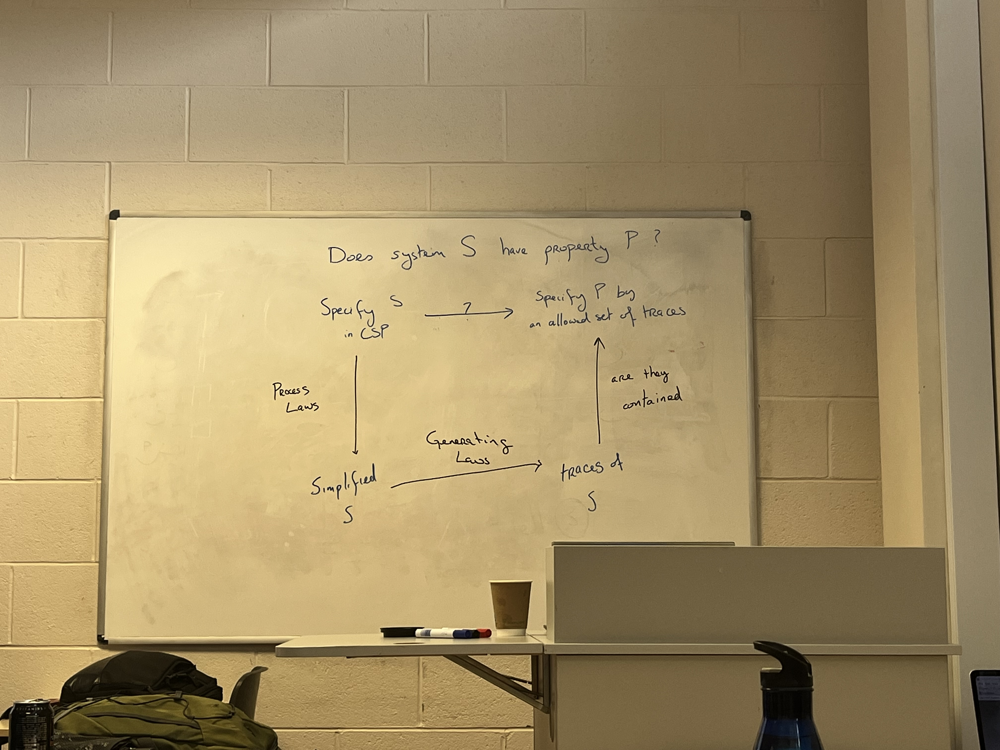

# Formal Sepcifications

#### [https://claude.ai/chat/7cf514c3-4720-4b2c-836a-ddacee85914f](https://claude.ai/chat/7cf514c3-4720-4b2c-836a-ddacee85914f)

#### Core CSP Concepts.&#x20;

| Concept             | Notation                 | Meaning                                    |
| ------------------- | ------------------------ | ------------------------------------------ |
| **STOP**            | `STOP_A`                 | Does nothing — models deadlock             |
| **Prefix**          | `x → P`                  | Engage event `x`, then behave as `P`       |
| **Recursion**       | `VM = coin → drink → VM` | Non-terminating process                    |
| **Choice**          | `x → P \| y → Q`         | Environment decides which event            |
| **Concurrency**     | `P ‖ Q`                  | Lock-step synchronisation on shared events |
| **Internal choice** | `P ⊓ Q`                  | System decides nondeterministically        |
| **External choice** | `P □ Q`                  | Environment drives the first event         |
| **Concealment**     | `P \ C`                  | Events in `C` hidden from environment      |
| **Communication**   | `c!v` / `c?x`            | Output value / input from channel          |

## Traces:

<figure><figcaption></figcaption></figure>

**Exam:**&#x20;

Specify p in CSP --> Process Laws --> Generating Laws -->  Traces of p

<figure><figcaption></figcaption></figure>
