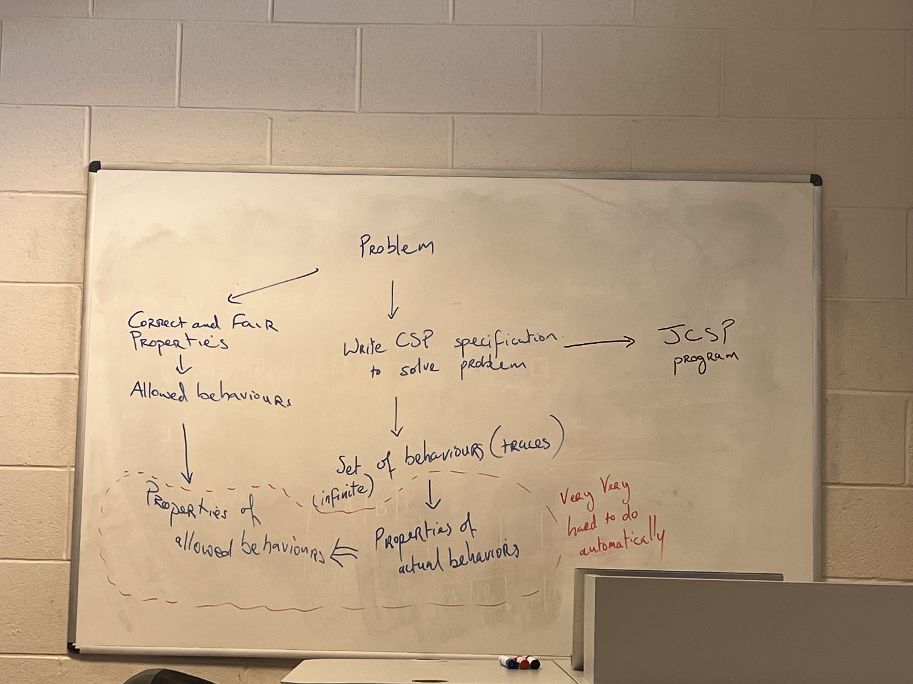

# JSCP

<figure><figcaption></figcaption></figure>


Great — let's build this up properly. JCSP has five main pillars: the process model, channels, parallel composition, alternation, and shared channels. I'll take you through each with diagrams and real code, building intuition as we go.

***

### 1. The Process Model

The foundational idea: **every concurrent actor is a `CSProcess`**. It is just an object with a `run()` method. The behaviour of the whole system is composed from many of these objects running concurrently.The critical design discipline: **channels are injected via the constructor, never created inside `run()`**. This means the wiring between processes happens outside them — the caller (or a driver class) decides which processes are connected together, and each process is oblivious to the network it sits in.

<figure><figcaption></figcaption></figure>

***

### 2. Channels

Channels are the _only_ way processes communicate. There is no shared mutable state. A channel has two ends — a write end and a read end — and **both sides must be ready simultaneously** for a transfer to happen. If the writer arrives first, it blocks waiting for a reader. If the reader arrives first, it blocks waiting for a writer. This is the CSP synchronous rendezvous.The object channel race hazard deserves a callout. When you call `out.write(myObject)`, you've handed a reference over the channel — but Java doesn't clone it. Both your process and the receiver now hold a pointer to the same object in memory. If you then mutate it on your side while the receiver reads it, that's a race condition. The discipline is: **`myObject = null` immediately after `write()`**.

<figure><figcaption></figcaption></figure>

***

### 3. Parallel Composition

`Parallel` is itself a `CSProcess`. You give it an array of processes and call `run()` — this is the direct Java translation of the CSP `‖` operator. It terminates when **all** child processes have terminated.

Here is the complete sample program from the lecture annotated to show the structure clearly:

```java
// ── Driver (wiring) ──────────────────────────────────────────────
public class DriverProgram {
    public static void main(String[] args) {
        // 1. Create the channel — one writer, one reader
        One2OneChannel chan = Channel.one2one();

        // 2. Wire the two processes to opposite ends
        // 3. Run them in parallel — blocks until BOTH finish
        new Parallel(new CSProcess[] {
            new SendEvenIntsProcess(chan.out()),
            new ReadEvenIntsProcess(chan.in())
        }).run();
    }
}

// ── Process A: writer ────────────────────────────────────────────
class SendEvenIntsProcess implements CSProcess {
    private ChannelOutput out;  // only sees the write-end

    public SendEvenIntsProcess(ChannelOutput out) { this.out = out; }

    public void run() {
        for (int i = 2; i <= 100; i += 2) {
            out.write(new Integer(i));  // blocks until reader is ready
            // good practice: local var after write = null (not needed for
            // Integer literals, but essential for mutable objects)
        }
        // run() returns → this process terminates
        // Parallel terminates once ReadEvenIntsProcess also terminates
    }
}

// ── Process B: reader ────────────────────────────────────────────
class ReadEvenIntsProcess implements CSProcess {
    private ChannelInput in;   // only sees the read-end

    public ReadEvenIntsProcess(ChannelInput in) { this.in = in; }

    public void run() {
        while (true) {
            Integer d = (Integer) in.read();  // blocks until writer writes
            System.out.println("Read: " + d.intValue());
        }
        // Never returns — infinite loop. But writer terminates after 50
        // writes, so the channel closes and this blocks forever.
        // In practice you'd add a poison-pill or use a finite loop.
    }
}
```

One thing to notice: `ReadEvenIntsProcess` loops forever, but the `SendEvenIntsProcess` terminates after 50 writes. In a real program you'd handle graceful shutdown with a **poison pill** — writing a sentinel value (like `null` or a special signal object) that tells the reader to exit its loop.

***

### 4. Alternation — nondeterminism in JCSP

This is the most powerful feature. `Alternative` lets a process wait on _multiple guards at once_ and proceed with whichever one becomes ready first. It's the JCSP implementation of CSP's choice operators.The real-time sampler from the lecture is a perfect worked example of alternation. It juggles three guards — a `reset` channel, a `CSTimer`, and an `in` channel — in a single loop:

<figure><figcaption></figcaption></figure>

```java
class Sample implements CSProcess {
    private long t;
    private final AltingChannelInput in;
    private final AltingChannelInputInt reset;
    private final ChannelOutput out;

    public void run() {
        final CSTimer tim = new CSTimer();
        // Guard array — order defines the case numbers
        final Alternative alt = new Alternative(
            new Guard[]{ reset, tim, in }
        );
        final int RESET = 0, TIM = 1, IN = 2;

        Object sample = null;
        long timeout = tim.read() + t;
        tim.setAlarm(timeout);   // arm the timer

        while (true) {
            switch (alt.preSelect()) {   // blocks until one guard is ready
                case RESET:
                    t = reset.read();    // update sampling period
                    break;
                case TIM:
                    out.write(sample);  // emit last captured value (may be null)
                    sample = null;
                    timeout += t;
                    tim.setAlarm(timeout);  // re-arm for next period
                    break;
                case IN:
                    sample = in.read();  // capture latest value
                    break;
            }
        }
    }
}
```

Notice `preSelect()` — this is used (instead of `select()`) because the guard's readiness has already been determined by the `Alternative`. After `preSelect()` returns an index, you **must** call `read()` (or `accept()`) on that guard's channel — the handshake is still pending.

***

### 5. Shared Channels

Standard JCSP channels are `one2one` — one writer, one reader. But JCSP also supports many-to-one, one-to-many, and many-to-many topologies.

```
one2one  →  one writer,  one reader     (standard)
any2one  →  many writers, one reader    (e.g. multiple producers → single consumer)
one2any  →  one writer,  many readers   (e.g. broadcaster)
any2any  →  many writers, many readers
```

The critical constraint: **ALTing (using a channel end inside an `Alternative`) is not allowed on shared channels**. The reason is that the fairness guarantees of `Alternative` depend on knowing exactly which process is waiting — with shared channels that's undefined.

***

### The Mental Model in One Picture

Here's how it all fits together:

```
            ┌──────────────────────────────────────┐
            │           new Parallel(...)           │  ← wires everything, calls run()
            └──────────────────────────────────────┘
                 │               │               │
         ┌───────┘           ────┘           ────┘
         ▼                   ▼               ▼
  ┌─────────────┐    ┌──────────────┐  ┌──────────────┐
  │  ProcessA   │    │  ProcessB    │  │  ProcessC    │
  │  run() {    │    │  run() {     │  │  run() {     │
  │  out.write()│───▶│  in.read()  │  │  alt.select()│
  │  }          │    │  out.write()│─▶│  ...         │
  └─────────────┘    └──────────────┘  └──────────────┘
       chan1.out()      chan1.in()
                        chan2.out()       chan2.in()
```

Each process only knows about its own channel ends. The network topology is defined entirely in the driver — this is exactly the CSP piping model mapped to Java objects.

***

Want to try writing a process yourself? A good exercise would be implementing `IdInt` (read from `in`, write to `out`, repeat forever) — the simplest possible building block from the lecture. Or we can go deeper into alternation and build the real-time sampler from scratch.
