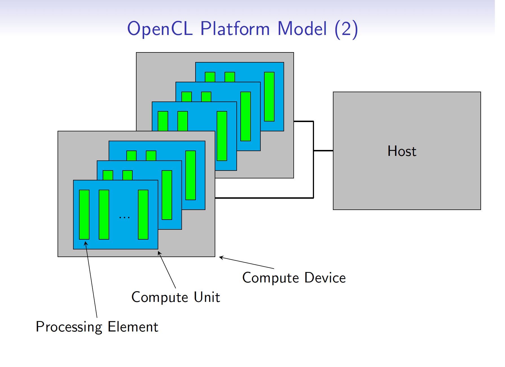
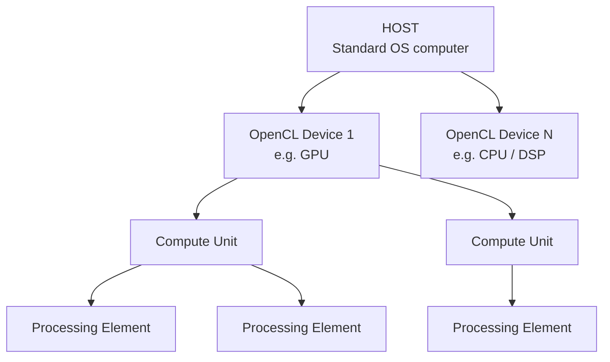
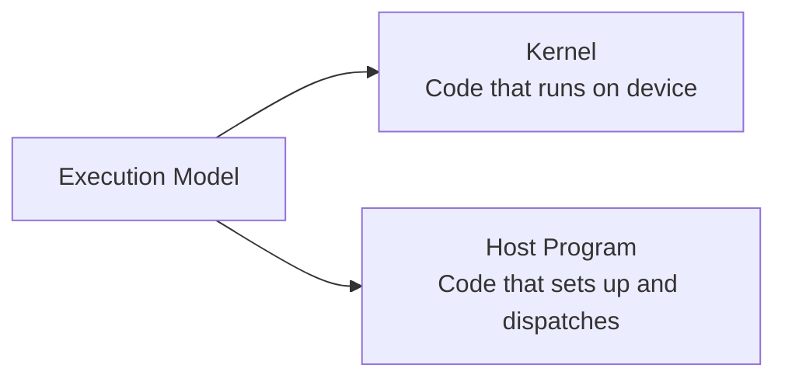
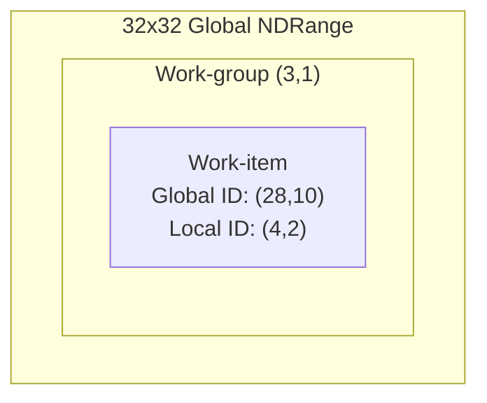
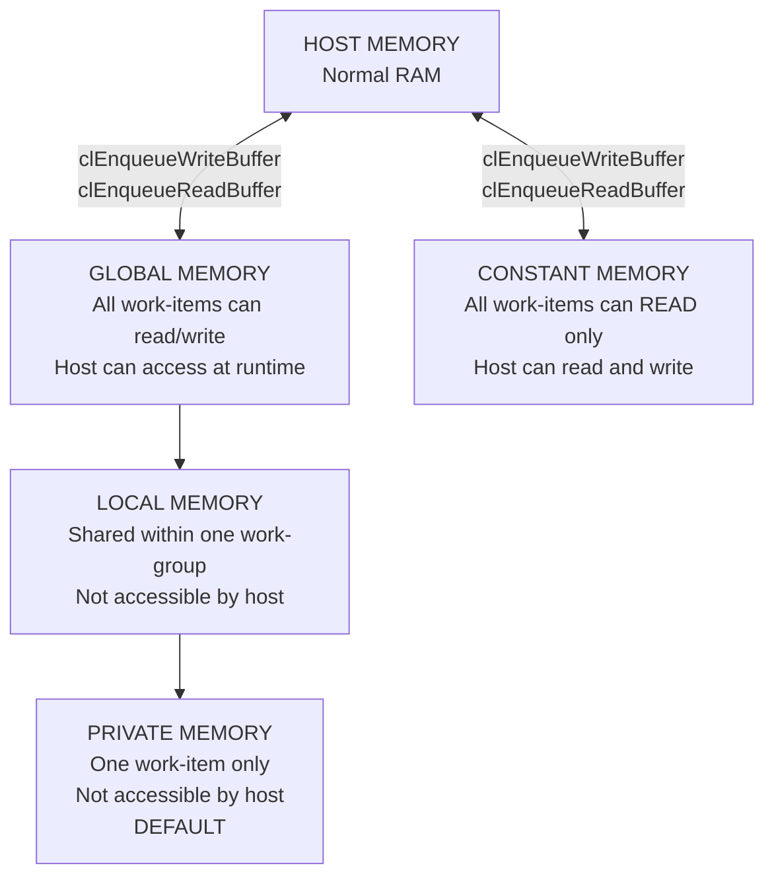
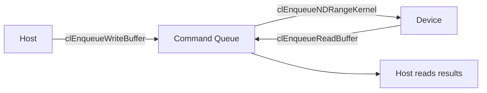
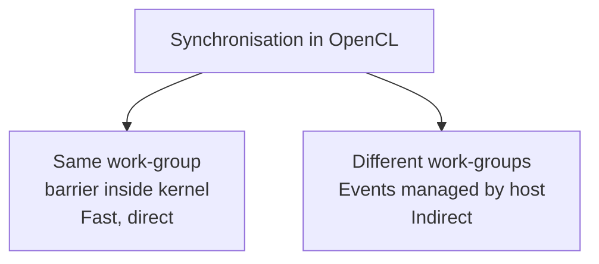
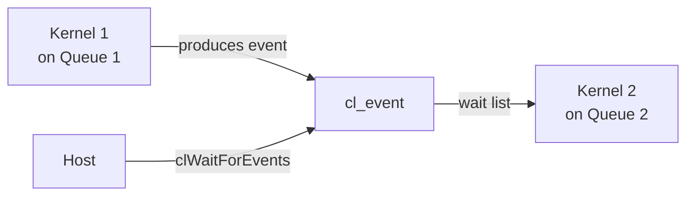
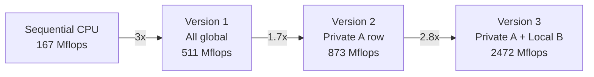

# CSC1141 — OpenCL Complete Study Guide

## CSC1141 — OpenCL Complete Study Guide

**Exam-focused · Intuition-first · Every topic from the lecture slides**

**Date:** 24 April 2026 **Topics covered:** Introduction, Platform Model, Execution Model, Memory Model, Host Program Steps, API Functions, OpenCL C Language, Synchronisation, Kernel Writing Patterns, Matrix Multiply Optimisation, OpenCL vs CUDA **Review dates:** Day+3: 27 Apr | Day+7: 1 May | Day+14: 8 May

***

#### How to use this guide

Every topic from the OpenCL lecture is here, ordered as the slides present them. Each section has the **intuition**, the **code**, the **exam angle**, and the **confusions that came up** in our session with their resolutions.

Topics marked **\[EXAM EVERY YEAR]** have appeared in every past paper from 2019–2025.

***

### 1. What is OpenCL?

OpenCL is an **open standard** for running computation on heterogeneous systems — meaning your program can distribute work across a CPU, GPU, DSP, or any combination at once.

* Created by the **Khronos Compute Group** — industry consortium (Apple, Intel, AMD, ARM)
* Main competitor: **CUDA** — NVIDIA's proprietary equivalent
* Key difference: **OpenCL = open, cross-device. CUDA = NVIDIA-only, more mature tooling**
* OpenCL kernels compile at **runtime**. CUDA kernels compile at **compile time**.

#### 3 Components

| Component                  | Purpose                                                                  |
| -------------------------- | ------------------------------------------------------------------------ |
| **Language Specification** | OpenCL C — the language kernels are written in (based on C99)            |
| **Platform API**           | Discover devices, transfer data, submit work — setup phase               |
| **Runtime API**            | Query and manage command queues, memory objects, kernels — ongoing phase |

#### 3 Architecture Models

| Model               | Describes                                     |
| ------------------- | --------------------------------------------- |
| **Platform Model**  | How host and devices are physically organised |
| **Execution Model** | How work is distributed across devices        |
| **Memory Model**    | What memory exists and who can see what       |

> These three models map directly to the exam (a)/(b) questions every year. Sinclair just rotates which one he asks.

***

### 2. Platform Model \[EXAM 2019]

#### Intuition

A factory manager (host) running specialist machines (devices). The manager never does the manufacturing — it organises, dispatches, and collects.

#### The Hierarchy

<figure><figcaption></figcaption></figure>



#### What each level does

| Level                  | Role                                                                                                          |
| ---------------------- | ------------------------------------------------------------------------------------------------------------- |
| **Host**               | Standard OS computer. Controls everything. Transfers data to/from devices. **Never executes kernels itself.** |
| **OpenCL Device**      | The parallel compute device (GPU, CPU, DSP). Executes kernels.                                                |
| **Compute Unit**       | Subdivision of the device. Work-items in the same work-group **must** run on the same CU.                     |
| **Processing Element** | Where one work-item actually executes.                                                                        |

#### SIMD vs SPMD

| PE Type  | Used in     | Behaviour                                                                        |
| -------- | ----------- | -------------------------------------------------------------------------------- |
| **SIMD** | GPUs        | All PEs in a CU execute the **same instruction** simultaneously — different data |
| **SPMD** | CPUs / DSPs | Each PE can be at a **different point** in the program                           |

#### Exam angle

> 📝 2019 — 4(a) \[4 marks] "Describe, with the aid of a diagram, OpenCL's Platform Model."

**Expected answer:** Draw the 4-level hierarchy. Label each level. State what the host does (never executes kernels). State SIMD vs SPMD distinction for PE type.

#### Watch out for

* The host **never** executes kernels — always state this
* Work-items in the same work-group must run on the **same compute unit** — this is why local memory sharing is possible

***

### 3. Execution Model \[EXAM 2020, 2022, 2025]

#### Intuition

Instead of writing a loop, OpenCL asks you to think differently:

```
Sequential:  "Loop over 1000 elements, process each one"
OpenCL:      "Define a space of 1000 work-items — each one IS an element,
              and they all run the kernel simultaneously"
```

#### Two components

<figure><figcaption></figcaption></figure>



#### NDRange — the index space

The problem is defined on an **N-Dimensional Range** where N = 1, 2, or 3.

| Problem           | N | Global work size       |
| ----------------- | - | ---------------------- |
| Process an array  | 1 | size of array          |
| Process an image  | 2 | width × height         |
| Process 3D volume | 3 | width × height × depth |

#### Work-items and Work-groups

| Concept        | What it is                                                                                                                |
| -------------- | ------------------------------------------------------------------------------------------------------------------------- |
| **Work-item**  | One element in the NDRange. Runs the kernel once. Knows its own position.                                                 |
| **Work-group** | Collection of work-items. All run on the **same compute unit**. Can share local memory. Can synchronise with `barrier()`. |

**Key rule:** Synchronisation between work-items is only possible within the **same work-group**.

#### NDRange example — 2D



**Calculating IDs:**

|               | Formula              | Example (global 28,10 with group size 8,8) |
| ------------- | -------------------- | ------------------------------------------ |
| Work-group ID | global / group\_size | (28/8, 10/8) = **(3, 1)**                  |
| Local ID      | global % group\_size | (28%8, 10%8) = **(4, 2)**                  |

> Note: OpenCL uses **(x, y)** = **(column, row)** — opposite of matrix convention (row, col).

#### Two types of kernels

| Type              | Written in      | Compiled when                     | Portable? |
| ----------------- | --------------- | --------------------------------- | --------- |
| **OpenCL kernel** | OpenCL C        | **Runtime** — hardware known then | Yes       |
| **Native kernel** | Device-specific | Compile time                      | No        |

#### Exam angle

> 📝 2020 — 4(a) \[5 marks] / 2022 — 4(a) \[5 marks] / 2025 — 4(b) \[6 marks] "Describe the Execution Model in OpenCL."

**Expected answer:** Two components (kernel + host program). NDRange explanation. Work-item and work-group definitions. Synchronisation constraint. Two kernel types.

#### Watch out for

* NDRange is defined by the **host** in `clEnqueueNDRangeKernel` — the kernel itself has no idea how big the space is
* `get_global_id(0)` = x = **column**, `get_global_id(1)` = y = **row**
* Loop is replaced by the NDRange — you write what **one iteration does**, not the loop

***

### 4. Memory Model \[EXAM 2021, 2023, 2024, 2025]

#### Intuition

```
Global   = company database        — everyone sees it, slow to query
Constant = printed manual on desk  — everyone reads, nobody changes
Local    = team whiteboard         — your team only, fast
Private  = personal notepad        — you only, fastest
```

#### Diagram

<figure><figcaption></figcaption></figure>



#### Each memory type

| Memory       | Visible to                 | Host access  | Speed         | Advantages                               | Disadvantages                     |
| ------------ | -------------------------- | ------------ | ------------- | ---------------------------------------- | --------------------------------- |
| **Global**   | All work-items             | Read & Write | Slowest       | Large, flexible                          | High latency, contention          |
| **Constant** | All work-items (read only) | Read & Write | Slow (cached) | Cached reads, broadcast                  | Read-only from kernel             |
| **Local**    | Same work-group only       | None         | Fast          | Shared within group, enables cooperation | Limited size, explicit management |
| **Private**  | One work-item only         | None         | Fastest       | Register-level speed                     | Very limited size, not shared     |

**Default rule:** Variables declared in a kernel without any qualifier → **private memory**.

#### Exam angle

> 📝 2021 — 4(a) \[6 marks] / 2023 — 4(a) \[4 marks] / 2024 — 4(a) \[6 marks] / 2025 — 4(a) \[4 marks] "Describe, using a diagram, the Memory Model used in OpenCL."

**Expected answer:** Draw the diagram with 4 memory regions (+ host memory). Label visibility and host access for each. State advantages and disadvantages (for 6-mark version). State the default = private rule.

#### Watch out for

* Global memory is on the **device** — it is not "inside" the kernel, it is accessed via pointers
* Local memory is fast but **tiny** (32–64KB typically) — cannot fit a whole matrix, only tiles
* The optimisation answer is always: move data from global → private/local to reduce contention

***

### 5. Host Program — 8 Basic Steps \[EXAM 2019]

#### Intuition


#### Each step with API call

| Step                    | What happens                             | API call                                                                |
| ----------------------- | ---------------------------------------- | ----------------------------------------------------------------------- |
| 1. Find devices         | Get platform, then find devices          | `clGetPlatformIDs()` → `clGetDeviceIDs()`                               |
| 2. Create context       | Link devices into one workspace          | `clCreateContext()`                                                     |
| 3. Create command queue | Channel to send commands to device       | `clCreateCommandQueue()`                                                |
| 4. Compile kernel       | Source → program → build → kernel object | `clCreateProgramWithSource()` → `clBuildProgram()` → `clCreateKernel()` |
| 5. Create buffers       | Allocate memory on device                | `clCreateBuffer()`                                                      |
| 6. Copy data to device  | Write host data into device buffers      | `clEnqueueWriteBuffer()`                                                |
| 7. Set args + execute   | Bind args, launch NDRange, wait          | `clSetKernelArg()` → `clEnqueueNDRangeKernel()` → `clFinish()`          |
| 8. Copy results back    | Read device buffer into host memory      | `clEnqueueReadBuffer()`                                                 |
| 9. Clean up             | Release all OpenCL resources             | `clRelease*()`                                                          |

#### Why order matters

Each step depends on the previous:

* No context without a device
* No command queue without a context
* No kernel without a context and compiled program
* No buffer without a context
* No kernel arguments without a kernel and buffers
* No execution without arguments
* No results before execution completes

#### Everything goes through the command queue



`clFinish()` blocks the host until the entire queue is empty.

#### Exam angle

> 📝 2019 — 4(b) \[6 marks] "Describe the basic steps in an OpenCL host program."

**Expected answer:** List all 8 steps in order. Name the key API call for each. Explain why order matters (dependency chain).

***

### 6. OpenCL C Language \[EXAM 2021, 2024]

#### 5 Restrictions from C99

| Removed feature             | Why                                     |
| --------------------------- | --------------------------------------- |
| **Function pointers**       | GPUs cannot do dynamic dispatch         |
| **Recursion**               | GPU stack is very limited               |
| **Variable length arrays**  | Size must be known at compile time      |
| **Bit-fields**              | Not supported                           |
| **No C99 standard headers** | Cannot `#include <stdio.h>` in a kernel |

#### Scalar vs Vector

**Scalar** = one single value:

```c
int x = 5;        // one integer
float f = 3.14f;  // one float
```

**Vector** = a fixed-size collection of the same type, treated as one unit:

```c
float4 v;   // four floats bundled together — [v.x, v.y, v.z, v.w]
```

On GPU hardware (SIMD), one vector operation = one clock cycle for all components simultaneously:

```c
float4 v3 = v1 + v2;
// equivalent to: v3.x=v1.x+v2.x, v3.y=v1.y+v2.y, v3.z=v1.z+v2.z, v3.w=v1.w+v2.w
// but done in ONE hardware instruction
```

#### Vector types

The pattern is `[type][n]` where n ∈ {2, 4, 8, 16}:

| Scalar type | Vector type                             | Host type        |
| ----------- | --------------------------------------- | ---------------- |
| `float`     | `float2`, `float4`, `float8`, `float16` | `cl_float2` etc. |
| `int`       | `int2`, `int4`, `int8`, `int16`         | `cl_int2` etc.   |
| `char`      | `char2`, `char4`, `char8`, `char16`     | `cl_char2` etc.  |

**Accessing components:**

```c
float4 v;
v.x   // 1st   v.y   // 2nd   v.z   // 3rd   v.w   // 4th
v.s0  // 1st   v.s1  // 2nd   v.sa  // 11th (for 16-wide vectors)
```

#### Type casting rules

**Scalar → scalar:** same as C99, implicit and explicit both allowed:

```c
int i = 5;
float f = (float) i;  // explicit ✅
float g = i;          // implicit ✅
```

**Vector → vector:** NOT allowed implicitly or explicitly:

```c
int4 i;
float4 f = (float4) i;  // ❌ NOT allowed
float4 g = i;           // ❌ NOT allowed
```

**Use built-in conversion functions instead:**

```c
float4 f = convert_float4(i);  // ✅ correct
```

Pattern: `convert_<destination_type>(source)`

#### Address space qualifiers

| Qualifier  | Address space                           | Default? |
| ---------- | --------------------------------------- | -------- |
| `global`   | Global memory — all work-items          | No       |
| `constant` | Constant memory — read-only from kernel | No       |
| `local`    | Local memory — within work-group        | No       |
| `private`  | Private memory — one work-item          | **Yes**  |

**The pointer distinction:**

```c
global float *ptr;
// ptr itself is in PRIVATE memory (just a variable)
// but it POINTS TO an address in GLOBAL memory

int4 v;  // private memory — default, no qualifier needed
```

Image objects use special qualifiers:

```c
read_only  image2d_t inputImage;
write_only image2d_t outputImage;
```

#### Built-in kernel functions

**Identity functions — who am I?**

| Function               | Returns                                            |
| ---------------------- | -------------------------------------------------- |
| `get_work_dim()`       | Number of dimensions (1, 2, or 3)                  |
| `get_global_size(dim)` | Total work-items in specified dimension            |
| `get_global_id(dim)`   | This work-item's global position                   |
| `get_local_size(dim)`  | Work-group size in specified dimension             |
| `get_local_id(dim)`    | This work-item's position within work-group        |
| `get_num_groups(dim)`  | Total number of work-groups in specified dimension |
| `get_group_id(dim)`    | This work-item's work-group ID                     |

**How they relate — concrete example (work-item at global (2,1), group size 3):**

```
get_work_dim()       → 2        (2D problem)
get_global_id(0)     → 2        (x = column)
get_global_id(1)     → 1        (y = row)
get_local_size(0)    → 3
get_local_id(0)      → 2 % 3 = 2
get_group_id(0)      → 2 / 3 = 0
```

**Synchronisation functions:**

| Function          | What it does                                                                                 |
| ----------------- | -------------------------------------------------------------------------------------------- |
| `mem_fence(flag)` | Flushes memory — ensures YOUR writes are visible. Does NOT wait for other work-items.        |
| `barrier(flag)`   | Waits until ALL work-items reach this point, THEN flushes memory. Stronger than `mem_fence`. |

Flags: `CLK_LOCAL_MEM_FENCE` (for local memory) or `CLK_GLOBAL_MEM_FENCE` (for global memory).

#### Exam angle

> 📝 2021 — 4(b) \[4 marks] / 2024 — 4(b) \[4 marks] "Describe type casting and address space qualifiers in OpenCL C."

**Expected answer:** Scalar casting = C99 rules. Vector casting = NOT allowed, use `convert_type()`. Four address space qualifiers with what each means. Default = private.

***

### 7. Synchronisation \[EXAM 2020, 2022, 2023]

#### Two scenarios



#### barrier vs mem\_fence

|                    | `barrier(flag)`                                | `mem_fence(flag)`                 |
| ------------------ | ---------------------------------------------- | --------------------------------- |
| **Execution sync** | ✅ Waits for ALL work-items to reach this point | ❌ Does NOT wait for others        |
| **Memory flush**   | ✅ Yes                                          | ✅ Yes                             |
| **Use when**       | Loading shared data, then reading it           | Just need your own writes visible |
| **Exam kernels**   | Always use this                                | Rarely needed                     |

**The barrier pattern:**

```c
// Step 1 — all work-items cooperatively load into local memory
for (k = ilocal; k < Pdim; k = k + nloc)
{
    Blocal[k] = B[k * Pdim + j];
}

// Step 2 — STOP until everyone has finished loading
barrier(CLK_LOCAL_MEM_FENCE);

// Step 3 — NOW safe to read — all of Blocal is guaranteed loaded
for (k = 0; k < Pdim; k++)
{
    tmp += Apriv[k] * Blocal[k];
}
```

**Analogy:** `barrier` = everyone stops at the meeting point until the whole team arrives. `mem_fence` = I've finished my part — I'll make my notes visible, but I'm not waiting for anyone.

#### Across different work-groups — host-side events



```c
// kernel2 waits for kernel1 to complete
cl_event kernel_event;
clEnqueueNDRangeKernel(queue1, kernel1, ..., NULL, &kernel_event);
clEnqueueNDRangeKernel(queue2, kernel2, ..., 1, &kernel_event, NULL);

// or host blocks until kernel completes
clWaitForEvents(1, &kernel_event);
```

Event status values: `CL_QUEUED` → `CL_SUBMITTED` → `CL_RUNNING` → `CL_COMPLETE`

#### Exam angle

> 📝 2020 — 4(b) \[5 marks] / 2022 — 4(b) \[5 marks] / 2023 — 4(b) \[6 marks] "Describe how synchronisation is achieved in OpenCL."

**Expected answer:** Two scenarios (same work-group vs different). barrier() for same group. Events for different groups. Code example for 6-mark version.

#### Watch out for

* `barrier()` placement: AFTER loading into local memory, BEFORE reading from it
* Different work-groups **cannot** synchronise inside a kernel — only via host events
* `barrier` must be reached by ALL work-items in the group — putting it inside an `if` branch is a deadlock if some work-items skip it

***

### 8. Kernel Writing Patterns \[EXAM EVERY YEAR — 10 marks]

#### The skeleton — never changes

```c
kernel void my_kernel(global const float *input,
                      global float *output,
                      int width, int height)
{
    // Step 1 — identify yourself
    int x = get_global_id(0);   // column
    int y = get_global_id(1);   // row

    // Step 2 — border check (protect against out-of-bounds)
    if (x <= 0 || x >= width - 1 || y <= 0 || y >= height - 1)
        return;

    // Step 3 — read neighbours from input (global memory)
    float centre = input[y * width + x];
    float above  = input[(y - 1) * width + x];
    // ... etc

    // Step 4 — compute result
    float result = /* formula from question */;

    // Step 5 — write to output (one write to global memory)
    output[y * width + x] = result;
}
```

#### Neighbour access pattern — memorise this

```c
float centre = input[y * width + x];          // pixel (i, j)
float above  = input[(y - 1) * width + x];    // pixel (i-1, j)
float below  = input[(y + 1) * width + x];    // pixel (i+1, j)
float left   = input[y * width + (x - 1)];    // pixel (i, j-1)
float right  = input[y * width + (x + 1)];    // pixel (i, j+1)
```

#### Border check rules

```c
// Using above AND below:
if (y <= 0 || y >= height - 1) return;

// Using left AND right:
if (x <= 0 || x >= width - 1) return;

// Using all 4 neighbours:
if (x <= 0 || x >= width - 1 || y <= 0 || y >= height - 1) return;

// Using full 3x3 grid (Sobel):
if (x <= 0 || x >= width - 1 || y <= 0 || y >= height - 1) return;
```

#### Problem space answer — always the same

```
- 2D NDRange — one work-item per pixel
- global dimensions = {width, height}
- local dimensions  = {8, 8}
- launched with clEnqueueNDRangeKernel(queue, kernel, 2, NULL, global, local, ...)
```

#### Improve runtime answer — always the same

```
1. Move frequently-read data from global → PRIVATE memory
   - each work-item copies its needed pixels into private variables
   - reads from global once, then uses register-speed private memory

2. Move shared data from global → LOCAL memory
   - work-group cooperatively loads a tile into local memory
   - use barrier(CLK_LOCAL_MEM_FENCE) after loading
   - all work-items then read from fast local memory

3. Result: fewer global memory accesses = less contention = faster
```

#### What changes each year — just the formula

| Year | Formula                                              | Neighbours needed         |
| ---- | ---------------------------------------------------- | ------------------------- |
| 2019 | Sobel edge detection (v1² + v2² > T)                 | 8 neighbours (full 3×3)   |
| 2020 | max(above, below)                                    | above + below             |
| 2021 | average(self + 4 neighbours)                         | above, below, left, right |
| 2022 | min(left, right)                                     | left + right              |
| 2023 | matrix multiply (private A row, local B col)         | different pattern         |
| 2024 | average(self + 4 neighbours)                         | above, below, left, right |
| 2025 | horizontal edge \| (right-centre) - (centre-left) \| | left, centre, right       |

***

### 9. Matrix Multiply Case Study

#### The optimisation journey



#### Full performance table

| Implementation            | Mflops   | Speedup vs Sequential |
| ------------------------- | -------- | --------------------- |
| Sequential CPU            | 167      | 1×                    |
| GPU — all global memory   | 511      | 3×                    |
| GPU — private A row       | 873      | 5.2×                  |
| GPU — private A + local B | **2472** | **15×**               |
| CPU — all global memory   | 744      | 4.5×                  |

#### Why each step helps

**Version 1 → Version 2 (private A row):**

* Multiple work-items computing the same row of C all need the same row of A
* Without private: each reads entire row of A from global — repeated contention
* With private: read row of A from global **once**, store in private array, use register-speed for all subsequent accesses

**Version 2 → Version 3 (local B column):**

* All work-items in the work-group need the same column of B
* Without local: each work-item reads entire column from global — massive contention on B
* With local: work-group **cooperatively** loads column once into local memory — one global read shared across entire work-group
* `barrier` ensures column is fully loaded before any work-item reads it

#### The cooperative loading loop explained

```c
// ilocal = my ID within work-group (0..nloc-1)
// nloc   = work-group size
// Each work-item loads a strided subset of the column

for (k = ilocal; k < Pdim; k = k + nloc)
{
    Blocal[k] = B[k * Pdim + j];
}
```

With nloc=4, Pdim=12:

```
Work-item 0: loads Blocal[0], Blocal[4], Blocal[8]
Work-item 1: loads Blocal[1], Blocal[5], Blocal[9]
Work-item 2: loads Blocal[2], Blocal[6], Blocal[10]
Work-item 3: loads Blocal[3], Blocal[7], Blocal[11]
→ All 12 elements covered, no duplicates
```

***

### 10. OpenCL vs CUDA

| Feature                | OpenCL                                   | CUDA                                          |
| ---------------------- | ---------------------------------------- | --------------------------------------------- |
| **Vendor**             | Open standard (Khronos)                  | NVIDIA proprietary                            |
| **Hardware support**   | Any OpenCL-capable device                | NVIDIA GPUs only                              |
| **Kernel compilation** | **Runtime** — compiled when program runs | **Compile time** — compiled when you build    |
| **Templates**          | Not supported                            | ✅ Supported (due to compile-time compilation) |
| **Tooling maturity**   | Less mature                              | More mature — better debugger and profiler    |
| **Libraries**          | Fewer available                          | More available                                |
| **Portability**        | High — same code on any device           | Low — NVIDIA only                             |

**Key exam distinction:** OpenCL compiles at runtime because the hardware device isn't known at compile time — this makes it portable but means no templates and slightly more startup overhead.

***

### 11. Past Paper Analysis

#### What appears every year

| Topic                                           | Question part | Every year? |
| ----------------------------------------------- | ------------- | ----------- |
| One of the 3 models (Platform/Execution/Memory) | 4(a)          | ✅ Yes       |
| One concept (sync/type casting/host steps)      | 4(b)          | ✅ Yes       |
| Write an OpenCL kernel                          | 4(c)          | ✅ Yes       |
| "How would you improve runtime?"                | Part of 4(c)  | ✅ Yes       |
| "Describe the problem space"                    | Part of 4(c)  | ✅ Yes       |

#### What rotates

| Topic                        | Years asked                        |
| ---------------------------- | ---------------------------------- |
| Platform Model               | 2019                               |
| Execution Model              | 2020, 2022, 2025                   |
| Memory Model                 | 2021, 2023, 2024, 2025             |
| Basic steps in host program  | 2019                               |
| Synchronisation              | 2020, 2022, 2023                   |
| Type casting + address space | 2021, 2024                         |
| Image processing kernel      | 2019, 2020, 2021, 2022, 2024, 2025 |
| Matrix multiply kernel       | 2023                               |

#### Full question summary with sample answers

***

**2019 — Question 4 \[20 marks]**

**4(a) \[4 marks]** — "Describe, with the aid of a diagram, OpenCL's Platform Model."

**Sample answer:** The Platform Model has 4 levels: Host → Device → Compute Unit → Processing Element. The host is a standard computer running a standard OS — it controls everything but never executes kernels. An OpenCL device is the parallel compute unit (GPU, CPU, DSP). Each device has one or more compute units. Each compute unit has one or more processing elements — SIMD in GPUs, SPMD in CPUs/DSPs. \[Include hierarchy diagram.]

***

**4(b) \[6 marks]** — "Describe the basic steps in an OpenCL host program."

**Sample answer:** (1) Query for devices using `clGetPlatformIDs` then `clGetDeviceIDs`. (2) Create a context with `clCreateContext` — links devices into one managed workspace. (3) Create a command queue with `clCreateCommandQueue` — channel for sending work to device. (4) Create the kernel: load source with `clCreateProgramWithSource`, compile at runtime with `clBuildProgram`, create kernel object with `clCreateKernel`. (5) Create memory buffers on device with `clCreateBuffer`. (6) Copy input data to device with `clEnqueueWriteBuffer`. (7) Set kernel arguments with `clSetKernelArg`, execute with `clEnqueueNDRangeKernel`, wait with `clFinish`. (8) Copy results back with `clEnqueueReadBuffer`. (9) Release all resources with `clRelease*`. Each step depends on the previous — cannot create context without device, cannot compile kernel without context.

***

**4(c) \[10 marks]** — Sobel edge detection kernel.

```c
#define THRESHOLD 128

kernel void sobel(global const float *input, global float *output,
                  int width, int height)
{
    int x = get_global_id(0);
    int y = get_global_id(1);

    if (x <= 0 || x >= width-1 || y <= 0 || y >= height-1) {
        output[y * width + x] = 0;
        return;
    }

    float v_im1_jm1 = input[(y-1)*width+(x-1)];
    float v_im1_j   = input[(y-1)*width+x];
    float v_im1_jp1 = input[(y-1)*width+(x+1)];
    float v_i_jm1   = input[y*width+(x-1)];
    float v_i_jp1   = input[y*width+(x+1)];
    float v_ip1_jm1 = input[(y+1)*width+(x-1)];
    float v_ip1_j   = input[(y+1)*width+x];
    float v_ip1_jp1 = input[(y+1)*width+(x+1)];

    float value1 = v_im1_jp1 - v_im1_jm1
                 + 2.0f*(v_i_jp1 - v_i_jm1)
                 + v_ip1_jp1 - v_ip1_jm1;

    float value2 = v_im1_jp1 + 2.0f*v_im1_j + v_im1_jm1
                 - v_ip1_jp1 - 2.0f*v_ip1_j - v_ip1_jm1;

    output[y*width+x] = (value1*value1 + value2*value2 > THRESHOLD)
                        ? 255.0f : 0.0f;
}
```

Problem space: 2D NDRange `{width, height}`, local `{8,8}`. Improve runtime: load the 3×3 neighbourhood into local memory cooperatively; use `barrier(CLK_LOCAL_MEM_FENCE)` before reading.

***

**2020 — Question 4 \[20 marks]**

**4(a) \[5 marks]** — "Describe the Execution Model in OpenCL."

**Sample answer:** The Execution Model has two components: kernels and the host program. OpenCL defines the problem as an N-dimensional index space (NDRange) where N=1, 2, or 3. Each element is a work-item. The code each work-item executes is the kernel. Work-items are grouped into work-groups — all work-items in a work-group run on the same compute unit and can synchronise. Work-items identify themselves with `get_global_id()`, `get_local_id()`, and `get_group_id()`. There are two kernel types: OpenCL kernels (compiled at runtime in OpenCL C, portable) and native kernels (device-specific). The host program creates devices, contexts, kernels, and memory objects.

***

**4(b) \[5 marks]** — "Describe how synchronisation between work-items in different work-groups is achieved. How does this differ from same work-group?"

**Sample answer:** Same work-group: use `barrier(CLK_LOCAL_MEM_FENCE)` inside the kernel — blocks all work-items until everyone reaches that point, then flushes local memory. This works because they share a compute unit and local memory. Different work-groups: direct synchronisation inside a kernel is NOT possible. Instead, the host uses events — every `clEnqueue*` call can produce an event and accept a wait list. `clWaitForEvents()` blocks the host until specified events complete. Kernels on different queues can be chained so one waits for the other's event.

***

**4(c) \[10 marks]** — max(above, below) kernel.

```c
kernel void max_above_below(global const float *input, global float *output,
                              int width, int height)
{
    int x = get_global_id(0);
    int y = get_global_id(1);

    if (y <= 0 || y >= height-1 || x >= width) return;

    float above = input[(y-1)*width+x];
    float below = input[(y+1)*width+x];

    output[y*width+x] = (above > below) ? above : below;
}
```

Problem space: 2D NDRange `{width, height}`, local `{8,8}`. Improve runtime: load relevant rows into local memory so all work-items in the group read from fast local memory instead of slow global memory.

***

**2021 — Question 4 \[20 marks]**

**4(a) \[6 marks]** — "Describe, using a diagram, the Memory Model. Describe advantages and disadvantages."

**Sample answer:** \[Draw diagram with 4 levels: global/constant, local, private + host memory.] Global: visible to all work-items, host can access, largest but slowest — advantages: large, flexible; disadvantages: high latency, contention. Constant: read-only from kernel, host can write, cached — advantages: faster for read-only data; disadvantages: cannot be written by kernel. Local: shared within work-group, host cannot access — advantages: fast, enables cooperation; disadvantages: tiny (\~32KB), explicit management. Private: one work-item only, fastest — advantages: register speed; disadvantages: very limited, not shared. Default is private.

***

**4(b) \[4 marks]** — "Describe type casting and address space qualifiers in OpenCL C."

**Sample answer:** Address space qualifiers: `global` (all work-items), `constant` (read-only from kernel), `local` (work-group only), `private` (one work-item — default). A qualifier on a pointer describes where it points to, not where the pointer itself lives. Type casting: scalar types follow C99 — implicit and explicit both allowed. Vector types: casting NOT allowed implicitly or explicitly. Use `convert_<type>(source)` e.g. `convert_float4(i)`.

***

**4(c) \[10 marks]** — Image smoothing (average 4 neighbours).

```c
kernel void smooth(global const float *input, global float *output,
                   int width, int height)
{
    int x = get_global_id(0);
    int y = get_global_id(1);

    if (x <= 0 || x >= width-1 || y <= 0 || y >= height-1) return;

    float sum  = input[y*width+x];
    sum       += input[(y-1)*width+x];
    sum       += input[(y+1)*width+x];
    sum       += input[y*width+(x-1)];
    sum       += input[y*width+(x+1)];

    output[y*width+x] = sum / 5.0f;
}
```

Problem space: 2D NDRange `{width, height}`, local `{8,8}`. Improve runtime: load a tile (including 1-pixel halo) into local memory; barrier after loading; all reads from fast local memory.

***

**2022 — Question 4 \[20 marks]**

**4(a) \[5 marks]** — Same as 2020 4(a). See Execution Model answer above.

**4(b) \[5 marks]** — Same as 2020 4(b). See Synchronisation answer above.

**4(c) \[10 marks]** — min(left, right) kernel.

```c
kernel void min_left_right(global const float *input, global float *output,
                            int width, int height)
{
    int x = get_global_id(0);
    int y = get_global_id(1);

    if (x <= 0 || x >= width-1 || y >= height) return;

    float left  = input[y*width+(x-1)];
    float right = input[y*width+(x+1)];

    output[y*width+x] = (left < right) ? left : right;
}
```

***

**2023 — Question 4 \[20 marks]**

**4(a) \[4 marks]** — Same as 2021 4(a) but 4 marks — diagram + one line per memory type, skip full advantages table.

**4(b) \[6 marks]** — Same as 2020 4(b) + add code examples for barrier and event-based sync.

**4(c) \[10 marks]** — Matrix multiply kernel.

```c
kernel void matrix_mul(int Mdim, int Ndim, int Pdim,
                       global float *A, global float *B, global float *C,
                       local float *Blocal)
{
    int i      = get_global_id(0);
    int j      = get_global_id(1);
    int ilocal = get_local_id(0);
    int nloc   = get_local_size(0);
    int k;

    float Apriv[1000];
    for (k = 0; k < Pdim; k++)
        Apriv[k] = A[i*Ndim+k];

    for (k = ilocal; k < Pdim; k = k+nloc)
        Blocal[k] = B[k*Pdim+j];

    barrier(CLK_LOCAL_MEM_FENCE);

    float tmp = 0.0f;
    for (k = 0; k < Pdim; k++)
        tmp += Apriv[k] * Blocal[k];

    C[i*Ndim+j] = tmp;
}
```

Why improvement: global-only causes contention — every access queues up. Private A: each row read once from global, rest register-speed. Local B: column read once per work-group (shared), not once per work-item. Performance: 511 → 873 → 2472 Mflops (15× vs sequential).

***

**2024 — Question 4 \[20 marks]**

**4(a) \[6 marks]** — Same as 2021 4(a). See Memory Model answer above.

**4(b) \[4 marks]** — Same as 2021 4(b). See Type casting answer above.

**4(c) \[10 marks]** — Same as 2021 4(c). See Image smoothing kernel above.

***

**2025 — Question 4 \[20 marks]**

**4(a) \[4 marks]** — Same as 2021 4(a), 4 marks. Diagram + brief description.

**4(b) \[6 marks]** — Same as 2020 4(a). See Execution Model answer above.

**4(c) \[10 marks]** — Horizontal edge detection.

```c
kernel void horizontal_edges(global const float *A, global float *B, int width)
{
    int x = get_global_id(0);
    int y = get_global_id(1);

    if (x <= 0 || x >= width-1) { B[y*width+x] = 0; return; }

    // private copies — read from global once each
    float left   = A[y*width+(x-1)];
    float centre = A[y*width+x];
    float right  = A[y*width+(x+1)];

    float diff = (right - centre) - (centre - left);
    B[y*width+x] = diff < 0 ? -diff : diff;
}
```

Advantage of private copy: each value is read from slow global memory only once, then all computation uses fast private (register-level) memory, eliminating repeated global memory accesses and reducing contention.

***

### 12. Confusions & Clarifications from Study Session

These are the exact questions that came up — worth knowing because they represent genuine traps.

**Q: What is N in NDRange?** N is the number of dimensions describing your problem space — 1 for arrays, 2 for images, 3 for 3D volumes. Each work-item has N coordinates to identify itself.

**Q: Is `kernel` a return type?** No. `kernel` is a qualifier marking the function as callable from the host. The return type is always `void`. Results go via memory buffers, not return values.

**Q: Where is the NDRange defined — in the kernel or host?** In the **host** — specifically in `clEnqueueNDRangeKernel`. The kernel has no idea how big the space is. It just calls `get_global_id()` to find its own position.

**Q: Is global memory inside the kernel?** No. Global memory lives on the **device**. The kernel accesses it via pointers marked `global`. The host creates the buffer and fills it before the kernel runs.

**Q: OpenCL (x,y) vs matrix (row,col) — which is which?** OpenCL uses x=column first, y=row second. `get_global_id(0)` = x = column. `get_global_id(1)` = y = row. Access pixels as `image[y * width + x]`.

**Q: What is Pdim/Ndim/Mdim?** Matrix dimensions. A is Ndim×Pdim, B is Pdim×Mdim, C is Ndim×Mdim. `i` = row of C (from `get_global_id(0)`), `j` = column of C (from `get_global_id(1)`), `k` = inner loop variable for the dot product.

**Q: What is `ilocal` and `nloc` in the cooperative loading loop?** `ilocal = get_local_id(0)` — this work-item's position within the work-group (0..nloc-1). `nloc = get_local_size(0)` — total work-items in the group. The loop `k = ilocal; k < Pdim; k += nloc` gives each work-item a strided slice of the loading job — no overlap, full coverage.

**Q: Why not just copy all of B into local memory?** Local memory is tiny (\~32–64KB). A 1000×1000 float matrix = 4MB. Only one column = 4KB — fits. You tile: load only what's needed now.

**Q: How is work-group size calculated?** Set by the host in `clEnqueueNDRangeKernel`. Must be a power of 2, must divide evenly into global size, must not exceed device maximum. Typical values: 64 or 128 for 1D; {8,8} or {16,16} for 2D.

**Q: What is a scalar vs a vector?** Scalar = one single value (`float`, `int`). Vector = fixed collection of the same type treated as one unit (`float4` = four floats). GPU SIMD hardware can process all components in one clock cycle. OpenCL vectors are a performance tool — different from AI embedding vectors which encode meaning.

**Q: `CLK_LOCAL_MEM_FENCE` vs `CLK_GLOBAL_MEM_FENCE` — which do I use?** Use `CLK_LOCAL_MEM_FENCE` when working with local memory (the most common case in exam kernels). Use `CLK_GLOBAL_MEM_FENCE` when ensuring global memory writes are visible. You can combine both: `barrier(CLK_LOCAL_MEM_FENCE | CLK_GLOBAL_MEM_FENCE)`.

**Q: barrier vs mem\_fence — what is the real difference?** `barrier` = hard meeting point — nobody continues until ALL work-items arrive. `mem_fence` = softer — flushes your memory writes to be visible, but doesn't wait for others. For exam kernel questions, always use `barrier`.

***

### 13. Quick Reference — Exam Cheat Sheet

#### Kernel skeleton

```c
kernel void name(global const float *input, global float *output,
                 int width, int height)
{
    int x = get_global_id(0);   // column
    int y = get_global_id(1);   // row

    if (/* border check */) return;

    // read neighbours from input[]
    // compute result
    // write to output[y * width + x]
}
```

#### Address space qualifiers

```c
global    // all work-items — pointers to device buffers
constant  // all work-items read-only
local     // shared within work-group
private   // one work-item — DEFAULT for all unqualified variables
```

#### All built-in identity functions

```c
get_work_dim()        // N dimensions
get_global_size(dim)  // total work-items
get_global_id(dim)    // my global position — use for array indexing
get_local_size(dim)   // work-group size
get_local_id(dim)     // my position within work-group
get_num_groups(dim)   // total work-groups
get_group_id(dim)     // my work-group
```

#### Synchronisation one-liners

```c
barrier(CLK_LOCAL_MEM_FENCE);   // wait for all + flush local
barrier(CLK_GLOBAL_MEM_FENCE);  // wait for all + flush global
mem_fence(CLK_LOCAL_MEM_FENCE); // flush only — no wait
clWaitForEvents(n, list);       // host blocks until events complete
```

#### "Improve runtime" 3-line answer

```
1. Copy per-work-item data from global → private (read once, use many times)
2. Copy shared data from global → local (cooperatively, with barrier after)
3. Result: eliminate global memory contention → significant speedup
```

#### Performance reference

```
Sequential:              167 Mflops   (1×)
GPU all global:          511 Mflops   (3×)
GPU private A row:       873 Mflops   (5.2×)
GPU private A + local B: 2472 Mflops  (15×)
```

#### OpenCL vs CUDA one-liners

```
OpenCL  = open, cross-device, runtime compilation, portable
CUDA    = NVIDIA-only, compile-time, better tools, templates supported
```

***

### ❓ Weak Spots Flagged This Session

* Kernel writing practice under exam conditions — concepts understood but not yet written from scratch independently
* Matrix multiply B indexing formula `B[k * Pdim + j]` — worth tracing through manually a few times
* Work-group size calculation — know the 3 rules (power of 2, divides global, within device max)

### 📅 Spaced Repetition Schedule

| Review | Date        | Focus                                                         |
| ------ | ----------- | ------------------------------------------------------------- |
| Day 3  | 27 Apr 2026 | Active recall — draw all 3 models from memory, no notes       |
| Day 7  | 1 May 2026  | Exam questions only — write a kernel from scratch             |
| Day 14 | 8 May 2026  | Full weak spots drill — matrix multiply + all kernel patterns |

***

_Generated from CSC1141 lecture slides + past papers 2019–2025 | Study session 24 April 2026_
