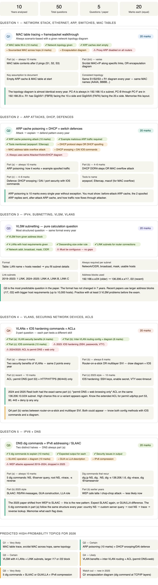

# QP Analysis

<figure><figcaption></figcaption></figure>

Let me pull all the data I need first.I have everything I need. Here's the full pattern analysis across all 10 years of papers:Now I have everything. Let me build the full analysis:Here are the key takeaways from 10 years of patterns:

**The certainties — marks you cannot afford to lose:**

Q2(a) ARP poisoning is 10 marks, every single year, no exception. That's 10% of the entire exam on its own. You must be able to draw the before/after ARP caches and show the two spoofed ARP replies with example traffic.

Q3 is the most predictable question in the paper — same format for 7 years straight. Pure VLSM calculation. Recent papers use larger blocks (/17, /22) with bigger hosts (up to 10,000). This is free marks if you practise.

Q4(a) is always the same two VLAN security benefits — 4 easy marks if you know the two points.

**The shift to watch in Q5** — WEP attacks dominated 2019–2024 but 2025 dropped them entirely and replaced with SLAAC. The new pattern is SLAAC + GUA/LLA. Don't waste time on WEP.

**The new Q1 variant** — 2025 Resit introduced an encapsulation diagram showing a `dig` command going through all TCP/IP layers. Brand new question type, could appear again.

Ready to start? Say `let's study Q1` and we'll go. 🎯
