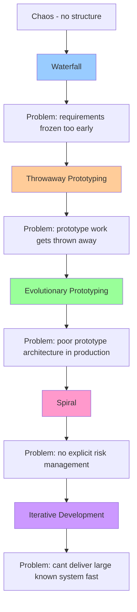
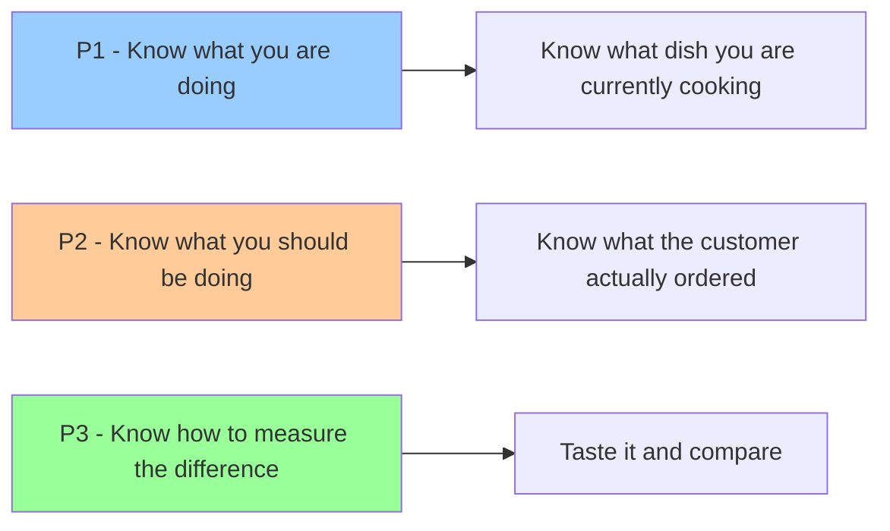
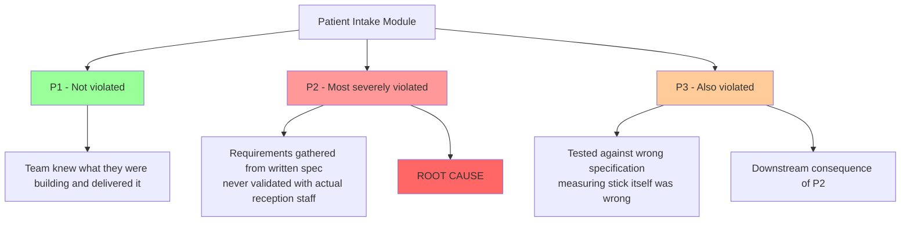
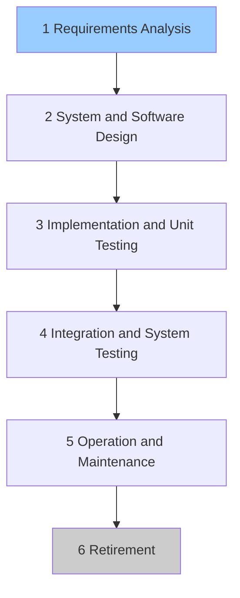
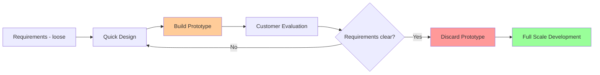
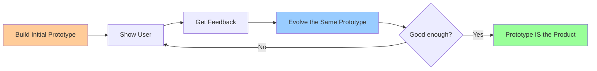
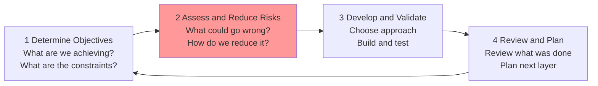
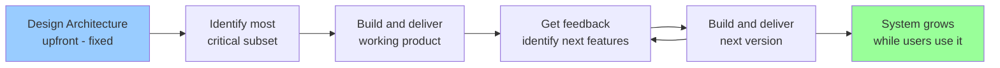
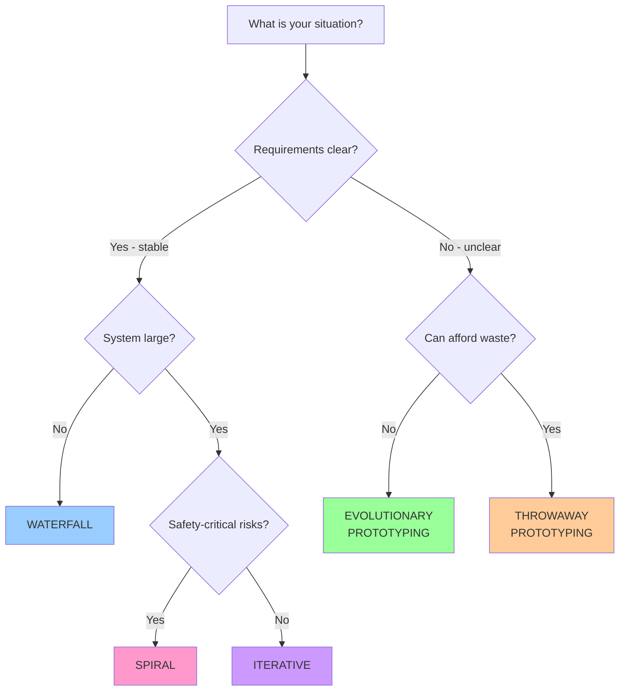

# Problem 1 — Software Processes

## Problem 1 — Software Processes

### How do you organise the work?

> **Exam question:** Q1 — 20 marks (Q1a: 10 marks, Q1b: 10 marks) **MediTrack modules:** Patient Intake Module (Q1a) · Drug Interaction Engine (Q1b) **Weeks:** Week 1 + Week 2

***

### 1. Big Picture

Before software processes existed, development was chaotic — no structure, no phases, no checkpoints. Process models were invented to bring discipline to how software is built.

> Each model was invented because the previous one had a flaw. Understanding that chain is more important than memorising any single model.

#### The chain of invention

***

### 2. The 3 QA Principles

#### What problem does it solve?

Quality doesn't happen by accident. Without explicit principles, teams build the wrong thing, in the wrong way, with no way to know they've gone wrong. The 3 QA Principles are the foundation of everything else in this module.

#### The 3 Principles

| Principle                                   | Plain English                                    | How you achieve it                                              |
| ------------------------------------------- | ------------------------------------------------ | --------------------------------------------------------------- |
| **P1 — Know what you are doing**            | Understand what you're building right now        | Regular meetings, test runs, milestones, management structure   |
| **P2 — Know what you should be doing**      | Have explicit, continuously updated requirements | Use cases, acceptance tests, user feedback, explicit prototypes |
| **P3 — Know how to measure the difference** | Compare actual vs expected continuously          | Testing + metrics                                               |

#### The chef analogy

#### MediTrack — Patient Intake Module

> **Key exam insight:** P3 failed _as a consequence_ of P2 failing. P2 is always the root cause — identify it as most severely violated. P3 is the downstream effect.

#### Failure mode

When P2 is violated, teams build to the wrong target. The system passes all tests but fails in real use — exactly what happened with the Patient Intake Module.

***

### 3. Process Models

#### Model 1 — Waterfall

**What it is**

The first explicit process model — borrowed from engineering. Phases carried out in strict order, each signed off before proceeding to the next.

**How it works**

**Why the name?**

The diagram shows phases cascading downward like water falling over steps. Water only flows one way — down. Going back up is unnatural and expensive. The name captures both the structure and the flaw.

**Strengths and when to use**

**Clear structure and trackable progress** _(advantage)_ — every phase has a defined start and end, making it easy to manage large teams and report status _**(when to use: large teams needing clear phase boundaries, government projects with strict reporting requirements)**_.

**Strong documentation at every phase** _(advantage)_ — quality control built into each phase through inspections and reviews _**(when to use: safety-critical systems requiring extensive documentation — NASA Space Shuttle achieved zero in-flight failures across 135 missions)**_.

**Works when requirements are fully known** _(advantage)_ — when nothing will change, the rigid structure is a feature not a bug _**(when to use: stable well-understood requirements — physics-based systems, hardware-constrained projects)**_.

**Weaknesses and when not to use**

**Requirements frozen too early** _(disadvantage)_ — users see the product for the first time at the end, by which point changes are catastrophically expensive _**(when not to use: requirements unclear or likely to change — Healthcare.gov 2013: $1.7B spent, only 6 enrolled on day one)**_.

**Inflexible partitioning** _(disadvantage)_ — rigid phase walls mean design problems discovered during implementation get worked around with messy code rather than properly fixed _**(when not to use: fast-moving environments where delivery speed matters)**_.

**Real world examples**

* ✅ **NASA Space Shuttle** — stable physics-based requirements, 420,000 lines of code, zero in-flight failures across 135 missions
* ❌ **Healthcare.gov 2013** — requirements frozen without user validation, $1.7B spent, only 6 people enrolled on day one

**Failure mode**

When requirements change after freezing, teams either work around design problems with implementation tricks — creating messy fragile code — or deliver a system that meets the spec but not real user needs.

**Exam signal words**

**Stable requirements · safety-critical · large team · government project · well-defined constraints · documentation heavy**

**One line summary:**

> Waterfall brings engineering discipline to software — but only works when requirements are stable, because going back up the waterfall is unnatural and expensive.

***

#### Model 2 — Throwaway Prototyping

**What it is**

An extended requirements phase — build a rough prototype, show it to users, get feedback, refine requirements, then discard the prototype and build the real product from scratch.

**How it works**

**The analogy**

Custom suit fitting — tailor makes a rough fitting first, you try it on, give feedback, adjust, try again — _then_ the real suit is made from scratch. The fitting is thrown away.

**Strengths and when to use**

**Requirements emerge from real use** _(advantage)_ — users interact with something tangible rather than describing needs abstractly _**(when to use: requirements genuinely unclear, users can't articulate needs without seeing something)**_.

**Reduces risk of building wrong product** _(advantage)_ — validated requirements before committing to full development _**(when to use: high risk of misunderstanding — Patient Intake Module type scenarios where workflow matters)**_.

**Weaknesses and when not to use**

**Prototype gets thrown away — wasted work** _(disadvantage)_ — all effort building the prototype produces nothing for the final product _**(when not to use: small teams that can't afford waste, tight deadlines)**_.

**Creeping excellence** _(disadvantage)_ — users keep requesting refinements, team never moves to real development _**(when not to use: undisciplined teams without clear prototyping exit criteria)**_.

**Failure mode**

Teams either waste significant effort on a prototype that gets discarded, or fall into creeping excellence — endlessly refining without ever building the real product.

**Exam signal words**

**Unclear requirements · user feedback needed · requirements keep changing · users don't know what they want**

**One line summary:**

> Throwaway Prototyping fixes the requirements problem by showing users something real — but wastes all the prototype work by discarding it afterwards.

***

#### Model 3 — Evolutionary Prototyping

**What it is**

Same as Throwaway Prototyping — but the prototype is never discarded. It is continuously evolved until it becomes the final production system.

**How it works**

**Key distinction from Throwaway**

|                | Throwaway Prototyping                 | Evolutionary Prototyping        |
| -------------- | ------------------------------------- | ------------------------------- |
| After feedback | Discard prototype, build from scratch | Evolve the same prototype       |
| Work wasted?   | Yes                                   | No                              |
| Risk           | Wasted effort                         | Poor architecture in production |

**The analogy**

Sculpture — start with rough clay, client says "make the nose smaller", refine it, keep going until the clay _becomes_ the final piece. Nothing is discarded.

**Strengths and when to use**

**No wasted work** _(advantage)_ — prototype becomes the product, every iteration adds value _**(when to use: requirements unclear, continuous user involvement possible, team can't afford prototype waste)**_.

**Requirements emerge from real use** _(advantage)_ — fixes the Patient Intake Module type failure — users shape the system through use rather than written guesses _**(when to use: systems requiring continuous user validation throughout development)**_.

**Weaknesses and when not to use**

**Poor architecture in production** _(disadvantage)_ — prototype shortcuts get baked into the production system, accumulating Technical Debt _**(when not to use: safety-critical systems — accumulated shortcuts are dangerous, Drug Interaction Engine)**_.

**Hard to know when done** _(disadvantage)_ — creeping excellence still a risk _**(when not to use: large teams — hard to coordinate continuous evolution at scale)**_.

**MediTrack — Patient Intake Module**

Instead of gathering requirements in a meeting room, build a rough version of the intake interface and let reception staff use it in their actual rapid patient-flow workflow. Requirements emerge from real use. Each iteration brings the interface closer to what staff actually need — not just the original written spec.

**Failure mode**

Prototype shortcuts get baked into production — accumulating Technical Debt and making the system fragile as it grows.

**Exam signal words**

**Requirements unclear · continuous user feedback · can't afford waste · evolving system · user involvement throughout**

**One line summary:**

> Evolutionary Prototyping fixes both the requirements problem AND the wasted work problem — but risks carrying poor prototype architecture into production.

***

#### Model 4 — Spiral Model

**What it is**

A refinement of Waterfall built around continuous risk assessment and mitigation. Every layer of development goes through the same four-step risk cycle before proceeding.

**How it works — the 4-step cycle repeated every layer**

> Risk assessment is not an add-on. It is the core of every cycle.

**The mountaineering analogy**

Before every stage of the climb, stop and ask: what could kill us here? Avalanche? Weather? Equipment failure? Assess each risk, reduce it, then proceed. Repeat at every camp on the way up.

**Strengths and when to use**

**Risk explicitly identified and reduced at every stage** _(advantage)_ — potential catastrophic failures caught before they happen, not after _**(when to use: safety-critical systems where failure is catastrophic — Drug Interaction Engine where decimal errors cause patient death)**_.

**Combines best of Waterfall and Prototyping** _(advantage)_ — structured phases with iterative risk validation _**(when to use: large complex long-term projects, government and defence projects, requirements partially known but risks are high)**_.

**Strong documentation and audit trail** _(advantage)_ — every risk decision is recorded _**(when to use: regulated industries requiring compliance documentation — medical software like MediTrack)**_.

**Weaknesses and when not to use**

**Heavyweight process** _(disadvantage)_ — every layer requires extensive documentation and meetings, slowing progress significantly _**(when not to use: small projects, tight budgets, fast delivery needed)**_.

**Depends on quality of risk analysis** _(disadvantage)_ — bad risk analysis produces false confidence and bad outcomes _**(when not to use: inexperienced teams without risk analysis expertise)**_.

**MediTrack — Drug Interaction Engine**

The Drug Interaction Engine is safety-critical — a decimal error in dosage calculation based on Serum Creatinine levels could cause patient harm or fatal overdose. Spiral forces the team to stop at every layer and ask: what could go wrong? Wrong renal function input? Edge cases for paediatric patients? Formula errors at boundary values? These risks are identified and reduced before the feature ships — not discovered after a patient is harmed.

**Why Spiral is superior to Iterative for Drug Interaction Engine**

Pure Iterative Development has no mechanism to stop and ask "what could kill a patient here?" It simply continues adding features. Spiral's four-step cycle ensures safety is never compromised for delivery speed.

**Failure mode**

Without risk analysis at each layer, critical failure modes are discovered only after deployment — at maximum cost and maximum harm.

**Exam signal words**

**Safety-critical · risk management · large government project · experienced team · catastrophic failure possible · long timeline**

**One line summary:**

> Spiral wraps every development phase in a risk assessment — the only model that explicitly prevents catastrophic failures before they happen.

***

#### Model 5 — Iterative Development

**What it is**

Deliver a massive system in working production-quality chunks. Start with the most critical subset of features, ship it, add more features each cycle, repeat until the system is complete.

**How it works**

> Every version is production-quality. Nothing is thrown away. These are not prototypes — they are real software delivered in prioritised chunks.

**Key distinction from Prototyping**

|              | Prototyping           | Iterative Development              |
| ------------ | --------------------- | ---------------------------------- |
| Each version | Rough prototype       | Real production software           |
| Requirements | Unclear — emerging    | Known upfront                      |
| Purpose      | Discover requirements | Deliver large system incrementally |

**The railway analogy**

Open Line 1 first, people start using it, open Line 2, add more stations, keep expanding. The system grows while people are already using it.

**Strengths and when to use**

**Users get working software early** _(advantage)_ — value delivered from day one rather than after years of development _**(when to use: large known systems where early delivery matters — Legacy Data Migration Module delivering critical patient records first)**_.

**Most critical features built first** _(advantage)_ — risk reduced by prioritising highest-value work _**(when to use: requirements known but system is large, small to medium team, architecture definable upfront)**_.

**Weaknesses and when not to use**

**Needs early architecture** _(disadvantage)_ — architecture set at the start and difficult to change later _**(when not to use: requirements unclear — prototyping needed first, large teams needing parallel development)**_.

**No explicit risk management** _(disadvantage)_ — unlike Spiral, no formal mechanism to identify and reduce catastrophic failure risks _**(when not to use: safety-critical systems — Drug Interaction Engine needs Spiral's risk cycle)**_.

**Real world example**

Gmail 2004 — 3 developers, basic email only for 10 Google employees. Each iteration added the most critical missing feature. Architecture set early and never changed. Now 1.8 billion active users.

**Failure mode**

If architecture is wrong at the start, every subsequent iteration builds on a flawed foundation — increasingly expensive to fix as the system grows.

**Exam signal words**

**Large known system · early delivery needed · small team · clear architecture · feature prioritisation · working software fast**

**One line summary:**

> Iterative Development delivers a massive known system in working production-quality chunks — users get value immediately while the product grows around them.

***

### 4. Decision Guide — Which Model to Use?

### 5. Complete Model Comparison Table

| Model                        | Core problem solved             | **When to use**                                       | **When not to use**                    | Key weakness                    |
| ---------------------------- | ------------------------------- | ----------------------------------------------------- | -------------------------------------- | ------------------------------- |
| **Waterfall**                | No structure                    | **Stable requirements, large team, safety-critical**  | **Requirements unclear**               | Frozen requirements             |
| **Throwaway Prototyping**    | Wrong requirements              | **Requirements unclear, user feedback needed**        | **Requirements known, tight deadline** | Work thrown away                |
| **Evolutionary Prototyping** | Wasted prototype work           | **Requirements unclear, continuous user involvement** | **Safety-critical, large team**        | Poor architecture in production |
| **Spiral**                   | No risk management              | **Safety-critical, large complex projects**           | **Small projects, inexperienced team** | Heavy, slow, needs experts      |
| **Iterative**                | Can't deliver large system fast | **Large known system, need early delivery**           | **Requirements unclear, large team**   | Needs early architecture        |

***

### 6. Exam Answers

#### Q1a — 10 marks

_Evaluate the Requirements Gap in the Patient Intake Module using the 3 QA Principles. Identify which was most severely violated and explain how Evolutionary Prototyping acts as a corrective mechanism._

> The most severely violated principle was Principle 2 — Know what you should be doing. MediTrack's Patient Intake Module met its written specifications but was rejected by hospital reception staff because the specifications failed to capture their rapid patient-flow workflow. Requirements were gathered through documentation rather than validated with actual users. Principle 3 was also violated as a downstream consequence — the team measured the system against the wrong specification, so testing passed while real-world use failed. Principle 1 was not violated — the team knew what they were building and delivered it.
>
> Evolutionary Prototyping corrects this by replacing the requirements-gathering meeting with a working prototype deployed directly to reception staff. Instead of writing specifications and hoping they are correct, requirements emerge from real use. Each iteration exposes what the written spec missed — for example, that emergency admissions cannot support lengthy mandatory intake forms. The prototype is never discarded; it is continuously evolved until it matches the actual rapid patient-flow workflow, not just the original written guess.

***

#### Q1b — 10 marks

_Critically analyse why a Spiral Model approach is superior to pure Iterative Development for the Drug Interaction Engine, focusing on Risk Analysis and Planning phases._

> The Drug Interaction Engine is safety-critical — a single decimal error in dosage calculation based on Serum Creatinine levels could cause patient harm or fatal overdose. This distinguishes it from modules where a bug causes inconvenience rather than death.
>
> The Spiral Model is superior because risk assessment and mitigation are the core of every development cycle, not an afterthought. Before each phase, the team explicitly identifies what could go wrong — incorrect renal function inputs, edge cases in paediatric dosing, formula errors at boundary values — and reduces those risks before proceeding. The four-step cycle of Determine Objectives, Assess and Reduce Risks, Develop and Validate, and Review and Plan ensures no feature ships without explicit safety validation.
>
> Pure Iterative Development has no such mechanism. It would continue adding dosage calculation features iteration by iteration without formally stopping to ask what could cause a fatal error. The Spiral's Planning phase also documents every risk decision — creating an audit trail essential for medical regulatory compliance. For a system where failure costs lives, the overhead of Spiral's heavyweight process is not a disadvantage — it is a requirement.

***

_Problem 1 Complete — Ready for Problem 2: Agile_
