# Problem 2 — Agile

```
ROOT — Why Agile exists at all
(Without this, nothing below makes sense)
        |
        ↓
ROOT — Technical Debt
(The core problem Agile is constantly fighting)
        |
        ├──────────────────────┐
        ↓                      ↓
       XP                 Scrum + Kanban
(How do we write         (How do we organise
better code?)                the team?)
        |                      |
   ┌────┴────┐           ┌─────┴──────┐
   ↓         ↓           ↓            ↓
Simple    Pair       Scrum         Kanban
Design +  Programming ceremonies   + WIP
Refactor              Daily        Limits
                      Standup +
                      Retrospective
                              |
                              ↓
                         Scrum vs Kanban
                        (comparison only makes
                        sense after both are known)
```

## Problem 2 — Agile

### How do you work as a team, fast?

> **Exam questions:** Q2 + Q3 — 40 marks total **MediTrack modules:** Clinical Decision Support (Q2a) · Legacy Data Migration (Q2b) · Compliance Reports vs Emergency Alerts (Q3a) · Prescription Engine integration (Q3b) **Weeks:** Week 3 + Week 4

***

### 1. Big Picture — Why Agile Exists

#### The problem Agile solved

By the late 1990s, teams using Waterfall kept failing — not because the process was wrong in theory, but because reality kept breaking the plan. Requirements changed mid-project. Customers saw the product for the first time at the end and hated it. Failures were discovered too late to fix cheaply. Teams burned out and left.

In 2001, 17 practitioners wrote the **Agile Manifesto** — four values that changed how software is built:

| Agile values                 | Over                        |
| ---------------------------- | --------------------------- |
| Individuals and interactions | Processes and tools         |
| Working software             | Comprehensive documentation |
| Customer collaboration       | Contract negotiation        |
| Responding to change         | Following a plan            |

> The right side isn't bad — the left side matters _more_ when there's a conflict.

#### Agile vs Process Models — the critical distinction

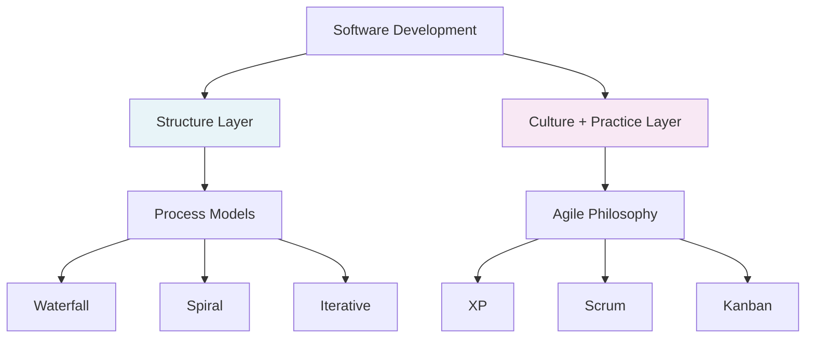

**Process Models** define _when_ things happen — structure, phases, order. **Agile** defines _how_ people work — culture, collaboration, practices.

> Scrum is Iterative Development with Agile values baked in. You need both layers.

#### Agile umbrella

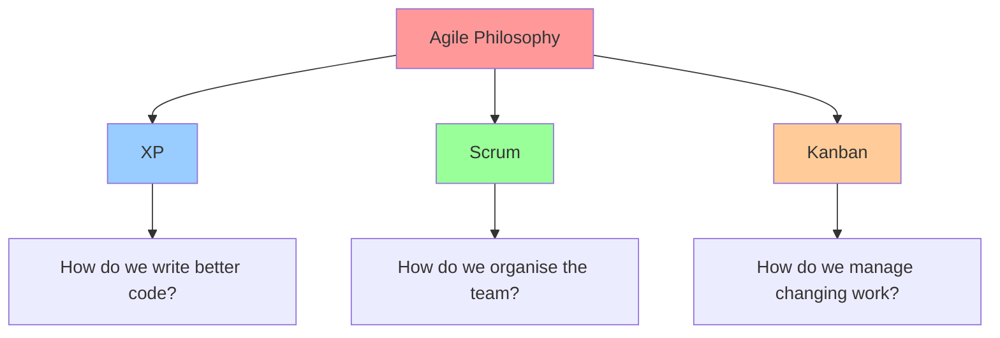

***

### 2. XP — Extreme Programming

#### What it is

XP is an Agile framework that takes the best software engineering practices to their logical extreme — continuous testing, continuous simplicity, continuous collaboration — to produce high quality software fast.

Originally designed for small to medium teams facing short timelines, rapidly changing requirements, and high expectations.

<figure><figcaption></figcaption></figure>

#### Why "Extreme"?

| Good practice             | XP takes it to the extreme                           |
| ------------------------- | ---------------------------------------------------- |
| Code reviews are good     | Review code **all the time** — Pair Programming      |
| Testing is good           | Test **all the time** — Test Driven Development      |
| Simple solutions are good | **Always** use the simplest solution — Simple Design |
| Short iterations are good | Use the **shortest** iterations possible             |
| Integration is important  | Integrate **continuously** — every day               |

#### Three layers of XP

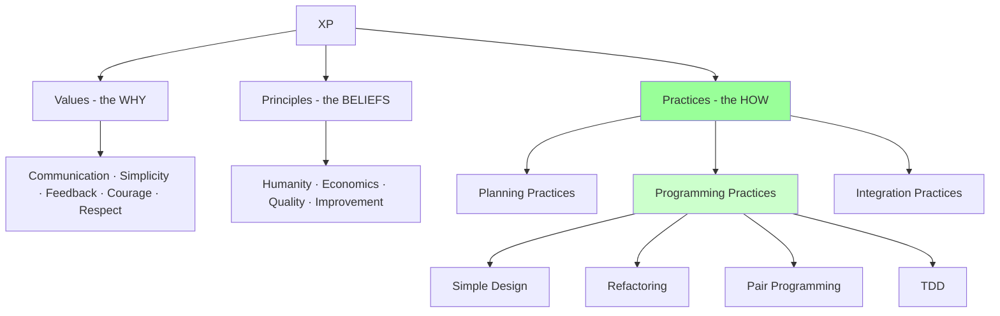

> Your exam focuses almost entirely on **Programming Practices** — specifically Simple Design, Refactoring, and Pair Programming.

**Strengths and when to use:**

**Lightweight and fast** _(advantage)_ — XP has minimal overhead compared to Waterfall or Spiral, making it ideal for teams that need to deliver quickly under pressure _**(when to use: short timelines, high expectations, competitive environments)**_.

**Handles changing requirements naturally** _(advantage)_ — continuous feedback loops mean the team adapts weekly rather than being locked into a plan _**(when to use: unclear or rapidly changing requirements like MediTrack's drug formulary updates)**_.

**Weaknesses and when not to use:**

**Doesn't scale easily** _(disadvantage)_ — XP was designed for small to medium teams and requires close collaboration _**(when not to use: large teams of 50+ developers, geographically distributed teams)**_.

**Requires customer involvement** _(disadvantage)_ — XP depends on continuous customer feedback _**(when not to use: when customer can't be continuously involved in development)**_.

***

### 3. Technical Debt

#### What it is

When a team is under pressure, they make a choice — do it properly (takes longer) or do it quickly (ships faster but leaves hidden fragility in the code). That shortcut is Technical Debt.

> Named by Ward Cunningham in 1992 — deliberately chosen as a financial metaphor. You borrow time now and pay it back later, with interest. The longer you leave it, the more interest accumulates.

#### The financial analogy

Borrowing €1000 on a credit card — you got the money fast but now owe more than €1000. Every month you don't pay it back, interest grows. Eventually you're paying more in interest than the original debt. Same in code — every future change to a shortcut takes longer than it should.

#### Four ways Technical Debt accumulates

**1. Deadline pressure** — team takes shortcut to meet deadline. "We'll fix it later." Later never comes.

**2. Unclear requirements** — team builds on best guess, requirements change, patches applied on top instead of redesigning properly.

**3. Lack of knowledge** — developer uses poor approach not out of laziness but ignorance. As system grows, the poor approach becomes increasingly costly.

**4. No refactoring time** — team keeps adding features but never cleans up old code. Debt grows through gradual neglect.

#### Technical Debt lifecycle — 5 named stages

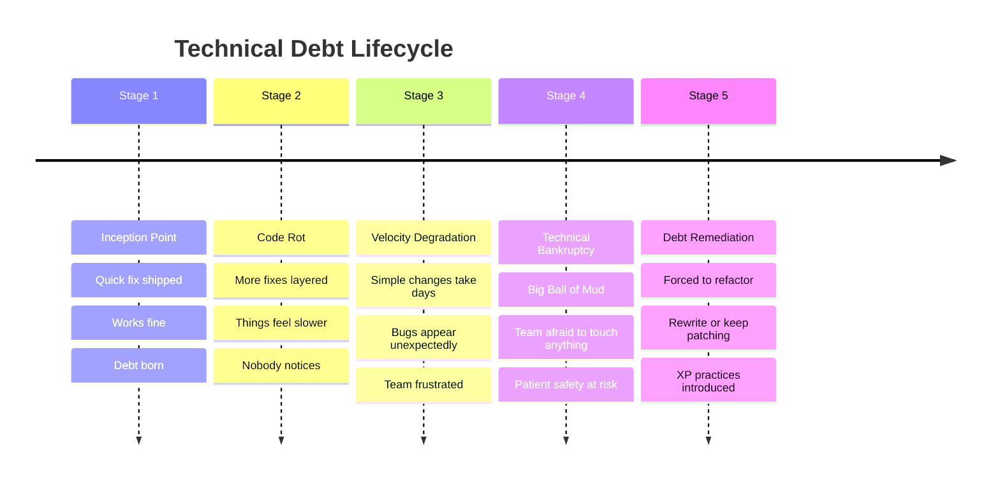

#### Technical Debt accumulation cycle

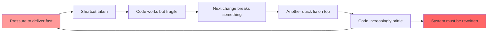

#### Cost over time

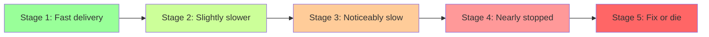

#### MediTrack — two modules affected

| Module                    | Stage     | How debt accumulated                           | Consequence                                    |
| ------------------------- | --------- | ---------------------------------------------- | ---------------------------------------------- |
| Clinical Decision Support | Stage 3–4 | Rushed fixes for weekly drug formulary updates | New safety rules break existing alert logic    |
| Legacy Data Migration     | Stage 3   | Rushed iterations to meet go-live deadlines    | Fragile schemas, unexpected failures on change |

#### Why it matters across multiple questions

| Question | How Technical Debt appears                                               |
| -------- | ------------------------------------------------------------------------ |
| Q2a      | Simple Design + Refactoring **prevent and pay back** debt                |
| Q2b      | Pair Programming **reduces** debt formation through collective ownership |
| Q6a      | IBM cost model shows the **financial impact** of unmanaged debt          |
| Q6b      | Fagan Inspection **catches** debt before it enters the codebase          |

> **Key phrase for exam:** _"Errors found after deployment are significantly more expensive to fix than those caught during the initial coding phase."_

***

### 4. Simple Design

#### What it is

A discipline applied when writing any new code — always ask: _"What is the simplest thing that could possibly work right now?"_ Not the cleverest. Not the most future-proof. The **simplest**.

> _"Simplicity — the art of maximising the amount of work not done — is essential."_ — Agile Manifesto

#### The four rules of Simple Design

| Rule                  | What it means                                        |
| --------------------- | ---------------------------------------------------- |
| **Passes all tests**  | Works correctly right now                            |
| **Reveals intention** | Anyone can read and understand what it does          |
| **No duplication**    | Same logic doesn't exist in two places               |
| **Fewest elements**   | No extra classes, methods, or code that isn't needed |

**Strengths and when to use:**

**Prevents Technical Debt at the point of creation** _(advantage)_ — by building only what is needed now, no complex code accumulates that future developers struggle to understand _**(when to use: any new feature or bug fix — apply always, especially under deadline pressure)**_.

**Makes future changes faster and cheaper** _(advantage)_ — simple code is easier to change, test, and maintain _**(when to use: systems with frequently changing requirements like MediTrack's drug formulary updates)**_.

**Weaknesses and when not to use:**

**Requires discipline under pressure** _(disadvantage)_ — when deadlines loom, teams skip simplicity for speed _**(when not to use: not a technical limitation — a discipline failure. Requires team buy-in)**_.

**May need revisiting as system grows** _(disadvantage)_ — the simplest solution today may need refactoring tomorrow as requirements evolve _**(when not to use: Simple Design alone is insufficient — must be paired with Refactoring)**_.

#### Prevention vs cure

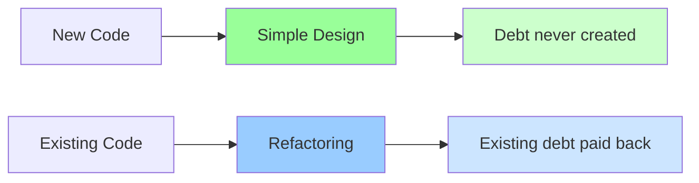

#### MediTrack — Clinical Decision Support Module

When implementing each new drug formulary update, the team writes only what is needed for that specific update — no extra conditions, no speculative logic for future scenarios. The simplest solution that passes all tests. This prevents new Technical Debt from forming with every rushed update.

**One line summary:**

> Simple Design prevents Technical Debt by building only what is needed now — the simplest solution that works, nothing more.

***

### 5. Refactoring

#### What it is

Restructuring existing code to be cleaner and simpler — **without changing its external behaviour.** The system does exactly the same thing before and after. Features don't change. Bugs don't get fixed. New functionality doesn't get added. Only the internal structure improves.

> This constraint is critical — if behaviour changes, it's not refactoring, it's rewriting. Refactoring is safe precisely because behaviour doesn't change.

#### The kitchen analogy

Before reorganising: pots in random cupboards, utensils everywhere, spices mixed with cleaning products. Cooking works but takes forever to find anything.

After reorganising: everything grouped logically, fast to find, easy to maintain. The food produced is identical. Only the kitchen's internal organisation changed.

**Strengths and when to use:**

**Pays back existing Technical Debt safely** _(advantage)_ — restructures fragile code into clean understandable form without risking broken functionality _**(when to use: after Technical Debt has accumulated — Stage 3–4 of the lifecycle)**_.

**Makes each subsequent change faster** _(advantage)_ — clean code is easier to understand and modify, so future features cost less _**(when to use: regularly, after every feature is implemented — not as a one-off cleanup)**_.

**Weaknesses and when not to use:**

**Requires comprehensive tests first** _(disadvantage)_ — without tests you can't confirm behaviour hasn't changed during restructuring _**(when not to use: untested codebases — refactoring without tests is risky)**_.

**Takes time that teams resist spending** _(disadvantage)_ — refactoring produces no new visible features, making it hard to justify to management _**(when not to use: when team lacks discipline to prioritise it — requires Scrum Master or XP coach support)**_.

#### Simple Design vs Refactoring — full picture

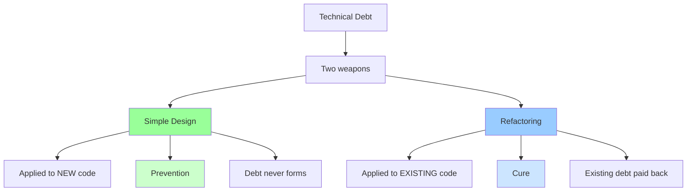

#### MediTrack — Clinical Decision Support Module

The rushed fixes across the Clinical Decision Support Module have created fragile, undocumented code. Refactoring would restructure that code — merging duplicate alert conditions, clarifying undocumented logic, simplifying complex branching — without changing what the alerts actually do. Then Simple Design prevents the next round of updates from creating the same mess.

**One line summary:**

> Refactoring pays back existing Technical Debt by restructuring code into cleaner form — without changing what the system does.

***

### 6. Pair Programming

#### What it is

Two developers. One computer. One keyboard. All production code written together. They are not doing the same thing — they have distinct roles that switch regularly.

#### Driver vs Navigator

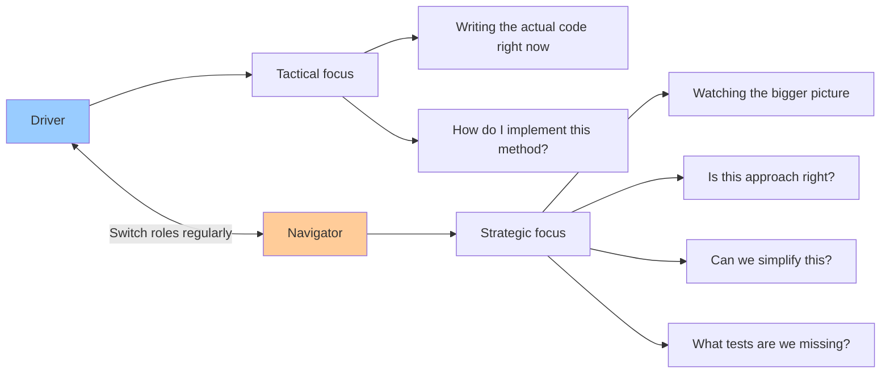

#### The rally car analogy

Driver focuses on the road immediately ahead — steering, accelerating, braking. Navigator reads the map, calls out upcoming turns, spots hazards before they arrive. Neither can do both jobs well simultaneously. Together they are faster and safer than either alone.

#### Three things Pair Programming does

**1. Continuous informal review** Every line of code is reviewed the moment it's written — not days later in a formal review. Navigator catches mistakes, bad design, and shortcuts in real time before they enter the codebase. Directly prevents Technical Debt from forming.

**2. Collective ownership** Pairs rotate — developer A works with B on Monday, with C on Tuesday. Everyone touches every part of the codebase. Nobody owns a private corner that only they understand. Directly kills the "nobody understands this module" problem.

**3. Knowledge transfer** Both directions simultaneously:

* Senior as Driver, Junior as Navigator → Junior learns by watching, asks questions in real time, catches simple mistakes senior might overlook
* Junior as Driver, Senior as Navigator → Junior learns by doing, Senior catches bad decisions immediately, corrects misunderstandings instantly

**Strengths and when to use:**

**Catches bugs before they enter the codebase** _(advantage)_ — navigator reviews every line in real time, reducing bug rates by approximately 15% _**(when to use: complex, high-risk code where mistakes are expensive — Drug Interaction Engine, Legacy Data Migration Module)**_.

**Collective ownership eliminates single points of failure** _(advantage)_ — rotating pairs means no module is a black box understood by only one person _**(when to use: fragile legacy code where institutional knowledge is dangerously concentrated — Legacy Data Migration Module)**_.

**Accelerates knowledge transfer** _(advantage)_ — new team members learn the codebase in real time through both roles _**(when to use: onboarding new developers, cross-training teams)**_.

**Weaknesses and when not to use:**

**Apparently slower in the short term** _(disadvantage)_ — two people on one task looks inefficient to managers _**(when not to use: simple, repetitive, low-risk tasks where the overhead isn't justified)**_.

**Requires compatible working styles** _(disadvantage)_ — pairs with very different speeds or approaches can create friction _**(when not to use: when developers are geographically distributed — remote pairing is harder)**_.

#### The apparently slower paradox

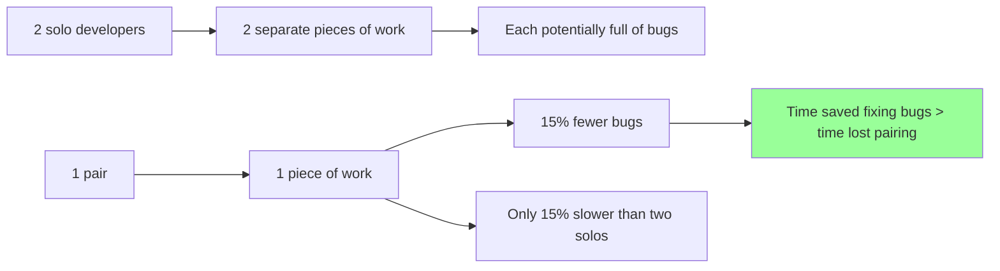

#### MediTrack — Legacy Data Migration Module

The module has fragile, poorly documented data schemas that nobody fully understands. Pair Programming fixes both problems simultaneously:

**Continuous informal review** — Navigator catches fragile logic and missing documentation in real time, before it compounds the existing Technical Debt.

**Collective ownership** — rotating pairs mean multiple developers understand the data schemas, eliminating the single point of failure where one developer leaving cripples the entire module.

**One line summary:**

> Pair Programming attacks Technical Debt at the human level — bad decisions are caught before they become bad code, and knowledge is shared so no developer becomes a bottleneck.

***

### 7. Test Driven Development (TDD)

#### What it is

TDD flips the normal order of development — instead of writing code then testing it, you write the test first, then write the minimum code needed to pass it.

> Tests written after code tend to test what the code _does_, not what it _should_ do. Bugs hide in the gap between the two. TDD eliminates that gap.

#### The Red Green Refactor cycle

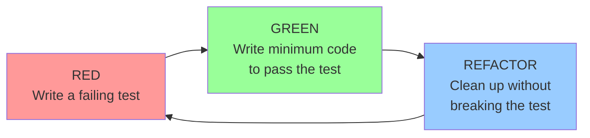

**Red** — write a test for the feature before any code exists. It fails immediately. That's expected — the feature doesn't exist yet.

**Green** — write the _minimum_ code needed to make that test pass. Nothing more. No extra logic, no future-proofing.

**Refactor** — clean up using Simple Design principles. The test ensures behaviour hasn't changed.

Repeat for every feature.

#### The analogy

Building to a blueprint vs drawing the blueprint after building.

Traditional = build the wall, then check if it's straight. TDD = define "straight" first, then build to that definition. The test _is_ the specification.

#### Connection to other XP practices

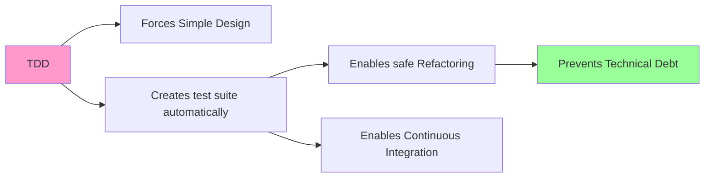

**Strengths and when to use:**

**Tests become the specification** _(advantage)_ — writing tests first forces developers to define correct behaviour before writing code, eliminating ambiguity _**(when to use: complex business logic requiring precision — Drug Interaction Engine dosage calculations where a decimal error causes patient harm)**_.

**Enables safe Refactoring** _(advantage)_ — every feature has a test, so restructuring code is safe — the test suite immediately catches any behaviour change _**(when to use: codebases requiring frequent refactoring — Clinical Decision Support Module)**_.

**Catches bugs at zero cost** _(advantage)_ — bugs are caught the moment they're introduced, not days later _**(when to use: safety-critical systems where late bug discovery is expensive or dangerous)**_.

**Weaknesses and when not to use:**

**Slower initially** _(disadvantage)_ — writing tests before code takes more upfront time and feels counterintuitive _**(when not to use: throwaway prototypes or exploratory code where requirements are completely unknown)**_.

**Requires discipline** _(disadvantage)_ — teams under pressure skip writing tests first and revert to code-then-test _**(when not to use: teams without TDD coaching — discipline collapses under deadline pressure)**_.

#### MediTrack — Drug Interaction Engine

TDD would define the expected output for every dosage calculation _before_ writing the calculation logic — making it impossible to ship code that hasn't been verified against a precise specification. Every edge case — paediatric dosing, renal function thresholds, boundary values at 0.6 and 4.0 mg/dL — would be a test before it was ever a line of code.

**One line summary:**

> TDD writes tests before code — forcing developers to define correct behaviour upfront, catching bugs at zero cost, and enabling safe refactoring throughout the lifecycle.

***

### 8. Continuous Integration (CI)

#### What it is

Every developer commits code to a shared repository multiple times per day. Every commit triggers an automated build and full test suite. If anything breaks, the team knows immediately — while the code is fresh in the developer's mind.

> The longer teams wait to integrate, the more painful integration becomes. CI makes integration a non-event by doing it constantly.

#### How it works

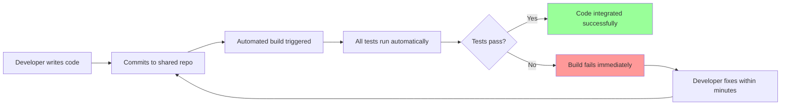

**The XP ten-minute build rule** — the entire system should build and all tests run in under 10 minutes. Short build = fast feedback = problems fixed while context is fresh.

#### Connection to other XP practices

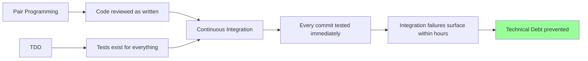

CI is the safety net that makes everything else work. Pair Programming catches problems in code. TDD defines correct behaviour. CI verifies the whole system still works every time anyone changes anything.

**Strengths and when to use:**

**Integration failures surface within hours not weeks** _(advantage)_ — because code is integrated multiple times daily, conflicts are small and cheap to fix _**(when to use: teams where multiple developers work on the same codebase simultaneously — MediTrack prescription engine and pharmacy system)**_.

**Complements TDD perfectly** _(advantage)_ — TDD creates the test suite, CI runs it automatically on every commit _**(when to use: any team practising TDD — the two practices are designed to work together)**_.

**Weaknesses and when not to use:**

**Requires investment in automation infrastructure** _(disadvantage)_ — CI pipelines need setup, maintenance, and fast test suites _**(when not to use: very small projects or short-lived prototypes where infrastructure cost outweighs benefit)**_.

**Useless without good test coverage** _(disadvantage)_ — CI runs whatever tests exist — poor coverage gives false confidence _**(when not to use: codebases without TDD or comprehensive test suites — CI without tests is meaningless)**_.

#### MediTrack — Prescription Engine + Pharmacy System

The integration failures between the prescription engine and legacy pharmacy system would have been caught within hours if CI was in place. Every commit to either system would trigger integration tests, surfacing schema mismatches the same day they were introduced — not during a Sprint Review weeks later.

**One line summary:**

> Continuous Integration merges and tests code multiple times daily — surfacing integration failures immediately while they're cheap to fix, rather than discovering them late when they're expensive.

***

### 9. XP Practices — Complete Picture

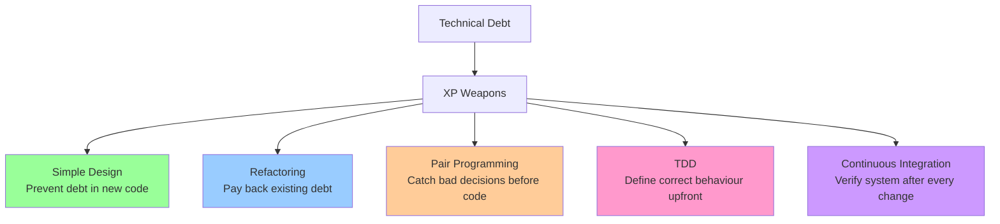

***

### 10. Scrum

#### What it is

A lightweight framework that helps teams deliver value continuously through short, structured cycles called Sprints — inspecting and adapting at every step.

#### Three pillars

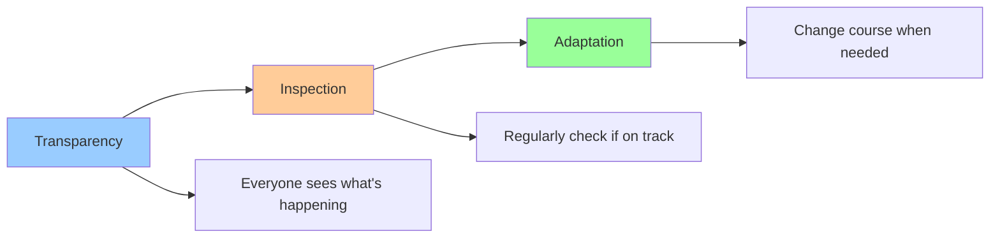

> Without transparency you can't inspect. Without inspection you can't adapt. Without adaptation you're just Waterfall with shorter phases.

#### The restaurant analogy

| Scrum concept   | Restaurant equivalent                     |
| --------------- | ----------------------------------------- |
| Product Owner   | Head chef — decides what dishes to serve  |
| Scrum Master    | Kitchen manager — removes obstacles       |
| Developers      | Kitchen staff — self-organising           |
| Sprint          | Dinner service — time-boxed period        |
| Product Backlog | Full menu — everything that could be made |
| Sprint Backlog  | Tonight's orders — what we're making now  |

#### Three roles

**Product Owner** — owns the Product Backlog, decides _what_ gets built and in _what order_, represents customer and business inside the team. One person — not a committee.

**Scrum Master** — accountable for team effectiveness, removes impediments, coaches on Scrum, facilitates all events. Not a manager — a servant leader.

**Developers** — build the product, self-organising, cross-functional, collectively accountable for the increment.

#### The Sprint — heart of Scrum

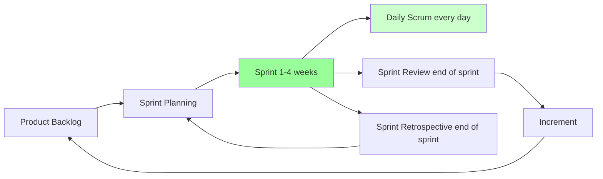

#### Four ceremonies

| Ceremony                 | When            | Purpose                             | Time-box    |
| ------------------------ | --------------- | ----------------------------------- | ----------- |
| **Sprint Planning**      | Start of Sprint | Decide what to build and how        | Max 8 hours |
| **Daily Scrum**          | Every day       | Inspect progress, identify blockers | 15 minutes  |
| **Sprint Review**        | End of Sprint   | Show what was built to stakeholders | Max 4 hours |
| **Sprint Retrospective** | End of Sprint   | Reflect on how the team worked      | Max 3 hours |

#### Daily Scrum — deep

Three questions, 15 minutes, same time, same place, every day:

1. What did I do yesterday toward the Sprint Goal?
2. What will I do today toward the Sprint Goal?
3. Do I have any blockers?

> Not a problem-solving meeting. Problems are _identified_ here, solved _outside_.

**MediTrack:** When a developer encounters a schema mismatch between the prescription engine and pharmacy system, they flag it at the next Daily Scrum. Scrum Master pulls in the Legacy Data team the same day — failure contained within 24 hours.

#### Sprint Retrospective — deep

End of every Sprint. Team inspects three areas:

| Inspection area              | MediTrack example                                        |
| ---------------------------- | -------------------------------------------------------- |
| Individuals and interactions | Are prescription and pharmacy teams communicating?       |
| Processes and tools          | Is integration testing catching schema mismatches early? |
| Definition of Done           | Should integration tests be added to DoD?                |

Output must be a **concrete improvement plan** — not just discussion. Improvements added to next Sprint Backlog as tasks.

#### Three artefacts

**Product Backlog** — single source of all work. Everything that could ever be built. Continuously refined and reprioritised. Owned by Product Owner.

**Sprint Backlog** — plan for the current Sprint. Sprint Goal + selected items + tasks. Owned by Developers. Updated daily.

**Increment** — working, usable product at end of Sprint. Must meet Definition of Done. Builds on previous increments.

**Strengths and when to use:**

**Regular delivery rhythm** _(advantage)_ — working software every Sprint gives stakeholders visibility and builds confidence _**(when to use: complex problems where requirements evolve, stakeholders need regular progress visibility)**_.

**Early problem detection** _(advantage)_ — daily inspection means blockers surface within 24 hours, not at Sprint end _**(when to use: integration-heavy work like prescription engine and pharmacy system connections)**_.

**Weaknesses and when not to use:**

**Doesn't handle unpredictable urgent work well** _(disadvantage)_ — Sprint commitment means urgent work disrupts the Sprint Goal _**(when not to use: emergency response work like Clinical Alerts — use Kanban instead)**_.

**Can become mechanical** _(disadvantage)_ — teams go through the motions of ceremonies without real inspection or adaptation _**(when not to use: teams without Scrum Master discipline — ceremonies become box-ticking)**_.

**One line summary:**

> Scrum organises a team into short delivery cycles with built-in checkpoints — problems surface early, progress is visible, and the team adapts continuously rather than discovering failure at the end.

***

### 11. Kanban + WIP Limits

#### What it is

A visual workflow management system that maximises flow by limiting how much work is in progress at any one time.

**Origin:** Toyota Production System, 1940s. _Kanban_ means "visual signal" in Japanese. Toyota limited parts at each production stage to prevent bottlenecks. Software teams adopted this in the 2000s.

#### How it works — the board

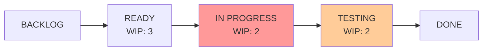

Every piece of work is a card. Every stage is a column. Cards move left to right. **WIP Limits cap how many cards can be in each column simultaneously.**

#### The coffee shop analogy

| Coffee shop     | Kanban      |
| --------------- | ----------- |
| Orders placed   | Backlog     |
| Order confirmed | Ready       |
| Making drink    | In Progress |
| Quality check   | Testing     |
| Served          | Done        |

If a barista can only make 2 drinks at once — WIP limit of 2 for In Progress. Without it, barista starts 8 drinks simultaneously, nothing gets finished properly, quality drops.

#### WIP Limits — why they work

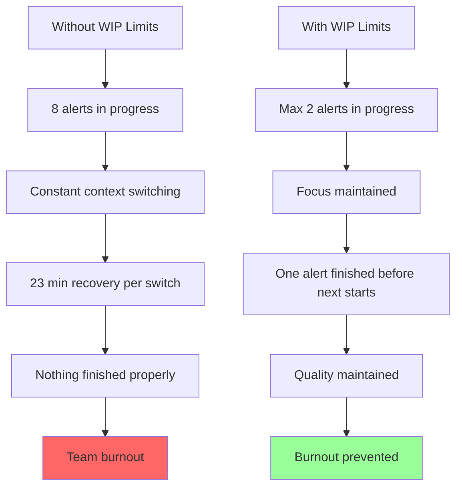

> Counterintuitive truth — **doing less work simultaneously makes you deliver more overall.**

#### WIP Limits — without vs with

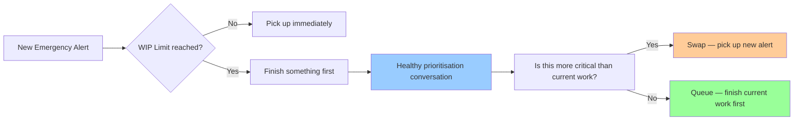

**Strengths and when to use:**

**Handles unpredictable work naturally** _(advantage)_ — no fixed sprints means new urgent work enters the board immediately _**(when to use: emergency response work, support queues, operations — Emergency Clinical Alerts at MediTrack)**_.

**WIP Limits prevent burnout** _(advantage)_ — capping simultaneous work maintains focus and prevents the cognitive overload of context switching between multiple emergencies _**(when to use: high-pressure incident response teams where burnout is a real risk)**_.

**Visual transparency** _(advantage)_ — board shows everyone exactly what's happening at every stage, making bottlenecks immediately visible _**(when to use: teams needing shared visibility across distributed work stages)**_.

**Continuous delivery** _(advantage)_ — work ships as soon as it's done, not at Sprint end _**(when to use: ongoing maintenance and operations where each item has independent value)**_.

**Weaknesses and when not to use:**

**No structured planning rhythm** _(disadvantage)_ — no natural moment to commit to features or give stakeholders predictable release dates _**(when not to use: fixed deadline work like Scheduled Monthly Compliance Reports — use Scrum)**_.

**No defined roles** _(disadvantage)_ — without formal accountability, teams ignore WIP limits under pressure, defeating the entire purpose _**(when not to use: teams without strong discipline or coaching)**_.

**Hard to measure velocity** _(disadvantage)_ — no sprint cadence makes capacity planning and forecasting difficult _**(when not to use: when predictable delivery estimates are required by stakeholders)**_.

#### MediTrack — Emergency Clinical Alerts

Emergency alerts arrive unpredictably — a drug interaction failure doesn't wait for Sprint Planning. Kanban lets the team respond immediately. WIP Limits of 2 on In Progress ensure developers finish one alert properly before picking up the next — preventing the burnout of simultaneously firefighting multiple critical alerts. The visual board makes every alert's status visible to the entire team instantly.

**One line summary:**

> Kanban maximises flow for unpredictable work by making it visible and limiting simultaneous effort — the natural fit for emergency and operations work that can't be planned in sprints.

***

### 12. Scrum vs Kanban — Full Comparison

```mermaid
graph TD
    A[Work arrives] --> B{Predictable and plannable?}
    B -->|Yes| C[SCRUM]
    B -->|No| D[KANBAN]
    C --> E[Sprint Planning]
    E --> F[2-week Sprint]
    F --> G[Sprint Review]
    G --> H[Increment delivered]
    D --> I[Added to Kanban board]
    I --> J[WIP Limits control flow]
    J --> K[Delivered when done]
    style C fill:#99ccff
    style D fill:#ffcc99
```

| Dimension            | Scrum                                   | Kanban                      |
| -------------------- | --------------------------------------- | --------------------------- |
| Work structure       | Time-boxed sprints                      | Continuous flow             |
| Planning             | Sprint Planning every 2 weeks           | Continuous reprioritisation |
| Roles                | Product Owner, Scrum Master, Developers | No defined roles            |
| Change mid-cycle     | Not allowed during Sprint               | Anytime                     |
| Best for             | Predictable, planned work               | Unpredictable, urgent work  |
| Delivery             | End of Sprint                           | As soon as item is done     |
| Ceremonies           | 4 fixed ceremonies                      | No required ceremonies      |
| Velocity measurement | Story points per Sprint                 | Cycle time per item         |
| MediTrack fit        | Compliance Reports                      | Emergency Clinical Alerts   |

#### MediTrack — why each fits

**Scrum for Compliance Reports** — the report is predictable, plannable, has a fixed monthly deadline, and requires coordinated team effort. Sprint Planning commits the team to the report as a Sprint Goal. The fixed cadence ensures delivery before month end.

**Kanban for Emergency Alerts** — alerts arrive unpredictably driven by external factors. They can't wait 2 weeks for Sprint Planning. Kanban lets the team respond immediately. WIP Limits prevent burnout during high-pressure incident response.

***

### 13. Exam Answers

#### Q2a — Simple Design + Refactoring \[10 marks]

_Apply Simple Design and Refactoring to the Clinical Decision Support Module. Explain how they work together to reduce Technical Debt and improve maintainability._

> The Clinical Decision Support Module at MediTrack suffers from significant Technical Debt — frequent drug formulary updates arriving with one week's notice have forced the team into rushed fixes, layering poorly documented patches on top of each other until new safety rules break existing alert logic.
>
> Simple Design addresses this at the point of creation. When implementing each new drug formulary update, the team writes only what is needed for that specific update — no extra conditions, no speculative logic for future scenarios, no clever architecture that makes the code harder to understand. The rule is simple: build the simplest solution that passes all tests. This prevents new Technical Debt from forming with every update.
>
> Refactoring addresses the debt that already exists. After each update is implemented and tested, the team reviews the surrounding code and restructures it — merging duplicate alert conditions, clarifying undocumented logic, simplifying complex branching — without changing what the alerts actually do. The system behaves identically before and after. Only the internal structure improves.
>
> Together they attack Technical Debt from both ends simultaneously — Simple Design prevents new debt from forming while Refactoring pays back existing debt. Over time the codebase becomes progressively cleaner, making each subsequent drug formulary update faster and safer to implement rather than increasingly dangerous.

***

#### Q2b — Pair Programming \[10 marks]

_Critically evaluate Pair Programming as a strategy for mitigating Technical Debt in the Legacy Data Migration Module, focusing on continuous informal review and collective ownership._

> The Legacy Data Migration Module at MediTrack is burdened by Technical Debt from previous rushed iterations — fragile, poorly documented data schemas that cause unexpected failures when changed, and code that no single developer fully understands.
>
> Pair Programming addresses this through two mechanisms simultaneously. First, continuous informal review — every line of code is reviewed the moment it is written by the Navigator, catching fragile logic, missing documentation, and shortcuts in real time before they compound the existing debt. This is fundamentally more effective than formal review cycles because problems are caught at zero cost — before they are ever committed to the codebase.
>
> Second, collective ownership — as pairs rotate across the module, multiple developers gain understanding of the data schemas. The dangerous concentration of knowledge in one developer is eliminated. When a developer writes code as Driver while a senior acts as Navigator, misunderstandings about schema logic are corrected immediately. When roles reverse, the junior learns by doing while the senior catches errors in real time.
>
> Together these mechanisms directly address MediTrack's core problem — a module so poorly understood that changes cause unexpected failures. Pair Programming ensures no future change is made in isolation, and no schema logic remains undocumented and privately held.

***

#### Q3a — Scrum vs Kanban \[10 marks]

_Compare Scrum for Scheduled Monthly Compliance Report Generation versus Kanban for Emergency Clinical Alerts. Explain WIP Limits and how they prevent team burnout._

> The Scheduled Monthly Compliance Report Generation is a predictable, plannable task with a fixed deadline — it occurs every month, has known scope, and requires coordinated team effort to deliver on time. Scrum is the natural fit because Sprint Planning allows the team to commit to the report as a Sprint Goal, breaking it into tasks across a 2-week cycle. The fixed Sprint cadence ensures the report is delivered before the month ends, with Sprint Review providing a formal checkpoint for stakeholders to validate the output.
>
> Emergency Clinical Alerts are fundamentally different — they arrive unpredictably, driven by external factors like new drug interactions or system failures, and cannot wait for a Sprint Planning cycle. Kanban is the natural fit because there are no fixed sprints — new alerts enter the board immediately and are prioritised continuously. The visual board gives the entire team instant visibility of every alert's status, and work flows continuously from Backlog to Done with each alert shipping as soon as it is resolved.
>
> WIP Limits are caps on how many items can be in any given stage of the Kanban board simultaneously. A WIP limit of 2 on In Progress means a maximum of 2 alerts can be actively worked on at once — no new alert enters until one is completed. During high-pressure incident response, without WIP limits the team would pick up every incoming alert simultaneously, context switching constantly, finishing nothing properly, and burning out under the combined cognitive load. WIP limits force the team to finish one alert before starting the next — maintaining focus, protecting quality, and creating a natural prioritisation conversation when capacity is full rather than chaotic firefighting.
>
> In summary — Scrum brings structure and rhythm to predictable planned work, while Kanban brings flow and focus to unpredictable urgent work. MediTrack needs both simultaneously because compliance and emergencies are two fundamentally different types of work requiring two fundamentally different management approaches.

***

#### Q3b — Daily Scrum + Sprint Retrospective \[10 marks]

_Explain Daily Standups and Sprint Retrospectives in the MediTrack context. Propose how a Scrum Master would use them to identify and resolve integration failure root causes._

> The Daily Standup is a 15-minute time-boxed event held every working day at the same time and place. Every developer answers three questions: What did I do yesterday toward the Sprint Goal? What will I do today? Do I have any blockers? It is not a problem-solving meeting — problems are identified here and solved outside. When a developer encounters a schema mismatch between the prescription engine and the legacy pharmacy system, they flag it at the next morning's standup. The Scrum Master hears this immediately, pulls in the Legacy Data team the same day, and the failure is contained within 24 hours rather than discovered at Sprint end.
>
> The Sprint Retrospective is a time-boxed ceremony held at the end of every Sprint — maximum 3 hours. The team inspects three areas: individuals and interactions, processes and tools, and the Definition of Done. The output must be a concrete improvement plan — not just discussion — with actions added to the next Sprint Backlog. After a Sprint where multiple integration failures occurred, the Scrum Master facilitates the Retrospective to find the root cause pattern rather than treating each failure as an isolated incident. The team identifies that integration testing was absent from the Definition of Done, that no shared schema validation existed between teams, and that developers were working in isolation without cross-team communication built into the process. These become concrete Sprint Backlog items — schema validation added to Definition of Done, a cross-team sync task added to every Sprint involving pharmacy system touches.
>
> Daily Standups detect integration failures within 24 hours of occurrence — Sprint Retrospectives ensure the same failures never happen again.

***

_Problem 2 Complete — Ready for Problem 3: Software Testing_
