# Problem 3 — Software Testing

### How do you know software works?

> **Exam questions:** Q4 + Q5 — 40 marks total (Q4a, Q4b, Q5a, Q5b — 10 marks each) **Weeks:** 5, 6, 8, 9, 11, 12 **MediTrack modules:** Drug Interaction Engine · Legacy Data Migration Module · Clinical Decision Support Module · Patient Intake Module

***

### 1. Big Picture

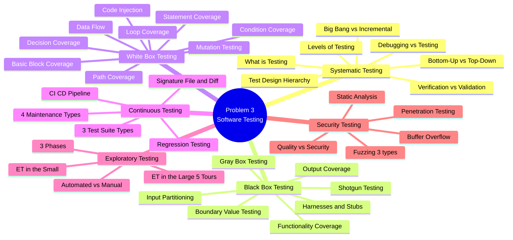
```mermaid
mindmap
  root((Problem 3
    Software Testing))
    Systematic Testing
      What is Testing
      Verification vs Validation
      Debugging vs Testing
      Levels of Testing
      Test Design Hierarchy
      Big Bang vs Incremental
      Bottom-Up vs Top-Down
    Black Box Testing
      Functionality Coverage
      Input Partitioning
      Shotgun Testing
      Boundary Value Testing
      Output Coverage
      Gray Box Testing
      Harnesses and Stubs
    White Box Testing
      Code Injection
      Statement Coverage
      Basic Block Coverage
      Decision Coverage
      Condition Coverage
      Loop Coverage
      Path Coverage
      Data Flow
      Mutation Testing
    Continuous Testing
      4 Maintenance Types
      3 Test Suite Types
      Regression Testing
      Signature File and Diff
      CI CD Pipeline
    Exploratory Testing
      Automated vs Manual
      3 Phases
      ET in the Small
      ET in the Large 5 Tours
    Security Testing
      Quality vs Security
      Buffer Overflow
      Penetration Testing
      Fuzzing 3 types
      Static Analysis
```

***

### 2. Systematic Testing (Weeks 5 + 6)

#### 2.1 What is Testing + Verification vs Validation

**What it is:** Testing is the process of executing software in a controlled manner to answer: _does the software behave as specified?_

**Verification vs Validation — the core split:**

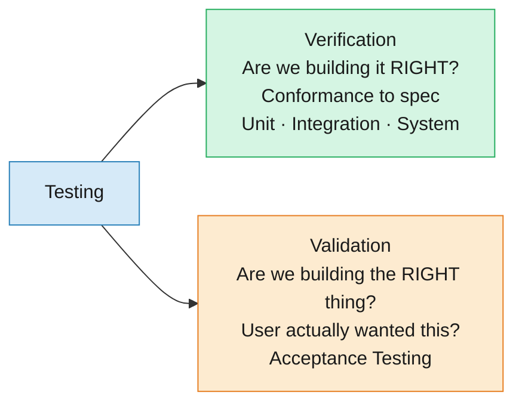
```mermaid
graph LR
    A[Testing] --> B[Verification<br/>Are we building it RIGHT?<br/>Conformance to spec<br/>Unit · Integration · System]
    A --> C[Validation<br/>Are we building the RIGHT thing?<br/>User actually wanted this?<br/>Acceptance Testing]

    style A fill:#d6eaf8,color:#1a1a1a,stroke:#2980b9
    style B fill:#d5f5e3,color:#1a1a1a,stroke:#27ae60
    style C fill:#fdebd0,color:#1a1a1a,stroke:#e67e22
```

|                 | Verification                      | Validation                                  |
| --------------- | --------------------------------- | ------------------------------------------- |
| **Question**    | Are we building it right?         | Are we building the right thing?            |
| **Method**      | Testing, inspection, measurement  | Meetings, reviews, discussions              |
| **Test levels** | Unit, Integration, System         | Acceptance                                  |
| **MediTrack**   | Drug Engine passes all unit tests | Hospital staff accept Patient Intake Module |

**Key insight:** A system can pass every verification test and still fail validation. The Patient Intake Module at MediTrack met its written spec — but reception staff rejected it because the spec did not match their real workflow. That is a validation failure, not a verification failure.

**One line summary:** Verification = built right. Validation = right thing built.

***

#### 2.2 Debugging vs Testing

**What it is:** Debugging and testing are complementary but different activities. Testing systematically searches for bugs. Debugging analyses and locates bugs after they appear.

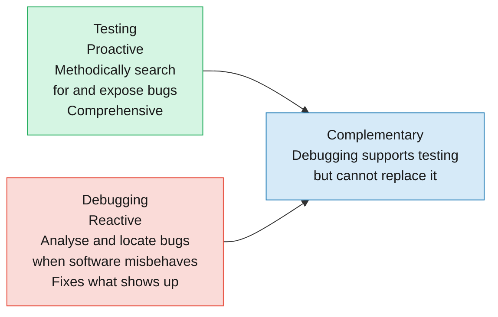
```mermaid
graph LR
    A[Testing<br/>Proactive<br/>Methodically search<br/>for and expose bugs<br/>Comprehensive] --> C[Complementary<br/>Debugging supports testing<br/>but cannot replace it]
    B[Debugging<br/>Reactive<br/>Analyse and locate bugs<br/>when software misbehaves<br/>Fixes what shows up] --> C

    style A fill:#d5f5e3,color:#1a1a1a,stroke:#27ae60
    style B fill:#fadbd8,color:#1a1a1a,stroke:#e74c3c
    style C fill:#d6eaf8,color:#1a1a1a,stroke:#2980b9
```

**Key insight:** No amount of debugging replaces systematic testing. Debugging is reactive — it only finds bugs that happen to show up. Testing is proactive — it hunts for bugs that have not shown up yet.

**One line summary:** Testing finds bugs systematically. Debugging fixes them reactively.

***

#### 2.3 Levels of Testing

**What it is:** Testing is structured into levels matching the hierarchy of specifications — each level tests against a different specification document.

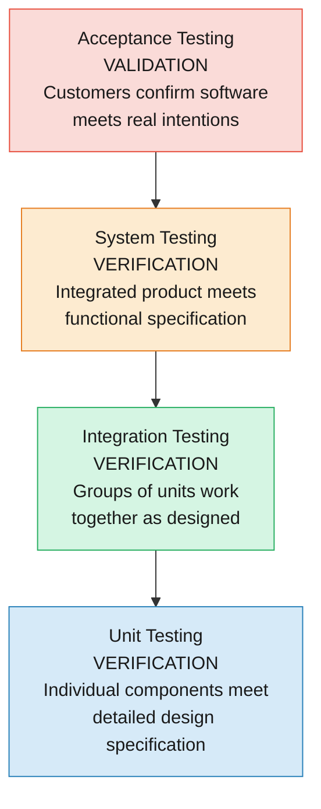
```mermaid
graph TD
    A[Acceptance Testing<br/>VALIDATION<br/>Customers confirm software<br/>meets real intentions] --> B[System Testing<br/>VERIFICATION<br/>Integrated product meets<br/>functional specification]
    B --> C[Integration Testing<br/>VERIFICATION<br/>Groups of units work<br/>together as designed]
    C --> D[Unit Testing<br/>VERIFICATION<br/>Individual components meet<br/>detailed design specification]

    style A fill:#fadbd8,color:#1a1a1a,stroke:#e74c3c
    style B fill:#fdebd0,color:#1a1a1a,stroke:#e67e22
    style C fill:#d5f5e3,color:#1a1a1a,stroke:#27ae60
    style D fill:#d6eaf8,color:#1a1a1a,stroke:#2980b9
```

| Level           | Tests against             | MediTrack example                              |
| --------------- | ------------------------- | ---------------------------------------------- |
| **Unit**        | Detailed design spec      | Test `calculateDose()` in isolation            |
| **Integration** | Architectural design spec | Drug Engine + Legacy Migration connected       |
| **System**      | Functional specification  | End-to-end patient intake → drug check → alert |
| **Acceptance**  | User real intentions      | Hospital staff validate complete workflow      |

**Key insight:** Unit tests pass but system fails — this is exactly the Legacy Data Migration Module scenario. Unit tests used clean stub data. System testing exposed real schema drift between legacy systems.

**One line summary:** Each level tests against a different specification — unit to acceptance, verification to validation.

***

#### 2.4 Test Design Hierarchy

**What it is:** Testing has four levels of planning, each building on the previous.

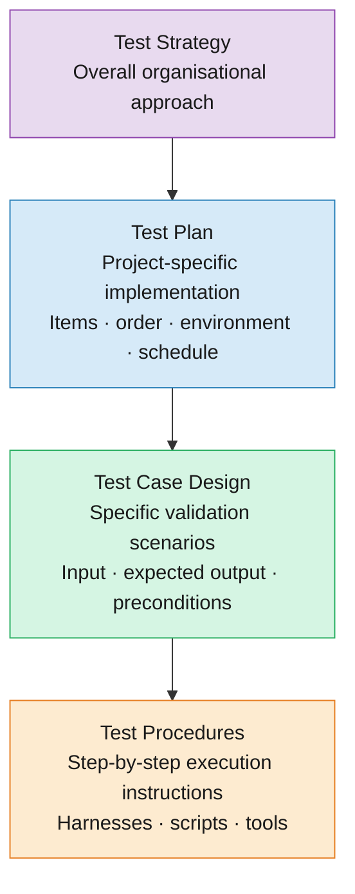
```mermaid
graph TD
    A[Test Strategy<br/>Overall organisational approach] --> B[Test Plan<br/>Project-specific implementation<br/>Items · order · environment · schedule]
    B --> C[Test Case Design<br/>Specific validation scenarios<br/>Input · expected output · preconditions]
    C --> D[Test Procedures<br/>Step-by-step execution instructions<br/>Harnesses · scripts · tools]

    style A fill:#e8daef,color:#1a1a1a,stroke:#8e44ad
    style B fill:#d6eaf8,color:#1a1a1a,stroke:#2980b9
    style C fill:#d5f5e3,color:#1a1a1a,stroke:#27ae60
    style D fill:#fdebd0,color:#1a1a1a,stroke:#e67e22
```

**One line summary:** Strategy sets direction → Plan sets scope → Cases define what → Procedures define how.

***

#### 2.5 Big Bang vs Incremental Testing

**What it is:** Two approaches to organising the order in which testing happens.

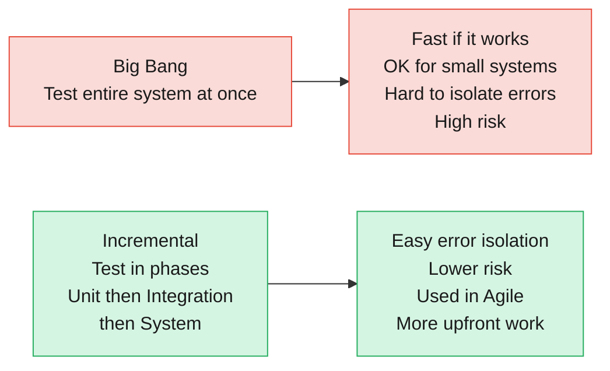
```mermaid
graph LR
    A[Big Bang<br/>Test entire system at once] --> B[Fast if it works<br/>OK for small systems<br/>Hard to isolate errors<br/>High risk]
    C[Incremental<br/>Test in phases<br/>Unit then Integration<br/>then System] --> D[Easy error isolation<br/>Lower risk<br/>Used in Agile<br/>More upfront work]

    style A fill:#fadbd8,color:#1a1a1a,stroke:#e74c3c
    style B fill:#fadbd8,color:#1a1a1a,stroke:#e74c3c
    style C fill:#d5f5e3,color:#1a1a1a,stroke:#27ae60
    style D fill:#d5f5e3,color:#1a1a1a,stroke:#27ae60
```

**Key insight:** Use incremental for anything safety-critical. For the Drug Interaction Engine, testing the entire MediTrack system at once would make it impossible to isolate whether a dosage error originates in the Engine itself or in the Legacy Data migration feeding it.

**One line summary:** Incremental testing isolates errors by building up one level at a time. Big Bang tests everything at once and makes isolation hard.

***

#### 2.6 Bottom-Up vs Top-Down

**What it is:** Two directions for incremental integration testing.

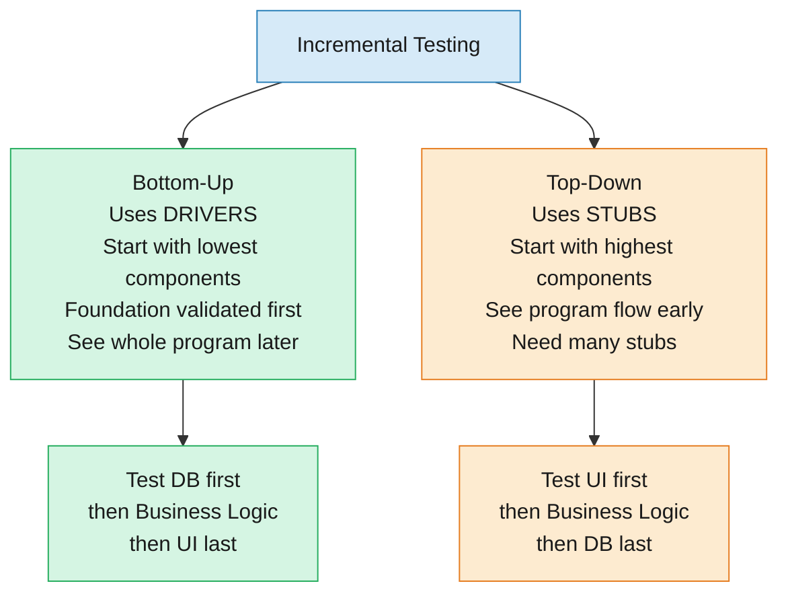
```mermaid
graph TD
    A[Incremental Testing] --> B[Bottom-Up<br/>Uses DRIVERS<br/>Start with lowest components<br/>Foundation validated first<br/>See whole program later]
    A --> C[Top-Down<br/>Uses STUBS<br/>Start with highest components<br/>See program flow early<br/>Need many stubs]
    B --> D[Test DB first<br/>then Business Logic<br/>then UI last]
    C --> E[Test UI first<br/>then Business Logic<br/>then DB last]

    style A fill:#d6eaf8,color:#1a1a1a,stroke:#2980b9
    style B fill:#d5f5e3,color:#1a1a1a,stroke:#27ae60
    style C fill:#fdebd0,color:#1a1a1a,stroke:#e67e22
    style D fill:#d5f5e3,color:#1a1a1a,stroke:#27ae60
    style E fill:#fdebd0,color:#1a1a1a,stroke:#e67e22
```

* **Driver** — a temporary program that calls the unit being tested (used in bottom-up)
* **Stub** — a simplified replacement that returns pre-defined outputs (used in top-down)

**One line summary:** Bottom-up validates the foundation first using drivers. Top-down validates the flow first using stubs.

***

#### 2.7 Test Plans, Cases, Procedures, Reports

| Element            | Contains                                                                                  |
| ------------------ | ----------------------------------------------------------------------------------------- |
| **Test Plan**      | Items to test · testing levels · testing order · environment · schedule · resources       |
| **Test Case**      | What to test · how to test it · expected output — both positive and negative tests        |
| **Test Procedure** | Step-by-step execution — harnesses, scripts, tools (JUnit, Selenium, JMeter)              |
| **Test Report**    | Concise, readable, points out failures clearly, saved in standardised form for comparison |

**Key insight:** Test cases must be designed **without knowledge of the implementation** — otherwise you test what the software does, not what it should do. In TDD, tests are written before implementation.

***

#### 2.8 Black Box vs White Box — Introduction

**What it is:** Two fundamental perspectives for choosing test cases.

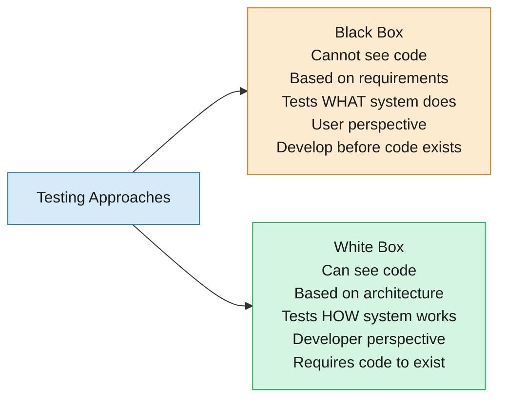
```mermaid
graph LR
    A[Testing Approaches] --> B[Black Box<br/>Cannot see code<br/>Based on requirements<br/>Tests WHAT system does<br/>User perspective<br/>Develop before code exists]
    A --> C[White Box<br/>Can see code<br/>Based on architecture<br/>Tests HOW system works<br/>Developer perspective<br/>Requires code to exist]

    style A fill:#d6eaf8,color:#1a1a1a,stroke:#2980b9
    style B fill:#fdebd0,color:#1a1a1a,stroke:#e67e22
    style C fill:#d5f5e3,color:#1a1a1a,stroke:#27ae60
```

* **Black Box** finds errors of **omission** — things the spec required but were not implemented
* **White Box** finds errors of **commission** — things implemented but implemented incorrectly

**One line summary:** Both perspectives needed. Black Box tests what. White Box tests how.

***

### 3. Black Box Testing (Week 8)

#### 3.1 What is Black Box Testing

**What it is:** A testing method where test cases are chosen solely from requirements, specification, or design documents — without seeing the code.

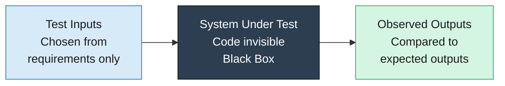
```mermaid
graph LR
    A[Test Inputs<br/>Chosen from<br/>requirements only] --> B[System Under Test<br/>Code invisible<br/>Black Box]
    B --> C[Observed Outputs<br/>Compared to<br/>expected outputs]

    style A fill:#d6eaf8,color:#1a1a1a,stroke:#2980b9
    style B fill:#2c3e50,color:#fff,stroke:#1a1a1a
    style C fill:#d5f5e3,color:#1a1a1a,stroke:#27ae60
```

**Three methods from spec:**

1. **Functionality Coverage** — test each requirement independently
2. **Input Coverage** — test all types of allowed inputs
3. **Output Coverage** — test all types of expected outputs

**Key advantage:** Tests can be developed in parallel with code — saving time on large projects.

**One line summary:** Black box tests behaviour against requirements without seeing the code.

***

#### 3.2 Functionality Coverage

**What it is:** Partition the functional specification into separate independent requirements, then create one test case per requirement.

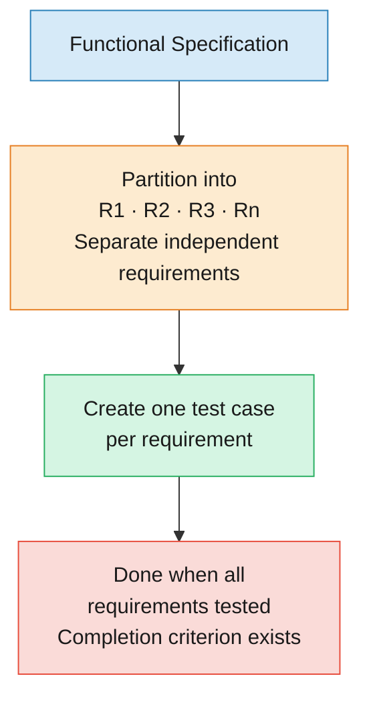
```mermaid
graph TD
    A[Functional Specification] --> B[Partition into<br/>R1 · R2 · R3 · Rn<br/>Separate independent requirements]
    B --> C[Create one test case<br/>per requirement]
    C --> D[Done when all<br/>requirements tested<br/>Completion criterion exists]

    style A fill:#d6eaf8,color:#1a1a1a,stroke:#2980b9
    style B fill:#fdebd0,color:#1a1a1a,stroke:#e67e22
    style C fill:#d5f5e3,color:#1a1a1a,stroke:#27ae60
    style D fill:#fadbd8,color:#1a1a1a,stroke:#e74c3c
```

**Key insight:** Partitioning often reveals requirements that were not in the original spec. It also catches problems in the specification itself, not just the code.

**MediTrack:** Drug Interaction Engine partitioned into R1 (accept Serum Creatinine input), R2 (validate range 0.6–4.0), R3 (calculate adjusted dose), R4 (output zero on invalid input). One test per requirement.

**One line summary:** Split the spec into independent requirements — one test per requirement — done when all are covered.

***

#### 3.3 Input Partitioning

**What it is:** Divide all possible inputs into equivalence classes — groups where every value in the class is expected to behave identically. Test one representative value per class.

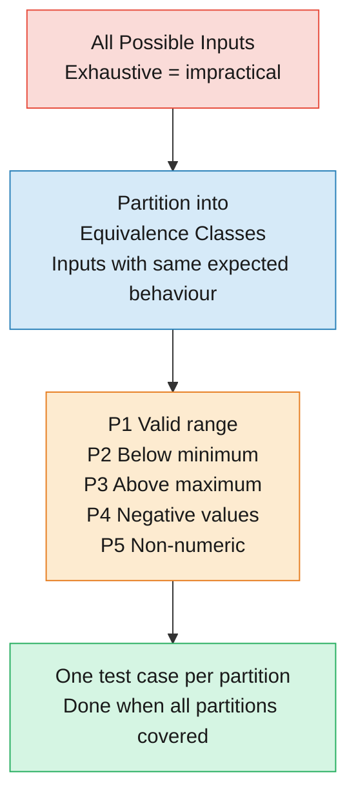
```mermaid
graph TD
    A[All Possible Inputs<br/>Exhaustive = impractical] --> B[Partition into<br/>Equivalence Classes<br/>Inputs with same expected behaviour]
    B --> C[P1 Valid range<br/>P2 Below minimum<br/>P3 Above maximum<br/>P4 Negative values<br/>P5 Non-numeric]
    C --> D[One test case per partition<br/>Done when all partitions covered]

    style A fill:#fadbd8,color:#1a1a1a,stroke:#e74c3c
    style B fill:#d6eaf8,color:#1a1a1a,stroke:#2980b9
    style C fill:#fdebd0,color:#1a1a1a,stroke:#e67e22
    style D fill:#d5f5e3,color:#1a1a1a,stroke:#27ae60
```

**Key insight:** Systematic partition testing may expose that tests for negative inputs are needed — even though the spec never mentioned them. Partitioning reveals gaps in the specification itself.

**MediTrack:** Serum Creatinine partitions — P1: 0.6–4.0 (valid), P2: below 0.6, P3: above 4.0, P4: negative, P5: non-numeric. Five test cases cover the entire input space.

**One line summary:** Group inputs into equivalence classes — one test per class covers all expected behaviour without exhaustive testing.

***

#### 3.4 Shotgun Testing

**What it is:** Generate a large number of random inputs — legal or illegal — and execute them automatically.

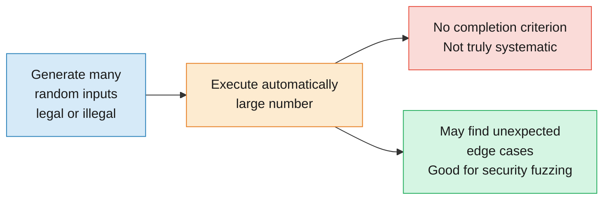
```mermaid
graph LR
    A[Generate many<br/>random inputs<br/>legal or illegal] --> B[Execute automatically<br/>large number]
    B --> C[No completion criterion<br/>Not truly systematic]
    B --> D[May find unexpected<br/>edge cases<br/>Good for security fuzzing]

    style A fill:#d6eaf8,color:#1a1a1a,stroke:#2980b9
    style B fill:#fdebd0,color:#1a1a1a,stroke:#e67e22
    style C fill:#fadbd8,color:#1a1a1a,stroke:#e74c3c
    style D fill:#d5f5e3,color:#1a1a1a,stroke:#27ae60
```

**Key insight:** Shotgun testing is black box but not truly systematic — no completion criterion exists. Best used as a **hybrid** — apply shotgun within each input partition to add confidence beyond simple partition tests. Requires automated output verification to be practical.

**One line summary:** Random inputs at scale — useful for finding unexpected edge cases but not a replacement for systematic partition testing.

***

#### 3.5 Boundary Value Testing

**What it is:** A robustness testing strategy based on the principle that most failures occur at the edges of valid ranges, not in the middle.

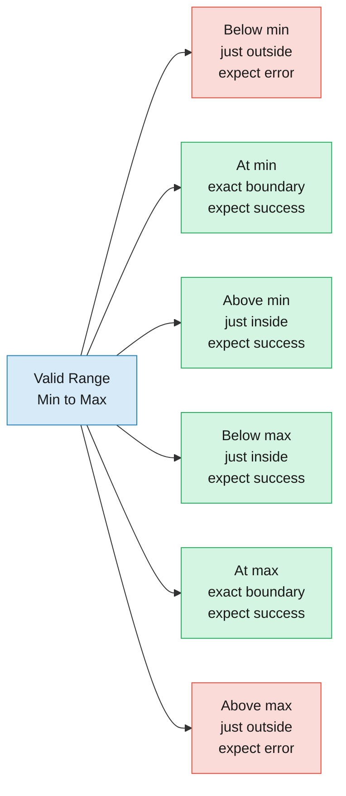
```mermaid
graph LR
    A[Valid Range<br/>Min to Max] --> B[Below min<br/>just outside<br/>expect error]
    A --> C[At min<br/>exact boundary<br/>expect success]
    A --> D[Above min<br/>just inside<br/>expect success]
    A --> E[Below max<br/>just inside<br/>expect success]
    A --> F[At max<br/>exact boundary<br/>expect success]
    A --> G[Above max<br/>just outside<br/>expect error]

    style A fill:#d6eaf8,color:#1a1a1a,stroke:#2980b9
    style B fill:#fadbd8,color:#1a1a1a,stroke:#e74c3c
    style C fill:#d5f5e3,color:#1a1a1a,stroke:#27ae60
    style D fill:#d5f5e3,color:#1a1a1a,stroke:#27ae60
    style E fill:#d5f5e3,color:#1a1a1a,stroke:#27ae60
    style F fill:#d5f5e3,color:#1a1a1a,stroke:#27ae60
    style G fill:#fadbd8,color:#1a1a1a,stroke:#e74c3c
```

**Key insight:** Boundary testing is more effective than random sampling because it has a **completion criterion** — you stop when all boundary points are covered. Random sampling has no such guarantee.

**MediTrack:** Serum Creatinine 0.6–4.0 mg/dL → test 0.59, 0.6, 0.61, 3.99, 4.0, 4.01. A decimal error in the dosage formula produces its most dangerous output at exactly these boundary points.

**One line summary:** Test just below, at, and just above every boundary — failures cluster at edges not in the middle.

***

#### 3.6 Robustness Testing

**What it is:** Testing that the program does not crash on unexpected input.

| Approach                      | How                                       | Goal                                           |
| ----------------------------- | ----------------------------------------- | ---------------------------------------------- |
| **Shotgun Robustness**        | Random garbage inputs                     | Just check: no crash, no hang                  |
| **Boundary Value Robustness** | Test edges of valid ranges systematically | Targeted, systematic, has completion criterion |

**One line summary:** Robustness testing proves the system handles unexpected input gracefully without crashing.

***

#### 3.7 Output Coverage Testing

**What it is:** Analyse all possible outputs from the specification and design inputs that produce each one — instead of starting from inputs.

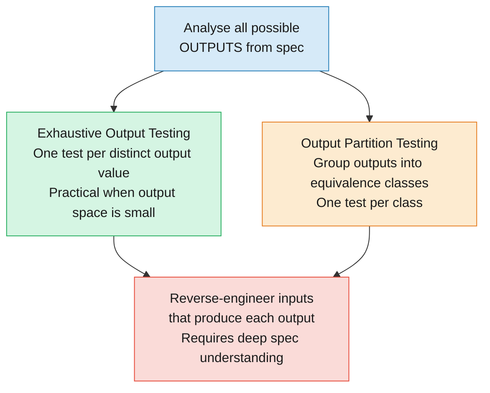
```mermaid
graph TD
    A[Analyse all possible<br/>OUTPUTS from spec] --> B[Exhaustive Output Testing<br/>One test per distinct output value<br/>Practical when output space is small]
    A --> C[Output Partition Testing<br/>Group outputs into equivalence classes<br/>One test per class]
    B --> D[Reverse-engineer inputs<br/>that produce each output<br/>Requires deep spec understanding]
    C --> D

    style A fill:#d6eaf8,color:#1a1a1a,stroke:#2980b9
    style B fill:#d5f5e3,color:#1a1a1a,stroke:#27ae60
    style C fill:#fdebd0,color:#1a1a1a,stroke:#e67e22
    style D fill:#fadbd8,color:#1a1a1a,stroke:#e74c3c
```

**Key insight:** If you cannot find an input to produce a partition → this signals a flaw in the requirements or the partition design itself. Output testing exposes what input testing misses.

**One line summary:** Design inputs that produce each expected output — more difficult than input testing but forces deep understanding of requirements.

***

#### 3.8 Gray Box Testing

**What it is:** Black box testing applied at design level — you know the structure but not the full source code.

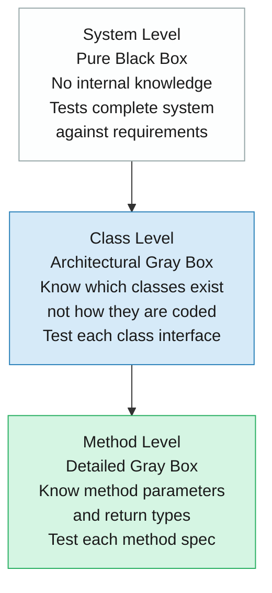
```mermaid
graph TD
    A[System Level<br/>Pure Black Box<br/>No internal knowledge<br/>Tests complete system<br/>against requirements] --> B[Class Level<br/>Architectural Gray Box<br/>Know which classes exist<br/>not how they are coded<br/>Test each class interface]
    B --> C[Method Level<br/>Detailed Gray Box<br/>Know method parameters<br/>and return types<br/>Test each method spec]

    style A fill:#fdfefe,color:#1a1a1a,stroke:#95a5a6
    style B fill:#d6eaf8,color:#1a1a1a,stroke:#2980b9
    style C fill:#d5f5e3,color:#1a1a1a,stroke:#27ae60
```

**Key advantage:** Tests can be written in parallel with coding — catching bugs before the full system is ready.

**One line summary:** Gray Box applies black box methods at the design level — tests written in parallel with code development.

***

#### 3.9 Test Harnesses + Stubs

**What it is:** A test harness is the execution environment for a unit under test. A stub is a simplified replacement for a real dependency.

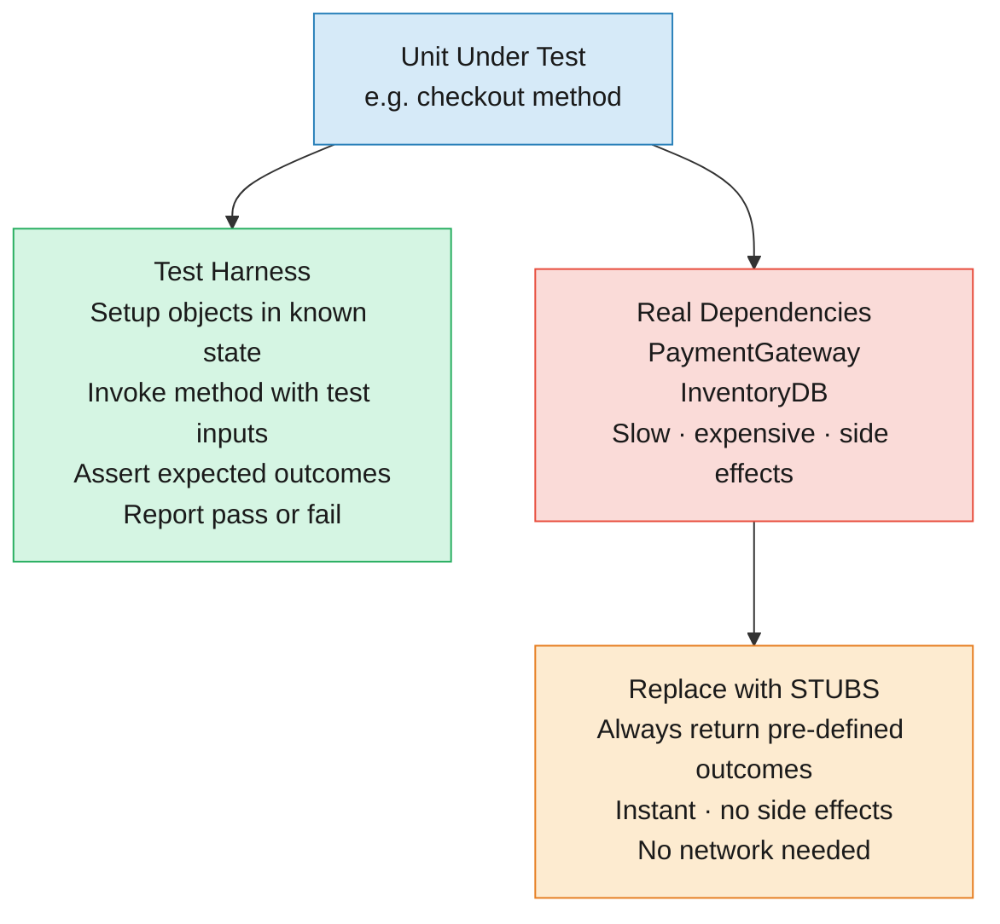
```mermaid
graph TD
    A[Unit Under Test<br/>e.g. checkout method] --> B[Test Harness<br/>Setup objects in known state<br/>Invoke method with test inputs<br/>Assert expected outcomes<br/>Report pass or fail]
    A --> C[Real Dependencies<br/>PaymentGateway<br/>InventoryDB<br/>Slow · expensive · side effects]
    C --> D[Replace with STUBS<br/>Always return pre-defined outcomes<br/>Instant · no side effects<br/>No network needed]

    style A fill:#d6eaf8,color:#1a1a1a,stroke:#2980b9
    style B fill:#d5f5e3,color:#1a1a1a,stroke:#27ae60
    style C fill:#fadbd8,color:#1a1a1a,stroke:#e74c3c
    style D fill:#fdebd0,color:#1a1a1a,stroke:#e67e22
```

**Key insight:** Stubs are replaced **one at a time** during integration testing. A unit test passing with a stub does not mean the full system with a real dependency will pass — the stub bypasses all real failure modes.

**One line summary:** Harnesses run the unit. Stubs isolate it from dependencies. Replace stubs one by one during integration.

***

#### 3.10 Assertions + Class Traces

**What it is:** Assertions are executable specifications — machine-checkable contracts on methods. Class Traces specify legal and illegal sequences of method calls.

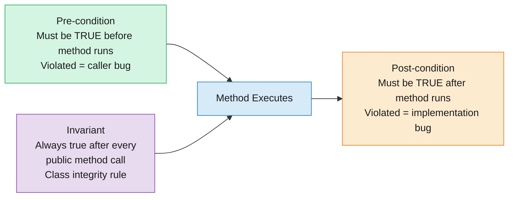
```mermaid
graph LR
    A[Pre-condition<br/>Must be TRUE before method runs<br/>Violated = caller bug] --> B[Method Executes]
    B --> C[Post-condition<br/>Must be TRUE after method runs<br/>Violated = implementation bug]
    D[Invariant<br/>Always true after every<br/>public method call<br/>Class integrity rule] --> B

    style A fill:#d5f5e3,color:#1a1a1a,stroke:#27ae60
    style B fill:#d6eaf8,color:#1a1a1a,stroke:#2980b9
    style C fill:#fdebd0,color:#1a1a1a,stroke:#e67e22
    style D fill:#e8daef,color:#1a1a1a,stroke:#8e44ad
```

**Class Traces:** Specify legal sequences (must succeed) and illegal sequences (must throw exceptions). Example: `new() → push(X) → pop() = X → isEmpty() = true` is a legal trace. `new() → pop()` is illegal — must throw Underflow.

**One line summary:** Assertions make specs executable. Class Traces specify which sequences of calls are legal and which must fail.

***

### 4. White Box Testing (Week 9)

#### 4.1 What is White Box Testing

**What it is:** Testing based on the internal structure and source code of the program — not just its requirements.

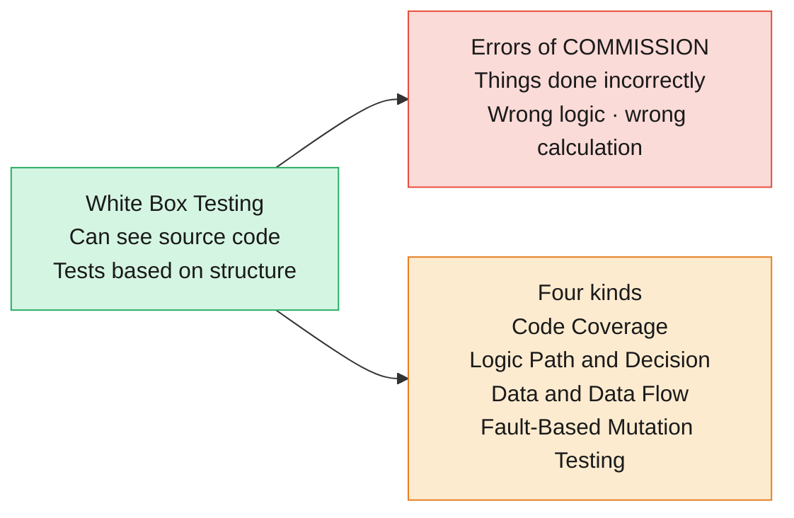
```mermaid
graph LR
    A[White Box Testing<br/>Can see source code<br/>Tests based on structure] --> B[Errors of COMMISSION<br/>Things done incorrectly<br/>Wrong logic · wrong calculation]
    A --> C[Four kinds<br/>Code Coverage<br/>Logic Path and Decision<br/>Data and Data Flow<br/>Fault-Based Mutation Testing]

    style A fill:#d5f5e3,color:#1a1a1a,stroke:#27ae60
    style B fill:#fadbd8,color:#1a1a1a,stroke:#e74c3c
    style C fill:#fdebd0,color:#1a1a1a,stroke:#e67e22
```

**Key insight:** White Box gives a measurable **stop condition** for open-ended black box testing — stop when every statement is covered at least once. Black Box and White Box find different bugs. Both are needed.

**One line summary:** White Box tests the internal structure — finds errors of commission that black box misses.

***

#### 4.2 Code Injection — 3 Levels

**What it is:** Adding extra statements to a **copy** of the program to log or track execution without changing what the program does.

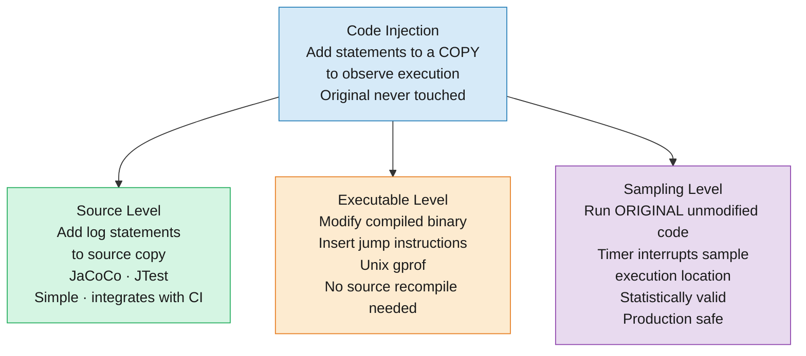
```mermaid
graph TD
    A[Code Injection<br/>Add statements to a COPY<br/>to observe execution<br/>Original never touched] --> B[Source Level<br/>Add log statements<br/>to source copy<br/>JaCoCo · JTest<br/>Simple · integrates with CI]
    A --> C[Executable Level<br/>Modify compiled binary<br/>Insert jump instructions<br/>Unix gprof<br/>No source recompile needed]
    A --> D[Sampling Level<br/>Run ORIGINAL unmodified code<br/>Timer interrupts sample<br/>execution location<br/>Statistically valid<br/>Production safe]

    style A fill:#d6eaf8,color:#1a1a1a,stroke:#2980b9
    style B fill:#d5f5e3,color:#1a1a1a,stroke:#27ae60
    style C fill:#fdebd0,color:#1a1a1a,stroke:#e67e22
    style D fill:#e8daef,color:#1a1a1a,stroke:#8e44ad
```

**4 applications:** Instrumentation (track coverage) · Performance (log time and space) · Assertion (localise failures) · Fault Injection (simulate errors for mutation testing)

**One line summary:** Inject logging into a copy of the code to observe execution — source, executable, or sampling level depending on environment.

***

#### 4.3 Statement + Basic Block Coverage

**What it is:** Statement coverage requires every statement to execute at least once. Basic block coverage groups consecutive statements with no branches inside — if the first executes, all execute.

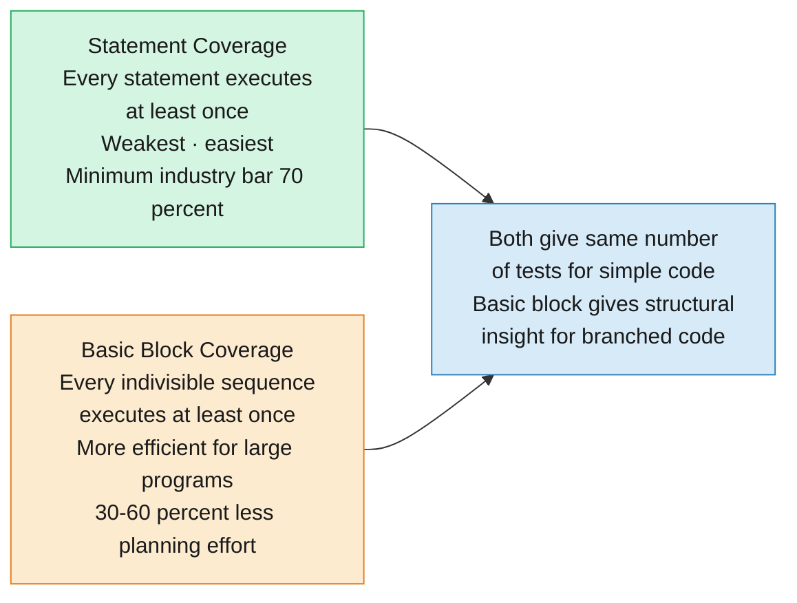
```mermaid
graph LR
    A[Statement Coverage<br/>Every statement executes<br/>at least once<br/>Weakest · easiest<br/>Minimum industry bar 70 percent] --> C[Both give same number<br/>of tests for simple code<br/>Basic block gives structural<br/>insight for branched code]
    B[Basic Block Coverage<br/>Every indivisible sequence<br/>executes at least once<br/>More efficient for large programs<br/>30-60 percent less planning effort] --> C

    style A fill:#d5f5e3,color:#1a1a1a,stroke:#27ae60
    style B fill:#fdebd0,color:#1a1a1a,stroke:#e67e22
    style C fill:#d6eaf8,color:#1a1a1a,stroke:#2980b9
```

**Key insight:** Statement coverage proves statements CAN run — not that they produce correct output. A statement can execute and still compute a wrong result (e.g. using `+` instead of `-`).

**One line summary:** Statement coverage = every line runs once. Basic block = every indivisible sequence runs once. Neither proves correctness.

***

#### 4.4 Decision Coverage

**What it is:** Every decision (if, switch, while, for) in the program must evaluate to both TRUE and FALSE during testing.

```mermaid
graph TD
    A[Identify every decision<br/>if · switch · while · for] --> B[Design TRUE case<br/>Test makes condition TRUE]
    A --> C[Design FALSE case<br/>Test makes condition FALSE]
    B --> D[Formula<br/>Decision outcomes exercised<br/>divided by total decision outcomes<br/>times 100 percent]
    C --> D

    style A fill:#d6eaf8,color:#1a1a1a,stroke:#2980b9
    style B fill:#d5f5e3,color:#1a1a1a,stroke:#27ae60
    style C fill:#fadbd8,color:#1a1a1a,stroke:#e74c3c
    style D fill:#fdebd0,color:#1a1a1a,stroke:#e67e22
```

**MediTrack:** Decision `if (creatinine < 0.6 || creatinine > 4.0)` must be tested TRUE (invalid range — no dose) AND FALSE (valid range — calculate dose). Testing only the valid path leaves the error handling path untested.

**One line summary:** Every branch must be tested in both directions — TRUE and FALSE.

***

#### 4.5 Condition Coverage

**What it is:** Every boolean sub-expression inside a compound condition must evaluate to both TRUE and FALSE independently.

```mermaid
graph LR
    A[Compound Condition<br/>if x equals 1 OR y greater 2<br/>AND z less than 3] --> B[Sub-expression 1<br/>x equals 1<br/>TRUE and FALSE]
    A --> C[Sub-expression 2<br/>y greater than 2<br/>TRUE and FALSE]
    A --> D[Sub-expression 3<br/>z less than 3<br/>TRUE and FALSE]

    style A fill:#d6eaf8,color:#1a1a1a,stroke:#2980b9
    style B fill:#d5f5e3,color:#1a1a1a,stroke:#27ae60
    style C fill:#fdebd0,color:#1a1a1a,stroke:#e67e22
    style D fill:#e8daef,color:#1a1a1a,stroke:#8e44ad
```

**Key insight:** Condition coverage zooms **inside** each decision. Decision coverage only tests the overall outcome. Condition coverage tests each sub-expression independently — catching compound logic bugs decision coverage misses.

**One line summary:** Condition coverage tests each sub-expression in a compound condition both TRUE and FALSE — not just the overall decision.

***

#### 4.6 Loop Coverage

**What it is:** Each loop must be tested at four states to ensure all behaviours are exercised.

```mermaid
graph LR
    A[Loop Under Test] --> B[0 Iterations<br/>Body never executes<br/>Tests guards and<br/>boundary conditions]
    A --> C[1 Iteration<br/>Body runs exactly once<br/>Checks initialisation logic]
    A --> D[2 Iterations<br/>Tests back-edge transition]
    A --> E[N Iterations<br/>Tests sustained repetition<br/>Many times]

    style A fill:#d6eaf8,color:#1a1a1a,stroke:#2980b9
    style B fill:#fadbd8,color:#1a1a1a,stroke:#e74c3c
    style C fill:#fdebd0,color:#1a1a1a,stroke:#e67e22
    style D fill:#d5f5e3,color:#1a1a1a,stroke:#27ae60
    style E fill:#e8daef,color:#1a1a1a,stroke:#8e44ad
```

**Key insight:** Minimum 4 test cases per loop. Each state exercises different behaviour — boundary guard, initialisation, back-edge, sustained repetition.

**One line summary:** Test every loop at zero, one, two, and many iterations.

***

#### 4.7 Path Coverage

**What it is:** Every unique execution path from program entry to exit must be tested. Two paths are independent if at least one statement differs.

```mermaid
graph TD
    A[Program Entry] --> B{Decision 1}
    B -->|TRUE| C[Path A]
    B -->|FALSE| D{Decision 2}
    D -->|TRUE| E[Path B]
    D -->|FALSE| F[Path C]
    C --> G[Program Exit]
    E --> G
    F --> G

    style A fill:#d6eaf8,color:#1a1a1a,stroke:#2980b9
    style B fill:#fdebd0,color:#1a1a1a,stroke:#e67e22
    style C fill:#d5f5e3,color:#1a1a1a,stroke:#27ae60
    style D fill:#fdebd0,color:#1a1a1a,stroke:#e67e22
    style E fill:#d5f5e3,color:#1a1a1a,stroke:#27ae60
    style F fill:#d5f5e3,color:#1a1a1a,stroke:#27ae60
    style G fill:#d6eaf8,color:#1a1a1a,stroke:#2980b9
```

**Key limitation:** Path coverage ignores data complexity. A switch with 5 cases gets 5 tests but a data array implementing the same logic gets only 1. This is why Data Flow coverage exists — to catch what path coverage misses.

**One line summary:** Path coverage is the strongest structural criterion but cannot detect data-specific bugs.

***

#### 4.8 Data Flow — DEF / P-USE / C-USE

**What it is:** Tracks the lifecycle of every variable from definition through all its uses — catches bugs that structural coverage misses.

```mermaid
graph LR
    A[Variable Lifecycle] --> B[DEF<br/>Variable ASSIGNED a value<br/>result = mid]
    A --> C[P-USE<br/>Predicate Use<br/>Used in conditional<br/>if result != -1<br/>Affects control flow]
    A --> D[C-USE<br/>Computation Use<br/>Used in calculation or output<br/>return result<br/>mid = lo plus hi divided by 2]

    style A fill:#d6eaf8,color:#1a1a1a,stroke:#2980b9
    style B fill:#fadbd8,color:#1a1a1a,stroke:#e74c3c
    style C fill:#fdebd0,color:#1a1a1a,stroke:#e67e22
    style D fill:#d5f5e3,color:#1a1a1a,stroke:#27ae60
```

**Coverage strategies — strongest to weakest:**

| Strategy                     | What it tests                                       |
| ---------------------------- | --------------------------------------------------- |
| **All-Uses**                 | Every use (P and C) of every definition — strongest |
| **All P-Uses / Some C-Uses** | All predicate uses, at least one computation use    |
| **All C-Uses / Some P-Uses** | All computation uses, at least one predicate use    |
| **All-Defs**                 | Each definition at least once via any use — weakest |

**One line summary:** Data flow tracks every variable from definition to every use — the strongest white box coverage strategy.

***

#### 4.9 Mutation Testing

**What it is:** A fault-based method that introduces artificial faults (mutants) into source code to check whether the existing test suite detects them.

```mermaid
graph TD
    A[1 Run original suite<br/>Fix until all pass] --> B[2 Save correct outputs<br/>as golden baseline]
    B --> C[3 Generate mutants<br/>One syntactic change each]
    C --> D[4 Run suite against<br/>each mutant]
    D --> E{5 Compare outputs}
    E -->|Different output| F[Mutant KILLED<br/>Test suite detected bug]
    E -->|Same output| G[Mutant SURVIVED<br/>Test gap found]
    G --> H[6 Add new tests<br/>to kill survivors]

    style A fill:#d6eaf8,color:#1a1a1a,stroke:#2980b9
    style B fill:#d5f5e3,color:#1a1a1a,stroke:#27ae60
    style C fill:#fdebd0,color:#1a1a1a,stroke:#e67e22
    style D fill:#e8daef,color:#1a1a1a,stroke:#8e44ad
    style E fill:#fdfefe,color:#1a1a1a,stroke:#95a5a6
    style F fill:#d5f5e3,color:#1a1a1a,stroke:#27ae60
    style G fill:#fadbd8,color:#1a1a1a,stroke:#e74c3c
    style H fill:#d6eaf8,color:#1a1a1a,stroke:#2980b9
```

**3 mutation types:**

| Type          | How                       | Example                  | What bug it catches        |
| ------------- | ------------------------- | ------------------------ | -------------------------- |
| **Value**     | Change constants by ±1    | `y == 0` → `y == 1`      | Off-by-one boundary errors |
| **Decision**  | Invert operators          | `==` → `!=` · `>` → `<`  | Flipped condition logic    |
| **Statement** | Delete or swap statements | Remove `throw exception` | Missing critical code      |

**Mutation Score = Killed ÷ (Total − Equivalent) × 100%**

| Score  | Rating     |
| ------ | ---------- |
| < 50%  | Poor       |
| 50–70% | Acceptable |
| 70–90% | Good       |
| > 90%  | Excellent  |

**Equivalent mutants** change code but not observable behaviour — cannot be killed by any test, excluded from score.

**Key insight:** 100% statement coverage with 62% mutation score means tests execute every line but many do not actually assert the output precisely enough to detect a real bug.

**One line summary:** Mutation testing measures test suite quality — not just coverage — by planting fake bugs and checking whether tests catch them.

***

### 5. Continuous Testing (Week 11)

#### 5.1 Software Maintenance — 4 Types

**What it is:** Maintenance is the phase where software runs in production. It accounts for 85%+ of total software effort — initial development is only \~15%.

```mermaid
graph TD
    A[Software Maintenance<br/>85 percent of total effort] --> B[Corrective<br/>Fix reported failures<br/>Coding errors cheapest<br/>Requirements errors costliest]
    A --> C[Adaptive<br/>New environment<br/>No functionality change<br/>New OS · new platform]
    A --> D[Perfective<br/>Improve performance<br/>maintainability readability<br/>Not triggered by failures]
    A --> E[Preventive<br/>Fix faults before<br/>they become failures<br/>Address early warnings]

    style A fill:#d6eaf8,color:#1a1a1a,stroke:#2980b9
    style B fill:#fadbd8,color:#1a1a1a,stroke:#e74c3c
    style C fill:#fdebd0,color:#1a1a1a,stroke:#e67e22
    style D fill:#d5f5e3,color:#1a1a1a,stroke:#27ae60
    style E fill:#e8daef,color:#1a1a1a,stroke:#8e44ad
```

**MediTrack:** Adding new drug formularies = Perfective. Migrating to a new hospital system API = Adaptive. Fixing a race condition in lab records = Corrective. Adding null-checks after spotting missing validation = Preventive.

**One line summary:** Maintenance is 85% of software effort — four types covering correction, adaptation, improvement, and prevention.

***

#### 5.2 Three Test Suite Types

**What it is:** Three kinds of tests maintained throughout the software lifecycle — together they form the regression suite.

```mermaid
graph LR
    A[Regression Suite<br/>All three combined<br/>Run on every release] --> B[Functionality Tests<br/>Software still meets<br/>specified requirements<br/>Add new test per feature]
    A --> C[Failure Tests<br/>Derived from real<br/>past production failures<br/>Write test FIRST then fix]
    A --> D[Operational Tests<br/>Real production inputs<br/>from actual system use<br/>Ultimate sanity check]

    style A fill:#d6eaf8,color:#1a1a1a,stroke:#2980b9
    style B fill:#d5f5e3,color:#1a1a1a,stroke:#27ae60
    style C fill:#fadbd8,color:#1a1a1a,stroke:#e74c3c
    style D fill:#fdebd0,color:#1a1a1a,stroke:#e67e22
```

**Failure Test lifecycle:** Failure observed → Write test that reproduces it → Confirm old code FAILS → Fix code → Confirm new code PASSES → Add to permanent suite forever.

**Key rule:** A failure test must FAIL on old code and PASS on new code. Never fix first, then write the test.

**One line summary:** Functionality + Failure + Operational tests combined = regression suite run on every release.

***

#### 5.3 Regression Testing

**What it is:** An automated continuous strategy ensuring software does not regress — does not lose existing correct behaviour across new versions.

```mermaid
graph LR
    A[v1.0<br/>Validated baseline<br/>by hand] --> B[v2.0<br/>Passes regression<br/>against v1.0]
    B --> C[v3.0<br/>Passes regression<br/>against v2.0]
    C --> D[vN<br/>Chain back to<br/>original baseline<br/>Induction reasoning]

    style A fill:#d5f5e3,color:#1a1a1a,stroke:#27ae60
    style B fill:#fdebd0,color:#1a1a1a,stroke:#e67e22
    style C fill:#fdebd0,color:#1a1a1a,stroke:#e67e22
    style D fill:#d6eaf8,color:#1a1a1a,stroke:#2980b9
```

**Three goals:**

1. Preserve existing functionality
2. Verify intended changes show up
3. Catch accidental side-effects before production

**Key insight:** Regression testing is NOT finding new bugs. It is verifying that old correct behaviour is still correct.

**MediTrack:** Every bi-weekly release of the Clinical Decision Support Module triggers the full regression suite. New drug rules cannot silently break existing alert logic because every past alert behaviour is covered by the suite.

**One line summary:** Regression testing verifies that fixing one thing did not break another — run on every release without exception.

***

#### 5.4 Behavioural Signature File

**What it is:** A single text file containing all observable artifacts from all tests — the behavioural fingerprint of a software version.

```mermaid
graph TD
    A[Run all tests] --> B[Collect ALL observable artifacts<br/>stdout · stderr · debug trace<br/>time · memory · log files]
    B --> C[Translate all to TEXT<br/>for diff comparison]
    C --> D[Concatenate into ONE<br/>Behavioural Signature File<br/>Unique fingerprint of this version]

    style A fill:#d6eaf8,color:#1a1a1a,stroke:#2980b9
    style B fill:#fdebd0,color:#1a1a1a,stroke:#e67e22
    style C fill:#d5f5e3,color:#1a1a1a,stroke:#27ae60
    style D fill:#e8daef,color:#1a1a1a,stroke:#8e44ad
```

**One line summary:** All test outputs concatenated into one text file — the fingerprint of the version.

***

#### 5.5 Differencing + Normalising

**What it is:** Running `diff` between old and new signature files to find every behavioural change — then classifying each as expected or a regression bug.

```mermaid
graph LR
    A[Old Signature<br/>Previous version] --> B[diff command<br/>diff old new]
    C[New Signature<br/>New version] --> B
    B --> D{Each difference}
    D -->|Expected change<br/>e.g. version string| E[Normalise out<br/>not a regression]
    D -->|Unexpected change<br/>e.g. error message| F[BUG<br/>Investigate<br/>Block release]

    style A fill:#d5f5e3,color:#1a1a1a,stroke:#27ae60
    style B fill:#d6eaf8,color:#1a1a1a,stroke:#2980b9
    style C fill:#fdebd0,color:#1a1a1a,stroke:#e67e22
    style D fill:#fdfefe,color:#1a1a1a,stroke:#95a5a6
    style E fill:#d5f5e3,color:#1a1a1a,stroke:#27ae60
    style F fill:#fadbd8,color:#1a1a1a,stroke:#e74c3c
```

**Normalisation:** Remove known intentional differences (e.g. new version strings) before diffing to reduce noise. Any unexpected diff is a potential regression bug.

**One line summary:** diff old signature vs new — every unexpected difference is a regression bug until proven otherwise.

***

#### 5.6 CI/CD Pipeline

**What it is:** Automated continuous testing triggered on every code commit — making regression testing practical at scale.

```mermaid
graph LR
    A[Developer<br/>commits code] --> B[CI pipeline<br/>triggers automatically]
    B --> C[Unit and functionality tests<br/>hundreds to thousands]
    C --> D[Failure test suite<br/>all historical failures]
    D --> E[Operational tests<br/>real production replays]
    E --> F{All pass?}
    F -->|Yes| G[Promote to staging<br/>then production]
    F -->|No| H[Block build<br/>Alert developer immediately]

    style A fill:#d6eaf8,color:#1a1a1a,stroke:#2980b9
    style B fill:#fdebd0,color:#1a1a1a,stroke:#e67e22
    style C fill:#d5f5e3,color:#1a1a1a,stroke:#27ae60
    style D fill:#d5f5e3,color:#1a1a1a,stroke:#27ae60
    style E fill:#d5f5e3,color:#1a1a1a,stroke:#27ae60
    style F fill:#fdfefe,color:#1a1a1a,stroke:#95a5a6
    style G fill:#d5f5e3,color:#1a1a1a,stroke:#27ae60
    style H fill:#fadbd8,color:#1a1a1a,stroke:#e74c3c
```

**Key insight:** Manual re-testing of the full system after every change is humanly impossible. Automation is what makes continuous testing practical. Google runs 150 million test cases per day.

**One line summary:** Every commit triggers the full regression suite automatically — pass to deploy, fail to block.

***

### 6. Exploratory Testing (Week 12 — Part 1)

#### 6.1 Automated vs Manual

**What it is:** Two complementary modes of testing — automated for scale and consistency, manual exploratory for human judgment and creativity.

```mermaid
graph LR
    A[Testing Approaches] --> B[Automated<br/>Tester writes CODE<br/>Repeatable and fast at scale<br/>Excellent for regression<br/>Limited UX bug detection]
    A --> C[Manual Exploratory<br/>Tester INTERACTS with UI<br/>Human judgment and creativity<br/>Finds business logic bugs<br/>Slower but adaptable]
    B --> D[Complementary<br/>Automated checks expected behaviour<br/>Exploratory finds unexpected behaviour<br/>Bugs still reach users without both]
    C --> D

    style A fill:#d6eaf8,color:#1a1a1a,stroke:#2980b9
    style B fill:#d5f5e3,color:#1a1a1a,stroke:#27ae60
    style C fill:#fdebd0,color:#1a1a1a,stroke:#e67e22
    style D fill:#fadbd8,color:#1a1a1a,stroke:#e74c3c
```

**Key insight:** Automated tests check what developers expected to happen. Exploratory testing finds what users actually do — which is different. Bugs still make it into releases and are found by end users when only automated testing exists.

**One line summary:** Automated = fast consistent regression. Exploratory = human creativity finding what automation misses.

***

#### 6.2 What is Exploratory Testing

**What it is:** Simultaneous test design, execution, and learning guided by the tester's experience and curiosity — using flexible charters not rigid test cases.

```mermaid
graph TD
    A[Exploratory Testing<br/>Simultaneous design<br/>execution and learning<br/>Guided by charter not rigid test cases] --> B[1 Orientation<br/>Understand system scope<br/>Build mental map of application<br/>What features exist]
    B --> C[2 Execution<br/>Run tests freely guided by charter<br/>Observe behaviour vary inputs<br/>Follow hunches document everything]
    C --> D[3 Closure<br/>Debrief findings<br/>File bugs with reproduction steps<br/>Assess coverage decide next session]

    style A fill:#d6eaf8,color:#1a1a1a,stroke:#2980b9
    style B fill:#d5f5e3,color:#1a1a1a,stroke:#27ae60
    style C fill:#fdebd0,color:#1a1a1a,stroke:#e67e22
    style D fill:#e8daef,color:#1a1a1a,stroke:#8e44ad
```

**Charter format:** "We will explore \[feature] as \[persona or approach] to discover \[risk]."

**Documentation:** Screen capture + keylogging to record sessions so bugs can be reproduced later.

**One line summary:** Exploratory testing is simultaneous design, execution, and learning — guided by a charter, documented for reproduction.

***

#### 6.3 ET in the Small

**What it is:** Making each small decision within a test correctly — five dimensions every exploratory tester considers.

```mermaid
graph TD
    A[ET in the Small<br/>Make each local decision CORRECTLY] --> B[Test Inputs<br/>Positive negative special chars<br/>boundary cases input filters]
    A --> C[Real User Data<br/>Resemble actual usage<br/>not synthetic developer data]
    A --> D[Software State<br/>Data stored internally<br/>Which input sequences matter]
    A --> E[Environment<br/>Target OS browser screen size<br/>Same bug may only appear in specific env]
    A --> F[Code Paths<br/>Different paths expose<br/>different bugs]

    style A fill:#d6eaf8,color:#1a1a1a,stroke:#2980b9
    style B fill:#fadbd8,color:#1a1a1a,stroke:#e74c3c
    style C fill:#fdebd0,color:#1a1a1a,stroke:#e67e22
    style D fill:#d5f5e3,color:#1a1a1a,stroke:#27ae60
    style E fill:#e8daef,color:#1a1a1a,stroke:#8e44ad
    style F fill:#fdfefe,color:#1a1a1a,stroke:#95a5a6
```

**One line summary:** ET in the Small = five dimensions — inputs, real user data, software state, environment, code paths.

***

#### 6.4 ET in the Large — 5 Tours

**What it is:** A strategy for exploring the whole application using tours as the basic unit of coverage — instead of feature-by-feature checklists.

```mermaid
graph TD
    A[ET in the Large<br/>Tours as unit of coverage<br/>Feature isolation misses interaction bugs] --> B[Landmark Tour<br/>Hit most important features first<br/>Top 10 things users actually do]
    A --> C[Garbage Collector Tour<br/>Invalid inputs empty fields<br/>delete things that should not be deleted]
    A --> D[Actor Tour<br/>Simulate specific user personas<br/>new user · power user · admin]
    A --> E[Connectivity Tour<br/>Follow links between screens<br/>deep navigation back and forward]
    A --> F[Saboteur Tour<br/>Interrupt workflows mid-flow<br/>close app · kill network<br/>run out of disk space]

    style A fill:#d6eaf8,color:#1a1a1a,stroke:#2980b9
    style B fill:#d5f5e3,color:#1a1a1a,stroke:#27ae60
    style C fill:#fadbd8,color:#1a1a1a,stroke:#e74c3c
    style D fill:#fdebd0,color:#1a1a1a,stroke:#e67e22
    style E fill:#e8daef,color:#1a1a1a,stroke:#8e44ad
    style F fill:#fdfefe,color:#1a1a1a,stroke:#95a5a6
```

**Key insight:** Real bugs often live at the **boundaries between features** — not inside individual features. Tours force testers to cross those boundaries.

**One line summary:** Five tours — Landmark, Garbage Collector, Actor, Connectivity, Saboteur — cover the whole application by crossing feature boundaries.

***

### 7. Security Testing (Week 12 — Part 2)

#### 7.1 Quality vs Security

**What it is:** High quality software meets requirements and passes all tests. Secure software resists adversarial misuse. These are not the same thing.

```mermaid
graph LR
    A[High Quality Software<br/>Meets all functional requirements<br/>Passes all test cases<br/>No known functional bugs] --> C[NOT the same thing<br/>A perfectly built house<br/>can still have an<br/>unlocked back door]
    B[Secure Software<br/>Resists malicious attacks<br/>Handles unexpected inputs safely<br/>Designed with adversarial mindset<br/>Explicit security requirements] --> C

    style A fill:#d5f5e3,color:#1a1a1a,stroke:#27ae60
    style B fill:#fadbd8,color:#1a1a1a,stroke:#e74c3c
    style C fill:#d6eaf8,color:#1a1a1a,stroke:#2980b9
```

**Key insight:** Security errors are **unintended behaviour** — they arise from inputs the requirements never specified. No requirement says "reject inputs longer than 4 digits" so no test was written for it. Black box testing based on requirements cannot find security bugs that arise from adversarial inputs outside the spec.

**One line summary:** Quality = built as designed. Security = resists those who try to misuse it. High quality does not guarantee security.

***

#### 7.2 Buffer Overflow

**What it is:** Writing data to a fixed-size buffer that exceeds its allocated length, overwriting adjacent memory including the return address on the stack.

```mermaid
graph TD
    A[Fixed-size buffer allocated<br/>e.g. char buffer 8 bytes] --> B[Input exceeds buffer size<br/>e.g. 20 byte attacker input]
    B --> C[Memory beyond buffer<br/>overwritten with attacker data]
    C --> D[Return address overwritten<br/>on the stack]
    D --> E[Attacker injects shellcode<br/>gains full system control]

    style A fill:#d6eaf8,color:#1a1a1a,stroke:#2980b9
    style B fill:#fdebd0,color:#1a1a1a,stroke:#e67e22
    style C fill:#fadbd8,color:#1a1a1a,stroke:#e74c3c
    style D fill:#fadbd8,color:#1a1a1a,stroke:#e74c3c
    style E fill:#c0392b,color:#fff,stroke:#922b21
```

**Where it occurs:** Unsafe languages C and C++ — no automatic bounds checking. Dangerous functions: `strcpy()`, `gets()`.

**Real example:** Heartbleed (2014) — buffer over-read in OpenSSL exposed private keys of millions of HTTPS servers. Estimated $500M in damages.

**One line summary:** Buffer overflow writes past a fixed buffer boundary — attacker overwrites the return address and gains system control.

***

#### 7.3 Penetration Testing

**What it is:** Simulated attacks on a system to find and exploit vulnerabilities before real attackers do.

```mermaid
graph TD
    A[Penetration Testing<br/>Simulated attacks<br/>find vulnerabilities first] --> B[1 Reconnaissance<br/>Gather info on target]
    B --> C[2 Scanning<br/>Identify attack surfaces]
    C --> D[3 Exploitation<br/>Attempt to exploit vulnerabilities]
    D --> E[4 Post-Exploitation<br/>Assess impact and depth]
    E --> F[5 Reporting<br/>Document findings and fixes]

    style A fill:#d6eaf8,color:#1a1a1a,stroke:#2980b9
    style B fill:#fdebd0,color:#1a1a1a,stroke:#e67e22
    style C fill:#fdebd0,color:#1a1a1a,stroke:#e67e22
    style D fill:#fadbd8,color:#1a1a1a,stroke:#e74c3c
    style E fill:#fadbd8,color:#1a1a1a,stroke:#e74c3c
    style F fill:#d5f5e3,color:#1a1a1a,stroke:#27ae60
```

* **Black Box pen test** — no internal knowledge, simulates a real external attacker
* **White Box pen test** — full code access, thorough internal audit

**One line summary:** Pen testing simulates real attacks across five phases to find vulnerabilities before attackers do.

***

#### 7.4 Fuzzing — 3 Types

**What it is:** Deliberately feeding invalid or semi-valid inputs to a program to trigger hidden unexpected behaviours — the core idea behind security-oriented dynamic testing.

```mermaid
graph TD
    A[Fuzzing<br/>Feed INVALID or SEMI-VALID inputs<br/>trigger hidden security behaviours] --> B[Blackbox Random<br/>Completely random inputs<br/>Broad coverage no internals<br/>Fast but low code coverage]
    A --> C[Grammar-Based<br/>Mutate VALID inputs<br/>based on input format grammar<br/>Higher chance of deep code paths]
    A --> D[Whitebox<br/>Symbolic execution<br/>Constraint solvers<br/>All execution paths systematically<br/>Most thorough most expensive]

    style A fill:#d6eaf8,color:#1a1a1a,stroke:#2980b9
    style B fill:#d5f5e3,color:#1a1a1a,stroke:#27ae60
    style C fill:#fdebd0,color:#1a1a1a,stroke:#e67e22
    style D fill:#fadbd8,color:#1a1a1a,stroke:#e74c3c
```

**Industry scale:** Google ClusterFuzz runs on 25,000+ cores continuously. Found 16,000+ Chrome bugs and 11,000+ open-source bugs. Microsoft SAGE found \~1/3 of all Windows 7 security bugs using whitebox symbolic execution.

**One line summary:** Fuzzing feeds invalid inputs to expose security vulnerabilities — three types from random to symbolic execution.

***

#### 7.5 Static Analysis for Security

**What it is:** Analysing source code without executing it to find security vulnerability patterns at development time.

| Tool         | Language             | Key capability                                                                    |
| ------------ | -------------------- | --------------------------------------------------------------------------------- |
| **SpotBugs** | Java bytecode        | SQL injection patterns, insecure random, hardcoded passwords, crypto issues       |
| **Coverity** | C, C++, Java, C#, JS | Buffer overflows, null dereferences, taint analysis for injection vulnerabilities |

**Key insight:** `gets()` combined with a fixed-size buffer is on Coverity's dangerous function list. GCC/Clang also warn. Static analysis catches this entire class of bug before a single test runs. Used by NASA, Boeing, and the Linux kernel team.

**One line summary:** Static analysis for security finds vulnerability patterns in code without execution — at development time before deployment.

***

### 8. MediTrack Application

| MediTrack Module                     | Problem                                              | Testing Concept                                     | How it helps                                                                                                     |
| ------------------------------------ | ---------------------------------------------------- | --------------------------------------------------- | ---------------------------------------------------------------------------------------------------------------- |
| **Drug Interaction Engine**          | Safety-critical dosage — decimal error harms patient | Equivalence Partitioning + Boundary Value Testing   | Partition Serum Creatinine 0.6–4.0 into valid/invalid classes. Test boundaries 0.59, 0.6, 0.61, 3.99, 4.0, 4.01. |
| **Drug Interaction Engine**          | Every decision branch must be correct                | Decision + Condition Coverage                       | Test every branch TRUE and FALSE. Compound conditions in dosage formula tested per sub-expression.               |
| **Legacy Data Migration Module**     | Unit tests pass but system fails — schema drift      | Verification vs Validation · Unit vs System Testing | Unit tests with stubs pass. System testing with real legacy data exposes format mismatches.                      |
| **Legacy Data Migration Module**     | Fragile schemas need systematic validation           | Data Flow Coverage                                  | Track every variable from definition through use — catches schema field mismatches that path coverage misses.    |
| **Clinical Decision Support Module** | Rushed updates break existing alerts                 | Regression Testing + CI/CD                          | Every bi-weekly release triggers full regression suite. New rules cannot silently suppress existing alerts.      |
| **Clinical Decision Support Module** | High statement coverage but low path coverage        | Path Coverage                                       | New interaction rules create new paths. Untested paths allow new rules to suppress existing alerts undetected.   |
| **Patient Intake Module**            | Met spec but rejected by users                       | Validation — Acceptance Testing                     | System passed all verification tests. Failed validation because spec did not match real reception workflow.      |

***

### 9. Exam Answers

#### Q4a — 10 marks

_Apply Equivalence Partitioning and Boundary Value Analysis to design a minimum test set for the Drug Interaction Engine (Serum Creatinine 0.6–4.0 mg/dL). Explain why boundary testing is more effective than random sampling in a patient-safety system._

**Equivalence Partitioning** divides inputs into classes where every value behaves identically. For Serum Creatinine, four partitions exist: below range (below 0.6), valid range (0.6–4.0), above range (above 4.0), and invalid non-numeric. One representative test per partition gives four test cases covering all behavioural classes without exhaustive testing.

**Boundary Value Analysis** extends this by recognising that failures occur at range edges, not the middle. For 0.6–4.0 mg/dL, the boundary test set is: 0.59 (below min), 0.6 (at min), 0.61 (above min), 3.99 (below max), 4.0 (at max), 4.01 (above max). Combined with partition tests, this gives ten test cases as the minimum systematic set.

**Why boundary testing beats random sampling for patient safety:** Boundary testing has a completion criterion — testing stops when all boundary points are covered, giving a measurable guarantee. Random sampling has no completion criterion — regardless of how many random values are tested, there is no guarantee that 0.6 or 4.0 mg/dL was ever exercised. A decimal error in the dosage formula produces its most dangerous output precisely at these boundaries where the formula switches calculation mode. Random sampling of 0.75 or 3.2 would never expose this.

***

#### Q4b — 10 marks

_Define Validation and Verification for the Legacy Data Migration Module. Construct a scenario where the system passes all Unit Tests but fails System Testing due to data format mismatches and schema drift._

**Verification** checks software against its specification — "are we building it right?" For the Legacy Data Migration Module, verification confirms individual transformation functions correctly parse the data formats they were designed to handle. **Validation** checks that the specification matches what users actually need — "are we building the right thing?" Validation confirms that migrated data is usable by the Drug Interaction Engine in real clinical workflows.

**Scenario:** At Unit Testing level, `parseCreatinineValue()` is tested with stub data and passes — the stub returns clean, well-formed values. `migratePatientRecord()` passes because its stub returns a predictable schema. All 30 unit tests pass. Verification is satisfied.

At Integration Testing, the Legacy Module connects to the Drug Interaction Engine for the first time using real legacy data. The old European hospital system stores Serum Creatinine as comma-decimal strings — "1,4" instead of "1.4". The Engine expects period-decimal floats. Integration fails on real data that stubs never exposed.

At System Testing, end-to-end testing reveals schema drift — patient records from different legacy systems use different field names. `medication_history` appears as `med_hist` in some schemas and `history_medications` in others. System tests produce null values for a subset of patients — invisible in unit tests because stubs used a single clean schema.

This demonstrates that Unit Testing is verification at the component level. System Testing is verification at the integrated level using realistic data. Neither constitutes validation until hospital staff confirm the migrated data supports their clinical workflows.

***

#### Q5a — 10 marks

_Define Statement Coverage and Path Coverage. If the Clinical Decision Support Module has high statement coverage but low path coverage, explain the risks of new drug interaction rules suppressing existing alerts._

**Statement Coverage** requires every statement to execute at least once. It proves that every statement is capable of executing — but not that it produces correct output, and not that every logical path has been exercised.

**Path Coverage** requires every unique execution path from entry to exit to be tested. It is the strongest structural criterion — achieving it guarantees every branch and condition has been exercised. It is often infeasible for large programs because paths grow exponentially with the number of decisions.

**The risk for MediTrack:** A new interaction rule is added — `if (newDrug && renalImpairment) suppressAlert("DrugY")`. This statement executes during testing, so statement coverage is satisfied. But the path where this new rule fires simultaneously with an existing active DrugY alert has never been tested — because that path did not exist before the new rule was added.

In production, a patient on both medications receives no DrugY alert. The statement ran. The path was never tested. High statement coverage gave a false confidence that the module was adequately tested. Path coverage would have required a test case where the new rule and the existing alert interact simultaneously — exposing the suppression before deployment. This is the Technical Debt risk described in the case study: rushed fixes layered on each other until new rules break existing logic in ways statement-level testing never detects.

***

#### Q5b — 10 marks

_Justify the investment in Test Automation for Regression Testing given MediTrack's bi-weekly release cycle. Reference consistency and scalability of automated tests compared to manual testing._

MediTrack operates on a bi-weekly release cycle driven by patient safety alerts and regulatory updates. Each release modifies the Clinical Decision Support Module or Drug Interaction Engine. The core risk is regression — a change intended to fix one issue silently breaks an existing alert or dosage calculation that was previously correct.

**The manual testing problem:** A regression suite comprehensive enough to cover the Drug Interaction Engine's boundary conditions, path combinations, and data format variations across all supported legacy schemas would require weeks of manual execution. The release cycle allows days. Manual regression testing is humanly impossible at this scale and frequency.

**Consistency:** An automated test executes identically every time. A human tester under deadline pressure may forget to test Serum Creatinine at the boundary of 0.6 mg/dL. An automated test never forgets. For a system where a single decimal error causes patient harm, consistency is a patient safety requirement — not a quality-of-life improvement.

**Scalability:** Automated tests run in minutes regardless of suite size. As MediTrack grows — more drugs, more interaction rules, more legacy schemas — the regression suite grows with it. Only automation keeps execution time constant as suite size scales. Google runs 150 million test cases per day. Microsoft's Windows regression suite has 90,000+ tests on every build. The test infrastructure cost amortises across every future release.

**Economic argument:** The IBM cost-of-bugs metric shows post-release defects cost 100x more than defects caught in testing. For MediTrack, a regression bug reaching production triggers a patient safety incident, regulatory investigation, and potential hospital withdrawal of the system. The investment in automation is paid once. The cost of not automating is paid once per regression bug that reaches a patient.

***

_Problem 3 Complete — All 4 Problems done. Ready for mock exam simulation._
