# Problem 4 — Verification

### How do you catch what testing misses?

> **Exam question:** Q6 — 20 marks (Q6a: 10 marks, Q6b: 10 marks) **MediTrack modules:** Dosage Adjustment Logic · Patient Data Privacy Logic **Week:** Week 10

***

### 1. Big Picture

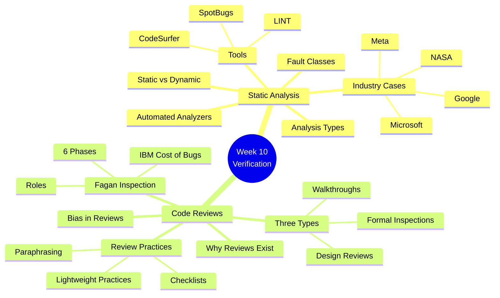

***

### 2. Static Analysis

#### 2.1 Static vs Dynamic

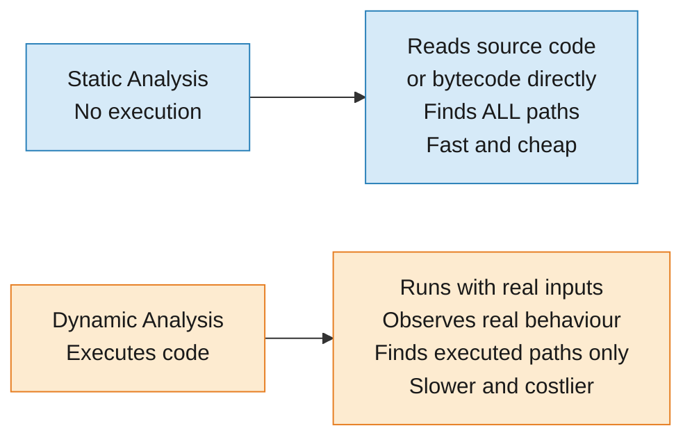

> **Key insight:** Static finds bugs in paths no test ever exercises. Dynamic finds bugs that only appear at runtime. Neither replaces the other — both are needed.

**One line summary:**

> Static analysis reads code to find bugs without running it. Dynamic analysis runs code to find bugs that only appear in execution.

***

#### 2.2 Automated Static Analyzers

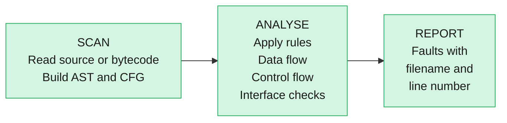

> Works best on weakly-typed languages like C. Strictly-typed languages like Java already prevent some errors at compile time.

***

#### 2.3 Fault Classes + Analysis Types

**Memory anchor — DCIIS**

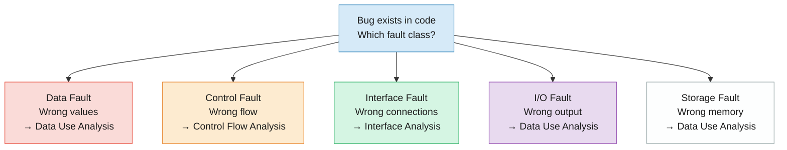

| Fault Class   | What it means             | Example                                      |
| ------------- | ------------------------- | -------------------------------------------- |
| **Data**      | Variable wrong or missing | Used before initialised, array out of bounds |
| **Control**   | Flow goes wrong place     | Unreachable code, illegal loop jump          |
| **Interface** | Function called wrongly   | Wrong parameter count or type                |
| **I/O**       | Output is wrong           | Variable output twice with no change between |
| **Storage**   | Memory handled wrongly    | Dangling pointer, unsafe pointer arithmetic  |

**5 Analysis Types:**

| Analysis Type                 | What it does                                           | Finds                             |
| ----------------------------- | ------------------------------------------------------ | --------------------------------- |
| **Data Use Analysis**         | Tracks variable lifecycle — declared → assigned → used | Data, I/O, Storage faults         |
| **Control Flow Analysis**     | Builds CFG, detects unreachable nodes                  | Control faults                    |
| **Interface Analysis**        | Checks every function call matches declaration         | Interface faults                  |
| **Information Flow Analysis** | Tracks dependencies between variables                  | Understanding only — not faults   |
| **Path Analysis**             | Enumerates ALL possible execution paths                | All fault classes — most powerful |

***

#### 2.4 Tools

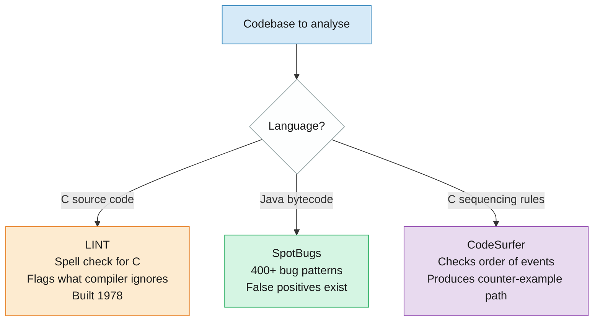

**Memory anchors:**

* **LINT** — spell check for C. Flags what the compiler ignores.
* **SpotBugs** — pattern matcher for Java. Knows 400+ ways code goes wrong.
* **CodeSurfer** — traffic light checker. Asks: can you reach GREEN without passing RED?

***

#### 2.5 Industry Cases

| Organisation  | Tool      | Key Result                                                       | Lesson                                                   |
| ------------- | --------- | ---------------------------------------------------------------- | -------------------------------------------------------- |
| **NASA JPL**  | SCRUB     | 227,041 lines reviewed. Tools found more issues than humans.     | Human + tool together beats either alone                 |
| **Microsoft** | PREfast   | Found 12% of all Windows bugs in 6 months without running a test | Even experienced teams miss what static analysis catches |
| **Google**    | Tricorder | 30+ tools per review. 35% of code flagged. 70% of issues fixed.  | Embedding analysis into review makes it culture          |
| **Meta**      | Infer     | Runs on every commit before merge. Open sourced 2015.            | Static analysis scales to thousands of commits per day   |

***

#### 2.6 PayFlow Scenario

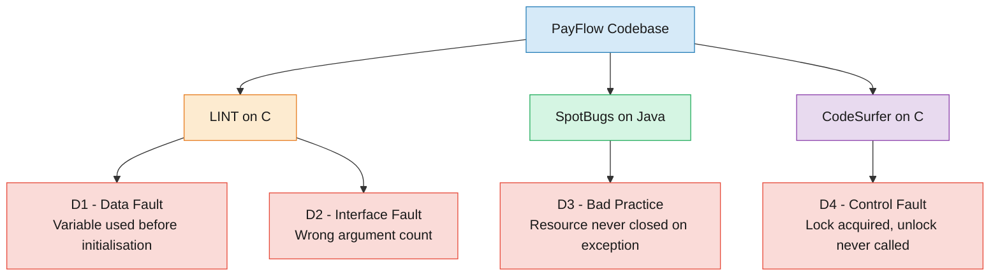

> Each defect maps exactly to a fault class and a tool. The Drug Interaction Engine at MediTrack has the same risk profile — safety-critical calculations where a Data or Sequencing fault harms a patient, not just crashes a payment system.

***

### 3. Code Reviews

#### 3.1 Why Reviews Exist

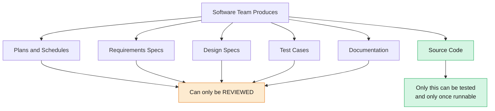

> A wrong requirement caught in review costs almost nothing. The same requirement caught post-release costs exponentially more.

***

#### 3.2 Three Types of Review

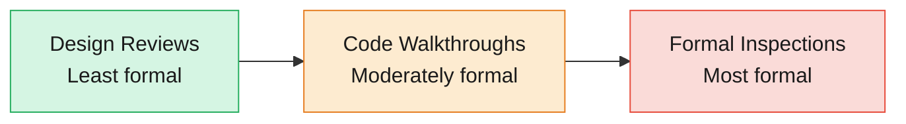

|                      | Design Reviews          | Code Walkthroughs             | Formal Inspections          |
| -------------------- | ----------------------- | ----------------------------- | --------------------------- |
| **Audience**         | Managers, customers     | Developers                    | Defined roles               |
| **Formality**        | Informal                | Informal-moderate             | Completely formal           |
| **Output**           | Confidence in direction | Defects found, feedback given | Written defect log, metrics |
| **Invented by**      | —                       | —                             | Fagan at IBM                |
| **Author controls?** | —                       | Yes                           | No — Moderator controls     |

***

#### 3.3 Code Checklists

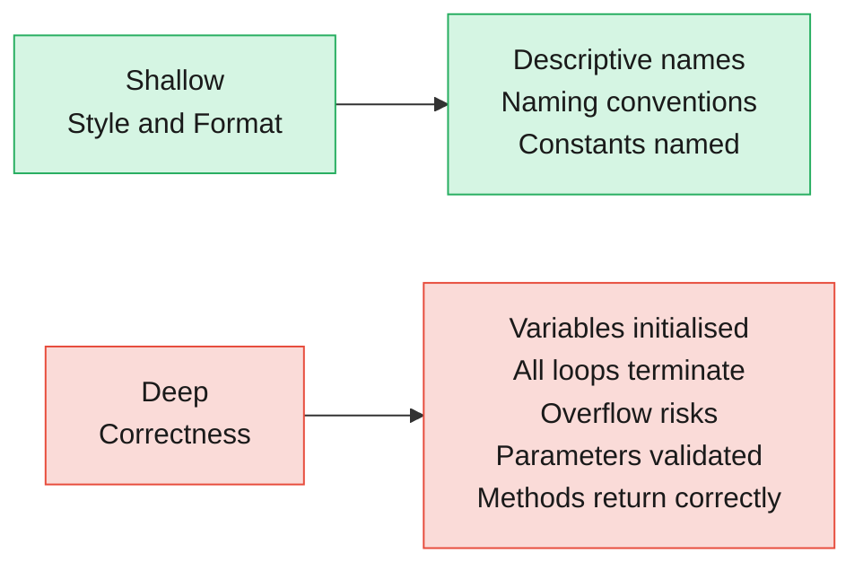

> **Anchor:** Aircraft pre-flight checklist. Pilots run it not because they forget — but because stress and familiarity make things invisible. Checklists make the invisible mandatory.

***

#### 3.4 Code Paraphrasing

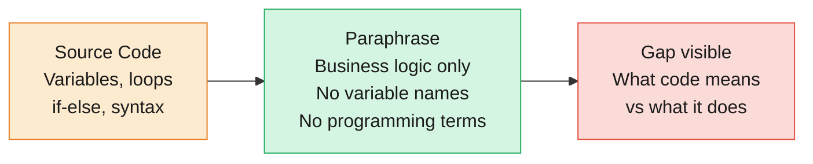

> **Fagan's original method.** The Reader paraphrases — not the Author. When the Author hears their own code described back, the gap between intent and implementation becomes audible.

***

#### 3.5 Structured Walkthroughs

|                    | Dynamic Walkthrough                            | Static Walkthrough                                   |
| ------------------ | ---------------------------------------------- | ---------------------------------------------------- |
| **How**            | Live meeting, author traces logic step by step | Annotated document, reviewers read asynchronously    |
| **Best for**       | Complex algorithmic code                       | Onboarding new team members                          |
| **Famous example** | —                                              | Lions Commentary 1977 — entire UNIX kernel annotated |

***

#### 3.6 Lightweight Practices

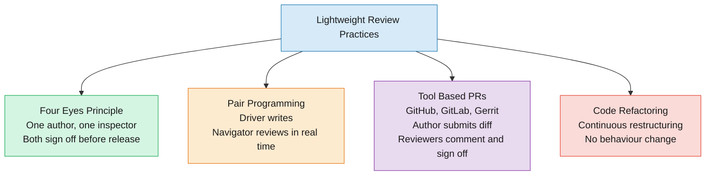

> Modern pattern: automated linting + human review = dual layer quality gate.

***

### 4. Fagan Inspection

#### 4.1 Roles

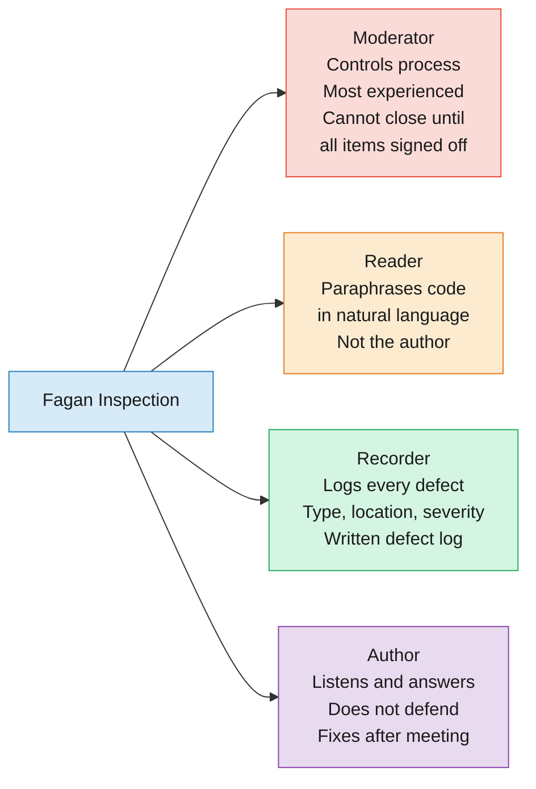

> **Anchor — courtroom:** Moderator = Judge. Reader = Lawyer. Recorder = Clerk. Author = Defendant. The defendant does not run the proceedings.

***

#### 4.2 Six Phases

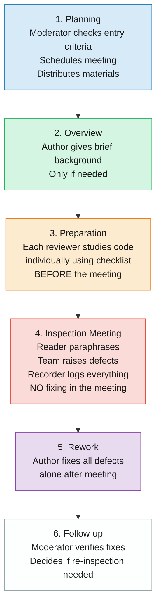

**Critical rules:**

* No fixing during the meeting — find defects only
* Preparation is mandatory — unprepared reviewer is sent away
* Entry criteria — code must compile and pass basic static analysis before inspection
* Exit criteria — all defects logged, rework verified by Moderator

***

#### 4.3 Fagan Inspection vs Code Walkthrough

|                    | Code Walkthrough      | Fagan Inspection                           |
| ------------------ | --------------------- | ------------------------------------------ |
| **Who leads**      | Author                | Moderator                                  |
| **Roles defined**  | No                    | Yes — Moderator, Reader, Recorder, Author  |
| **Checklist**      | Optional              | Mandatory                                  |
| **Defect log**     | No                    | Yes — written, formal                      |
| **Exit criteria**  | When team feels done  | When Moderator signs off all items         |
| **Author control** | High                  | None                                       |
| **Best for**       | Routine code review   | Safety-critical, compliance-sensitive code |
| **MediTrack use**  | Dosage formula review | Patient Data Privacy Logic                 |

***

### 5. IBM Cost of Bugs

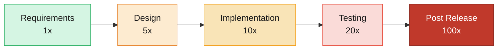

**MediTrack calculation:**

* Defect found during Formal Inspection = **€400**
* IBM post-release multiplier for safety-critical systems = **×100**
* Projected post-release cost = **€400 × 100 = €40,000**

> For Dosage Adjustment Logic, a post-release defect does not just cost €40,000 — it risks patient harm from an incorrect dosage calculation.

***

### 6. Bias in Code Reviews

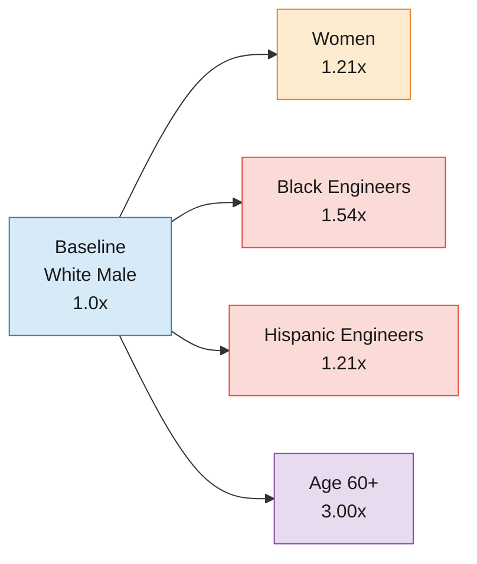

> **Source:** Google code reviews study, Jan–June 2019. 1,050 excess engineer-hours per day — cost borne entirely by non-White and non-male engineers.

**Why it happens — Role Congruity Theory:**

> Reviewers unconsciously associate certain demographic groups with lower technical competence and push back more — not based on code quality but on who wrote it.

**6 Fixes:**

| Fix                              | How it works                                             |
| -------------------------------- | -------------------------------------------------------- |
| **Bias Awareness Training**      | Educate reviewers on unconscious bias with real examples |
| **Anonymous Reviews**            | Remove author identity from review interface             |
| **Structured Rubrics**           | Objective checklist replaces subjective judgment         |
| **Demographic Dashboards**       | Monitor pushback rates by group, flag anomalies          |
| **Rotate Reviewers**             | Prevent same reviewer-author pairings repeating          |
| **Psychological Safety Culture** | Authors can escalate perceived unfair reviews            |

***

### 7. MediTrack Application

| MediTrack Module                     | Problem                                    | Verification Concept               | How it helps                                                                                  |
| ------------------------------------ | ------------------------------------------ | ---------------------------------- | --------------------------------------------------------------------------------------------- |
| **Dosage Adjustment Logic**          | Safety-critical decimal error              | Fagan Inspection + IBM Cost Model  | Catches boundary errors before release. Post-release cost = €40,000 vs €400                   |
| **Patient Data Privacy Logic**       | GDPR compliance, sensitive medical data    | Fagan Inspection + Checklist       | Mandatory privacy checklist — encryption, access control, logging — signed off systematically |
| **Drug Interaction Engine**          | Uninitialised variable risk in dosage calc | LINT — Data Fault detection        | Catches variable used before initialisation before a single test runs                         |
| **Legacy Data Migration Module**     | Fragile schemas, sequencing violations     | CodeSurfer — Sequencing properties | Catches lock/unlock violations in concurrent schema operations                                |
| **Clinical Decision Support Module** | Rushed fixes breaking alert logic          | Code Walkthrough + Checklists      | Developer-led review with checklist catches logic regressions before release                  |

***

### 8. Exam Answers

#### Q6a — 10 marks

_Economic analysis of defect detection using IBM cost model. €400 during Formal Inspection → projected post-release cost. Why Moderator/Reader/Recorder provide a superior quality gate vs system testing._

The IBM cost-of-bugs metric establishes that fixing a defect costs exponentially more the later it is discovered — 1x at requirements, 5x at design, 10x at implementation, 20x at testing, and 100x post-release. The cost escalates because post-release fixes require support investigation, developer context-switching, patch deployment, and regulatory penalties — none of which exist when the defect is caught during Formal Inspection.

For MediTrack's Dosage Adjustment Logic, a defect costs €400 during Formal Inspection. Applying the IBM 100x post-release multiplier: **€400 × 100 = €40,000**. For a system calculating doses from Serum Creatinine levels between 0.6–4.0 mg/dL, this is not just economic — a post-release defect risks patient harm from an incorrect dosage.

Formal Inspection provides a superior quality gate through three roles. The **Moderator** controls the process and cannot close the inspection until all checklist items are signed off — preventing the rushed sign-offs system testing allows. The **Reader** paraphrases dosage logic in natural language, making boundary errors at 0.6 or 4.0 mg/dL immediately audible to the team. The **Recorder** produces a written defect log creating an audit trail system testing never provides.

System testing only covers executed paths — an untested boundary condition in the dosage formula remains invisible until a patient is harmed. Formal Inspection reads all paths without executing code, making it structurally impossible for an untested path to escape review.

***

#### Q6b — 10 marks

_Critically compare Code Walkthrough and Fagan Inspection for Patient Data Privacy Logic. Why is checklist-directed approach essential for safety-critical medical data._

A Code Walkthrough is an informal review where the author leads the team through their own work. No defined roles, no mandatory checklist, no written defect log — the review ends when the team feels satisfied, a judgment dependent entirely on whoever is in the room.

A Fagan Inspection is completely formal — Moderator controls the process, Reader paraphrases code in natural language, Recorder logs every defect. The author listens and fixes. The review cannot close until all checklist items are signed off and all defects are addressed.

For MediTrack's Patient Data Privacy Logic, a Walkthrough depends on reviewers remembering to check GDPR compliance — encryption, access control, logging of sensitive fields, data retention. A Fagan Inspection with a privacy checklist removes this dependency — every item is mandatory, signed off, and auditable regardless of who is reviewing.

A checklist-directed approach is essential for three reasons. First, GDPR compliance is not optional — it cannot be left to memory. Second, a privacy breach at MediTrack means regulatory fines and patient data exposure, not just a bug report. Third, MediTrack's Clinical Decision Support Module already shows what happens without systematic review — rushed fixes making code brittle. A checklist-directed Fagan Inspection prevents Patient Data Privacy Logic from suffering the same fate.

A Walkthrough suits routine code review where missed defects are recoverable. For Patient Data Privacy Logic, only a Fagan Inspection with a mandatory checklist provides a quality gate independent of individual memory and judgment.

***

_Problem 4 Complete — Ready for Problem 3: Software Testing_
